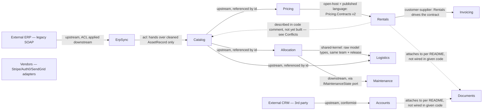

# RentField — context map

First-pass strategic decomposition. Modeled from the domain description (`README.md`,
`docs/domain-notes-draft.md`, `docs/erp-integration-notes.txt`) reconciled against shipped code
(`src/**`) and org data (`config/teams.yaml`, `db/migrations/0001_audit_log.sql`) — see step 1 of
SKILL.md. Draft: boundaries and aggregates will move as understanding deepens.

## Context map

Dotted edges (`-.->`) are described in the source material but not evidenced by an actual call/
reference in the given code — see Conflicts below. `Vendors` is drawn detached: README states it
serves "the platform" broadly, but no concrete call site into `StripePaymentClient` /
`Auth0IdentityClient` / `SendGridNotificationClient` appears in the given source, so no specific
edge is asserted.

## Core Domain Chart

| Bounded Context | Sub-domain type | Why |
|---|---|---|
| Allocation | **core** | README: "the heart of the business... this is where we win or lose against competitors, and the rules here change often." |
| Pricing | **core** (assumption — QUESTIONS.md Q1) | Real, actively-protected invariant (utilization-derived discount floor, enforceable against sales pressure); central to revenue capture. |
| Rentals | supporting (assumption — QUESTIONS.md Q2) | Orchestrates Allocation + Pricing + Invoicing into an order; no invariant of its own is stated. |
| Maintenance | supporting | README: "Routine record-keeping... Useful, not a differentiator"; code comment: "Straightforward record-keeping." |
| Catalog | generic *(master-data/reference — see mapping note)* | README: "Simple lookups"; code comment: "Pure lookups... no rules to enforce." |
| Logistics | supporting | README: "Planning depot hand-offs and delivery runs" — necessary, not called out as a differentiator. |
| Invoicing | supporting | Internal, co-negotiated service; the client/handler shown carries no invariant of its own. |
| Accounts | supporting | Necessary customer-record keeping; one stated ownership rule, not a differentiator. |
| Documents | generic (assumption — QUESTIONS.md Q3) | File-attachment capability serving multiple contexts; `teams.yaml` groups it with other platform/commodity concerns. |
| ErpSync | generic | Legacy integration technical adapter (Anti-Corruption Layer); no business differentiation. |
| Vendors | generic | README: "All off-the-shelf"; code comment: "no business rules... no model to build here." |

**Mapping note (schema):** SKILL.md's tactical-depth table has 4 rows (core / supporting / generic /
master-data-reference), but `output-template.md`'s `model.yaml` schema comment only allows 3
`subdomain_type` values (`core | supporting | generic`). Catalog is genuinely master-data/reference
(plain lookup CRUD, no aggregates/events by design) — mapped to `generic` for schema compliance,
with `tactical_pattern: crud` recording the more precise pattern. Flag for whoever maintains the
skill: reconcile the two tables (either add `master-data` to the schema enum, or fold it into
`generic` explicitly in SKILL.md's table).

## Load-bearing extraction seam

**`Pricing.Contracts` (the `PriceQuoted` event, versioned v1→v2)** is the clearest, already-built
Published Language artifact in the codebase: `Rentals.csproj` is architecturally forbidden from
referencing anything inside `Pricing` except this contract project ("Rentals may depend on... only
Pricing's stable, versioned contract project — never on anything inside Pricing"). This is the
first candidate to extract into its own service — the boundary already behaves like a service
contract, not just an in-process module split.

## Declined candidates (capability-vs-context test — ddd-methodology.md §2.6)

| Candidate | Evidence | Why declined | Escalation condition |
|---|---|---|---|
| **Ownership** (unified) | `SalesRepId` owns a sales account and its terms (Accounts); `DepotId` owns a committed unit (Allocation); `OwnerUserId` owns a document (Documents) | "Owner" is polysemic across these three — each meaning is real only inside its own context. A unified `Ownership` context would force one global `owner` serving none of them well. Modeled instead as a per-context projection: `Accounts.SalesRepId`, `Allocation.Reservation.DepotId`, `Documents.OwnerUserId`. | A generic, platform-wide authorization/policy engine is introduced that needs namespaced `(user, owner, resource)` relations across all three. |
| **Audit / activity-history** | Sales' request ("a timeline in the order screen showing who touched an order and when") + `db/migrations/0001_audit_log.sql`, whose own comment says "Nothing legal or retention-related; it's a convenience for the sales team." | No real invariants (no retention rule, no legal hold, no chain-of-evidence requirement) — a cross-cutting capability plus an append-only store, not a context. | The business becomes regulated (finance/healthcare) or the audit trail itself becomes a product feature — retention, legal hold, and chain-of-evidence would then become real invariants. |
| **SharedDomainRules** (as a context or a shared kernel) | `src/SharedDomainRules/README.md`: "Every module MUST inherit from the classes in this folder... if a rule could ever matter in more than one module, it belongs here." | This is the anti-pattern DDD's bounded contexts exist to eliminate (ddd-methodology.md §2.4, correction 3: "core logic every module must follow" belongs to governance, not a shared domain model). It is also currently unadopted — see Conflicts. Declined as a context *and* flagged against being built out as a literal shared kernel. | N/A — this is a structural recommendation (dissolve it; return each rule to its owning context), not a capability that could grow into a context. |

## Conflicts & reconciliation

Per SKILL.md step 1: prefer running/shipped code over a draft doc, never blend into a hybrid,
always record the divergence.

| Concept | Source A says | Source B says | Chosen (authoritative) | Flag for human |
|---|---|---|---|---|
| Discount floor | `docs/domain-notes-draft.md` (stale whiteboard, "not kept up to date"): "no minimum" on pricing | `README.md` + `Pricing/PricingEngine.cs`: floor = `listRate × (0.60 + 0.40×utilization)`, never discountable below it | README + shipped code | Confirm the draft notes are retired; consider deleting/archiving `domain-notes-draft.md`. |
| Same-unit double-booking | `docs/domain-notes-draft.md`: "a single unit can be held at two depots at once... whichever depot's customer shows up first gets it" | `README.md` ("without ever promising the same unit twice") + `Allocation/AllocationService.cs`: `Commit()` throws on any overlapping window for the same asset tag, regardless of depot | README + shipped code | Same as above. |
| Maintenance ownership | `docs/domain-notes-draft.md`: "Maintenance is tracked inside Allocation... doesn't need its own module" | `README.md` (separate "Maintenance scheduling" capability) + `Maintenance/MaintenanceScheduleService.cs`: its own module/service; `Allocation` only *queries* it through the `IMaintenanceState` port it defines itself | README + shipped code (separate context) | Same as above. |
| "Availability" as a standalone module | `docs/domain-notes-draft.md`: a standalone "Availability" module, separate from Allocation | Shipped code: no `Availability` type exists anywhere; the availability/overlap check lives inside `AllocationService.Commit()` itself | Shipped code — folded into Allocation | Not a regression: an availability check and a commit must be atomic to prevent a race (one aggregate, one transaction — aggregate-design-canvas.md), so merging them is the *correct* DDD move. Confirm this was an intentional design decision, not an unfinished split. |
| `SharedDomainRules` adoption | `SharedDomainRules/README.md` + `GlobalRules.cs`: "every module MUST inherit... wire to `GlobalRules` on day one" | Repo-wide grep: zero references to `GlobalRules`/`SharedDomainRules` outside its own file. `PricingEngine` computes its own independent floor formula (no reference to `MaxDiscountRate`); `AllocationService` never touches `AllocationPriority`; `Accounts.Segment` (CRM-sourced) doesn't match `GlobalRules.IsCustomer`'s `accountType` vocabulary at all | Shipped code (each context's own rule) | `GlobalRules` is dead/aspirational scaffolding today, and — see Declined Candidates — would itself be an anti-pattern if actually adopted as described. Recommend dissolving it: return `MaxDiscountRate`→Pricing, `IsCustomer`→Accounts, `AllocationPriority`→Allocation; keep only genuinely rule-free technical helpers (e.g. `Round()`) as a Building Blocks-level utility if still wanted. |
| Rentals ↔ Allocation wiring | `README.md`: Rentals turns "a quote **and a reservation**" into a booked order | `Rentals.csproj` has no project reference to `Allocation`; `RentalOrderService.Place()` never calls a Reservation/commit operation — it only reacts to `PriceQuoted` and calls `Invoicing` | Not modeled — no edge drawn; only the evidenced Rentals→Pricing and Rentals→Invoicing relationships are in the model | Confirm whether reservation confirmation happens via an orchestrator/saga not shown in this source, or whether this is a real integration gap (see QUESTIONS.md Q4). |
| Rentals ↔ Catalog sharing | `Rentals/RentalOrderService.cs` TODO comment: "stop maintaining a separate Equipment class here and in Catalog — just share Catalog's Equipment entity class directly" | Current code: two independent `Equipment` classes (Catalog's and Rentals' private one), manually kept in sync | Modeled as **not yet built** — no relationship asserted for it today | If implemented exactly as the TODO proposes (sharing Catalog's concrete class), that creates Shared Kernel coupling between Rentals and Catalog. Recommend a Published Language (a small reference DTO) instead, the same recommendation as the Allocation/Logistics finding below. |
| `crm-import` ownership | `config/teams.yaml`: `crm-import` is its own owned unit under the `platform` squad; `accounts` is not listed as owned by *any* squad | Shipped code: the CRM-import method (`ImportFromCrm`) lives inside `Accounts/CustomerAccountService.cs` — there is no separate `crm-import` module | Modeled as part of `Accounts` (matches the actual module) | `teams.yaml` should be reconciled: either add `accounts` as an owned unit (and clarify who owns the rest of `Accounts` beyond the CRM-import facet), or relabel `crm-import` to point at `Accounts`. |

## Shared-artifact sharing levels (ddd-methodology.md §2.4)

| Artifact | Shared between | Level | Cost / note |
|---|---|---|---|
| `BuildingBlocks.Money`, `BuildingBlocks.UnitOfMeasure` | Every context | **Building Blocks** | Explicitly rule-free per their own comments ("no business policy lives here"). Zero coupling risk — version like any library. |
| Allocation's `Reservation`/`EquipmentAllocated` raw types | Allocation ↔ Logistics | **Shared Kernel** | **Flagged.** Allocation is a **core** context; ddd-methodology.md §2.4 says to keep the Core Domain *out* of a Shared Kernel. Justified operationally today (same squad, same release cadence per `teams.yaml`), but it means any change to `Reservation`'s shape is a mutual-consent change for both teams, and it's the highest-coupling option on the menu. Recommend: if Logistics ever ships on its own cadence, replace this with a translated Published Language event instead of a raw shared type — mirroring the `Pricing.Contracts` pattern below. |
| `Pricing.Contracts.PriceQuoted` (v1→v2, changelog in file) | Pricing → Rentals | **Published Language** (+ Open Host Service) | Healthy, the default way to share. Explicitly the load-bearing extraction seam (above). |
| `SharedDomainRules.GlobalRules` (as declared) | Intended: every module | **Mis-labeled — see Declined Candidates** | Not a Building Block (it carries business meaning: customer definition, discount ceiling, allocation priority) and not a healthy Shared Kernel either (a mandatory universal rule set is the anti-pattern, not the exception). Currently harmless only because it's unused. |

## Event-flow continuity check (SKILL.md step 4)

| Event | Emitted by | Consumed by | Status |
|---|---|---|---|
| `EquipmentAllocated` | Allocation | Logistics (`LogisticsService.On`) | OK |
| `DepotTransferRequested` | Allocation | *(none)* | **Orphan emit** — the emitting code's own comment says "Nothing listens for this yet — the transfer still gets planned by hand in the depot office." Flagged, not fabricated a consumer. |
| `PriceQuoted` | Pricing | Rentals (`RentalOrderService.On`) | OK |
| `RentalOrderPlaced` | Rentals | Invoicing (`InvoicingClient.On`) | OK, but see note below. |

**Note — possible duplicate invoicing:** `RentalOrderService.Place()` calls
`_invoicing.RaiseInvoice(...)` directly **and** publishes `RentalOrderPlaced`, which
`InvoicingClient.On` turns into a second `RaiseInvoice(...)` call. If both paths are wired to the
same bus/port instance, placing one order raises two invoices. Flagged for a human to confirm
whether the direct call or the event handler is the intended path (likely only one should remain).

## Methodology notes

- Step 1 explicitly directs looking at "code carrying a domain layer" as authoritative input when
  reconciling against a draft doc — this decomposition therefore reads `src/**` alongside the prose
  description, per that instruction, rather than purely reverse-engineering from code (out of
  scope per SKILL.md Inputs).
- `config/teams.yaml` and `db/migrations/0001_audit_log.sql` are organizational/operational
  artifacts, not domain narrative — used only to corroborate team↔context mapping and the
  audit-decline decision, never as a source of business rules.
