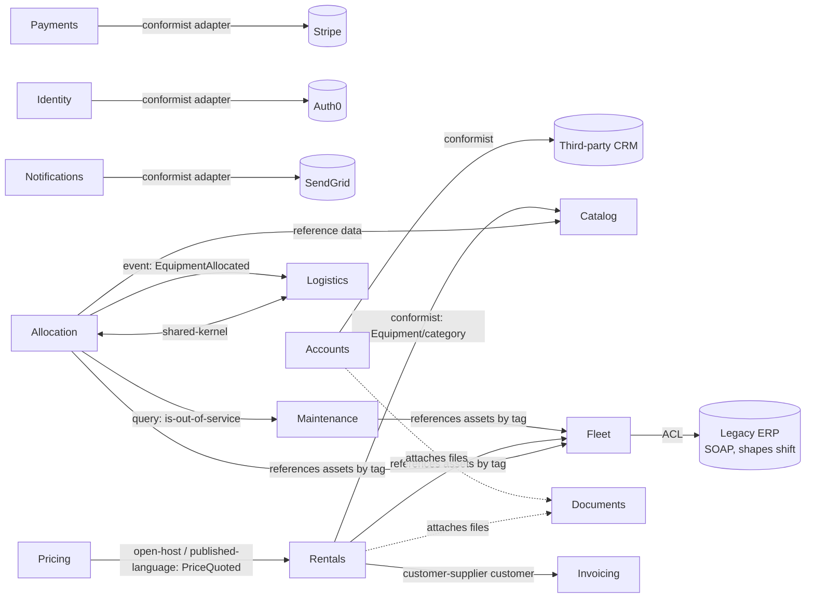

# RentField — Context Map

> Status: draft — a model to iterate on, not a final truth. Boundaries and aggregates
> will move as understanding deepens.
> Generated by `domain-decompose` (create mode). Sources reconciled: `README.md`,
> `docs/domain-notes-draft.md` (stale draft), `docs/erp-integration-notes.txt`,
> `config/teams.yaml`, and the shipped `src/**` domain layer (used only to resolve
> draft-vs-shipped conflicts — see Conflicts table).

## Context map

**Legend / direction.** Arrows point from the **downstream** (consumer/dependent) context to
the **upstream** (provider) context, except `shared-kernel` (mutual). Patterns:

- **shared-kernel** — two contexts share model types and a release train; neither moves without
  the other. *(Allocation ↔ Logistics.)*
- **open-host / published-language** — the upstream exposes a stable, versioned contract
  everyone integrates against, not its internals. *(Pricing → Rentals via `PriceQuoted`.)*
- **customer-supplier** — downstream is a paying "customer" whose needs the upstream plans
  around. *(Rentals is Invoicing's customer and drives its API shape.)*
- **conformist** — downstream accepts the upstream's model verbatim, no translation.
  *(Accounts ← CRM; the vendor adapters ← their SDKs.)*
- **ACL (anti-corruption layer)** — downstream translates the upstream's shifting/foreign model
  into its own clean shapes and never lets the raw model leak inward. *(Fleet ← Legacy ERP.)*

## Core Domain Chart

| Bounded Context | Sub-domain type | Why |
|---|---|---|
| **Allocation** | core | "The heart of the business… where we win or lose"; must commit the right physical unit without ever double-promising it; rules change often. |
| **Pricing** | core (see Q1) | Proprietary demand-driven pricing with a utilization floor — code calls it "the rule that makes this ours." Flagged for confirmation vs. supporting. |
| **Rentals** | supporting | Orchestrates quote + reservation → booked order → billing; valuable glue, not the differentiator. |
| **Logistics** | supporting | Plans depot hand-offs / delivery runs; ships as one unit with Allocation. |
| **Maintenance** | supporting | "Routine record-keeping… Useful, not a differentiator." |
| **Catalog** | supporting | Reference data: category tree, depots, tags — simple lookups. |
| **Accounts** | supporting | Customer/sales accounts mirrored from the CRM; owns the rep-owns-account relationship. |
| **Fleet** | supporting (see Q2) | Canonical clean registry of the physical units (assets), isolated from the legacy ERP by an ACL. |
| **Documents** | supporting (see Q5) | File attachments (agreements, photos, inspection sheets) with an owner-delete rule. Code-sourced; absent from the README capability list. |
| **Invoicing** | generic | Commodity billing capability; internal service but could be outsourced. |
| **Payments** | generic | Stripe adapter — off-the-shelf, swappable, no business rules. |
| **Identity** | generic | Auth0 adapter — off-the-shelf. |
| **Notifications** | generic | SendGrid adapter — off-the-shelf. |

## Load-bearing extraction seam

**`PriceQuoted` (Pricing → Rentals) is the load-bearing extraction seam — extract Pricing first.**
It is already a *Published Language*: a standalone, versioned contract project
(`Pricing.Contracts`, v1→v2) that Rentals depends on *instead of* Pricing's internals
(`Rentals.csproj` references `Pricing.Contracts` only, "never on anything inside Pricing").
Because the seam is already a clean contract, Pricing is the cheapest high-value context to pull
out into its own service on the monolith → microservices path.

Two other boundaries are load-bearing for **protection** (not first-to-split):
- **The ERP ACL inside Fleet** is the most important *defensive* seam — it quarantines an
  unstable external model so "if the ERP breaks its format, the damage stops here." Keep it a
  hard boundary; do not let raw ERP shapes leak past Fleet.
- **Allocation ↔ Logistics shared-kernel** is the *tightest* coupling and should **not** be split
  early — the Fulfilment squad ships them together as one deployable.

## Conflicts & reconciliation

The draft whiteboard notes (`docs/domain-notes-draft.md`, explicitly "not kept up to date")
disagree with the shipped code and the current `README.md` in several places. Per the reconcile
rule, the **running/shipped code wins over the draft doc**, each divergence is recorded, and none
are blended into a hybrid. All flagged for a human to confirm and to clean up the draft.

| Concept | Source A — draft notes | Source B — shipped code + README | Chosen (authoritative) | Flag for human |
|---|---|---|---|---|
| Discount floor | "Pricing is list price minus discount. There is **no minimum**." | `PricingEngine`: quote can never fall below a utilization-derived floor; README: "a floor below which a rep may not discount." | **B (code/README)** — floor exists | Draft rule is obsolete; update the draft and confirm the sales policy. |
| Same unit at two depots | "A single unit **can be held at two depots at once**; first customer to show up gets it." | `AllocationService.Commit`: "the same physical unit can never be committed twice for overlapping windows — not even from a different depot"; README: "without ever promising the same unit twice." | **B (code/README)** — no double-hold | Draft rule is obsolete; confirm removed. |
| Maintenance placement | "Maintenance is tracked **inside Allocation** — just another status; no own module." | `src/Maintenance/MaintenanceScheduleService.cs` is a standalone module; README lists Maintenance as its own capability; teams.yaml → platform squad owns it. | **B (code/README)** — own context | Modeled as its own bounded context (DOMAIN-0005). |
| "Availability" module | "**Availability** — a standalone module that tracks which units are free on which dates." | No such module exists; availability is computed inside Allocation (`Reservation.Overlaps`). | **B (code)** — folded into Allocation | Draft's separate Availability module never materialized; confirm none planned. |
| Platform discount ceiling | `GlobalRules.MaxDiscountRate = 0.35` — a fixed shared ceiling every module must obey. | `PricingEngine` computes its own utilization floor and **never reads** `GlobalRules.MaxDiscountRate`. | **Pricing's utilization floor** is the real pricing rule | The 0.35 ceiling appears unused/stale; confirm and remove, or reconcile with the floor. |
| Location of shared rules | `SharedDomainRules/GlobalRules` — "every module MUST inherit"; one place for customer-definition, allocation priority, rounding, discount ceiling. | Each rule actually belongs to one context; a platform-wide "inherit-everything" base is a false shared kernel across *all* contexts. | **Decompose per owning context** | Anti-pattern — see "Deliberately not modeled" below; confirm the decomposition. |
| Rentals' `Equipment` vs Catalog's `Equipment` | — | `RentalOrderService` keeps a private `Equipment` class with a `TODO` to "just share Catalog's Equipment entity class directly." | **Catalog is the source of truth** — Rentals conforms to it | Both are in the Commerce squad, so sharing is intra-team; recommend Rentals conform to Catalog rather than a mutual shared kernel. |

## Event-flow continuity check

| Domain event | Emitted by | Consumed by | Status |
|---|---|---|---|
| `PriceQuoted` | Pricing | Rentals (`RentalOrderService.On`) | OK |
| `EquipmentAllocated` | Allocation | Logistics (`LogisticsService.On`) | OK |
| `RentalOrderPlaced` | Rentals | Invoicing (`InvoicingClient.On`) — also a direct `RaiseInvoice` call | OK |
| `DepotTransferRequested` | Allocation | **none** | ⚠ **Orphan emit** — "Nothing listens for this yet — the transfer still gets planned by hand in the depot office." Flagged, not invented away (see Q3). |

Cross-context edges that are *queries/commands*, not events (still valid, just synchronous):
Allocation → Maintenance (`IsOutOfService`), Rentals → Invoicing (`RaiseInvoice`),
Fleet ← ERP (nightly ACL upsert), Accounts ← CRM (nightly conformist import).

## Deliberately NOT modeled (and why)

- **Order activity history / `audit_log`** (`db/migrations/0001_audit_log.sql`, README "Requests in
  flight"). This is **technical audit metadata** (`actor_user`, `occurred_at`, `action`) explicitly
  described as "a convenience for the sales team… nothing legal or retention-related." Per the
  ownership-vs-audit rule it is an infrastructural cross-cutting concern, **not** a domain
  aggregate — it belongs to the data-layer (`data-model` skill), so no `ActivityHistory` context
  or aggregate is created here. (Contrast: had it carried a legal/retention obligation, it would
  be a domain concern.)
- **`SharedDomainRules` / `GlobalRules` as a context or shared kernel.** A platform-wide "every
  module MUST inherit" base is a false shared kernel that couples *all* contexts. Its rules are
  redistributed to their owners: discount rule → **Pricing**, "what is a customer" → **Accounts**,
  allocation priority order → **Allocation**, money rounding → the technical **BuildingBlocks**
  value objects. Flagged for confirmation (Q4).
- **`Money`, `UnitOfMeasure` (`BuildingBlocks`) as a context.** These are shared *technical* value
  objects ("no business policy… arithmetic only"), reused across Pricing/Rentals/Invoicing. They
  are referenced as value objects where used, not elevated to a bounded context.
- **Audit columns generally** (`created_at/by`, `updated_at/by`, tenancy) — data-layer concern,
  never added to aggregates here.

## Team → context alignment (`config/teams.yaml`)

| Squad | Contexts owned | Note |
|---|---|---|
| fulfilment | Allocation, Logistics | shared code + shared release → **shared kernel** |
| pricing | Pricing | owns the `PriceQuoted` published contract |
| commerce | Rentals, Catalog | one squad → Rentals-conforms-to-Catalog is intra-team |
| billing | Invoicing | customer-supplier with Rentals (Rentals drives) |
| platform | Maintenance, Documents, Fleet (via erp-sync), Accounts (via crm-import) | |
| (vendors) | Payments, Identity, Notifications | generic adapters, no squad — off-the-shelf |

## Summary (create-mode run)

- **13 bounded contexts** emitted (2 core, 7 supporting, 4 generic) with `context-map.md`, `INDEX.md`,
  and per-context `README.md` + `model.yaml`.
- **6 draft-vs-shipped conflicts** reconciled (code/README authoritative), all flagged.
- **1 orphan event** (`DepotTransferRequested`) flagged.
- **2 anti-patterns** surfaced and deliberately not modeled (`GlobalRules` false shared kernel;
  `audit_log` audit metadata as domain).
- **6 open questions** recorded in `QUESTIONS.md`; proceeded on documented assumptions.
