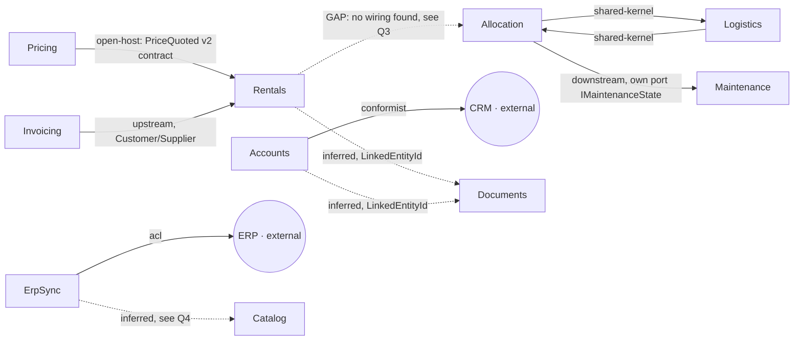

# RentField — Context Map

RentField is a B2B platform for renting heavy industrial equipment: reserving/allocating a finite
fleet across depots, pricing dynamically by utilization, turning quotes+reservations into billed
orders, and running fleet field service.

## Context map

Solid edges are confirmed in code/README; dashed edges (`-.->`) are inferred or flagged gaps — see
`QUESTIONS.md` for the reasoning behind each.

## Core Domain Chart

| Bounded Context | Sub-domain type | Why |
|---|---|---|
| Allocation | **core** | README, verbatim: "the heart of the business... where we win or lose against competitors, and the rules here change often." |
| Pricing | supporting *(assumption — see QUESTIONS.md Q1)* | Real utilization-based floor logic, but README never calls it a differentiator the way it does Allocation; framed as a service that "publishes each quote for the rentals team to consume." |
| Rentals | supporting | Orchestration/glue turning a quote + reservation into a billed order — necessary, not itself the differentiator. |
| Logistics | supporting | Plans hand-offs/delivery runs off the back of Allocation's commitments; shares a team and model with the core context but isn't named as the differentiator itself. |
| Maintenance | supporting | README, verbatim: "Routine record-keeping... Useful, not a differentiator." |
| Invoicing | supporting | In-house service, co-evolved with Rentals — necessary, but not bought/outsourced (so not generic) and not itself competitive. |
| Catalog | generic | Code, verbatim: "Pure lookups... No behaviour beyond storage and retrieval, no rules to enforce." README: "Simple lookups." |
| Accounts | generic | README, verbatim: CRM data "we take... exactly as they arrive... no leverage to change them" — a mirrored, commodity capability. |
| ErpSync | generic | Pure anti-corruption/translation plumbing over a legacy system we don't own; no business differentiation. |
| Documents | generic *(inclusion itself is an assumption — see QUESTIONS.md Q7)* | Commodity file-storage capability; the one real rule (owner-only delete) is an access-control detail, not a differentiator. |

## Load-bearing extraction seam

**`Pricing.Contracts` / `PriceQuoted`** is the clearest Published Language artifact in the system,
and it is *already* structurally separated: it lives in its own project
(`RentField.Pricing.Contracts`), is explicitly versioned in code (`v1 → v2` changelog comment,
"STABLE INTEGRATION CONTRACT"), and `Rentals.csproj` is wired so Rentals can reference the
contracts project but is structurally forbidden from referencing Pricing's internals. This is the
boundary that decouples the system most if split first — Pricing could become its own service
behind this contract with the least churn to its one confirmed consumer (Rentals). Contrast this
with Allocation/Logistics below, which share raw model types directly (a Shared Kernel) — that pair
would need a contract layer introduced *before* it could be split, unlike Pricing/Rentals which
already has one.

## Cross-cutting concerns (not modeled as bounded contexts)

- **`BuildingBlocks` (Money, UnitOfMeasure)** — shared technical value objects with no business
  policy of their own ("no business policy lives here — arithmetic only"). Used across Pricing,
  Rentals, Invoicing, Vendors. Not a bounded context; a shared kernel of pure technical types.
- **`SharedDomainRules` (GlobalRules)** — a single, explicitly platform-wide Shared Kernel
  ("Every module MUST inherit... if a rule could ever matter in more than one module, it belongs
  here"). Not a bounded context (no aggregates/entities/events of its own), but worth flagging as a
  monolith→microservices risk: as written, *every* context is coupled to one shared implementation
  of "customer," the discount ceiling, and the allocation-priority order. Splitting any context out
  as a service will require either forking this module or extracting it into its own tiny shared
  library — decide before the first extraction, not during it.
- **`Vendors` (Stripe, Auth0, SendGrid)** — thin third-party SDK adapters, explicitly "no model to
  build here" per the code's own comment. No caller of these adapters appears anywhere in the read
  modules (Stripe/Auth0/SendGrid clients exist but are never invoked by Rentals/Accounts/etc. in
  this fixture) — likely wired at a composition layer not included here. Not modeled as contexts.
- **`audit_log` / "activity history on orders"** (Sales' in-flight request, `db/migrations/0001_audit_log.sql`)
  — deliberately **not** modeled as a domain aggregate/entity/event. Both the migration comment and
  the README are explicit that this is "a convenience for them; there is no legal or retention angle
  to it," i.e. technical audit metadata (who touched what, when), not a domain concept with its own
  invariants. Per the skill's hard rule distinguishing ownership from audit metadata, this stays
  out of `docs/domain/` entirely — it belongs to the data/infrastructure layer, not this model.

## Conflicts & reconciliation

`docs/domain-notes-draft.md` is an explicitly stale whiteboard sketch ("from an early whiteboard
session... nobody has cleaned this up"). Per the skill's rule, running/shipped code (and the
README, which matches the code) is chosen as authoritative in every case below; the draft's
divergent claims are recorded, not blended in.

| Concept | Source A (draft notes) | Source B (README + shipped code) | Chosen (authoritative) | Flag for human |
|---|---|---|---|---|
| Double-booking | "a single unit can be held at two depots at once and whichever depot's customer shows up first gets it" | README: "without ever promising the same unit twice"; `AllocationService.Commit` throws on any overlapping window for the same `assetTag`, across depots | B (code/README) | Confirm the draft's overbooking idea was abandoned, not deferred |
| Discount floor | "no minimum — if a rep wants to give it away... that's a sales decision" | README: "a floor below which a rep may not discount, no matter how badly they want the deal"; `PricingEngine.Quote` enforces a utilization-derived floor unconditionally | B (code/README) | None — code and narrative agree; draft is simply outdated |
| Maintenance's home | "tracked inside Allocation — it's just another status a unit can be in" | Separate `MaintenanceScheduleService`/`MaintenanceRecord`; `AllocationService` only *queries* it via its own `IMaintenanceState` port | B (code) | None — clean separation already exists |
| Standalone "Availability" module | "a standalone module... separate from anything else" | No `Availability` class/namespace exists; `AllocationService.Commit` does both the availability check and the commit in one place | B (code) | None — merged, matches README's single "Reserving and allocating units" capability |
| Discount ceiling enforcement | `GlobalRules.MaxDiscountRate = 0.35m`, doc comment: "every module is expected to call into this" | `PricingEngine.Quote` never references `GlobalRules` at all — it computes its own independent utilization floor | **Unresolved — no source is clearly authoritative** (this is code-vs-code, not draft-vs-shipped) | **Yes — see QUESTIONS.md Q6**: is `MaxDiscountRate` vestigial, or is Pricing missing a real enforcement it's supposed to have? |

## Event-flow continuity check

Per step 4: every emitted event should have a consumer; every cross-context arrow should correspond
to an emitted event.

- `EquipmentAllocated` (Allocation) → consumed by Logistics. OK.
- `PriceQuoted` (Pricing) → consumed by Rentals. OK.
- `RentalOrderPlaced` (Rentals) → consumed by Invoicing. OK.
- **`DepotTransferRequested` (Allocation) → no consumer anywhere in the read code.** The emitting
  code says so itself: "Nothing listens for this yet — the transfer still gets planned by hand in
  the depot office." Flagged as an orphan emit, not a modeling omission on this decomposition's
  part.
- **Rentals ↔ Allocation: narrative/code gap.** README frames Rentals as "turning a quote **and a
  reservation** into a booked order," implying Rentals depends on an Allocation reservation — but
  no such call or event subscription exists in `RentalOrderService`. See QUESTIONS.md Q3.

## Team/service-boundary alignment (`config/teams.yaml`)

| Squad | Owns | Note |
|---|---|---|
| fulfilment | allocation, logistics | Matches the Allocation/Logistics Shared Kernel exactly — one team, one release, confirms the modeled boundary. |
| pricing | pricing | Matches the Pricing context 1:1. |
| commerce | rentals, catalog | One team spans two contexts of different sub-domain type (supporting + generic) — acceptable; team boundaries don't have to equal context boundaries. |
| billing | invoicing | Matches the Invoicing context 1:1; confirms the Customer/Supplier read (billing "adds" fields "when rentals needs" them). |
| platform | maintenance, documents, erp-sync, crm-import | Four ownership labels map to three contexts here (Maintenance, Documents, ErpSync) plus `crm-import`, which this model folds into **Accounts** rather than splitting out — see QUESTIONS.md Q5. |

## Naming note

`Reservation` (Allocation), `Equipment`/`Category`/`Depot`/`Tag` (Catalog), and `Document`
(Documents) are each scoped to their own context; none of these terms collide in meaning across
contexts in this model, so no polysemy conflicts were found to record here (unlike, e.g., a term
like "Account" which could have collided between Accounts and Invoicing/billing — it doesn't:
Invoicing never uses the word "account," only `customerId`).
