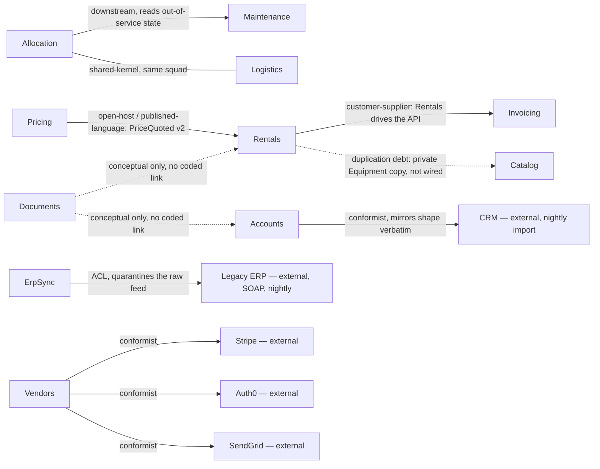

# RentField context map

Source: `README.md`, `config/teams.yaml`, `docs/domain-notes-draft.md` (stale whiteboard draft),
`docs/erp-integration-notes.txt`, `db/migrations/0001_audit_log.sql`, and the domain knowledge
stated in comments/config/contracts across `src/**`. No prior `docs/domain/` existed — this is a
**create**, not a delta merge.

## Context map

Two cross-cutting **shared kernels** sit outside this map because neither owns a business
capability (not candidate service boundaries, so no context folder was created for either):

| Shared kernel | Contents | Used by (as read from source) | Note |
|---|---|---|---|
| `BuildingBlocks` | `Money` (currency-safe amount), `UnitOfMeasure` (quantity+unit conversion) | Pricing, Rentals, Vendors (Money); declared reusable by all | Purely technical, no business policy — genuine shared kernel per the code's own comments. |
| `SharedDomainRules` | `GlobalRules` — `MaxDiscountRate` (0.35), `IsCustomer`, `AllocationPriority`, `Round` | **None of the modules read in this codebase actually call it** | Documented as mandatory ("every module MUST inherit... wire it to `GlobalRules` on day one") but no call site was found in Allocation, Pricing, Rentals, or anywhere else. See Conflicts table — this looks like an unenforced or abandoned governance rule, not a working shared kernel. |

## Core Domain Chart

| Bounded Context | Sub-domain type | Why |
|---|---|---|
| Allocation | **core** | README states this explicitly: "the heart of the business... where we win or lose against competitors, and the rules here change often." |
| Pricing | **core** (assumption — see QUESTIONS.md Q1) | A genuine differentiating algorithm (utilization-driven discount floor) plus its own versioned, stable integration contract (`PriceQuoted` v1→v2) — investment beyond a commodity capability. README never uses the word "core" for it, so flagged for confirmation rather than asserted. |
| Rentals | **core** (assumption — see QUESTIONS.md Q2) | Owns the `RentalOrder` identity (`OrderId`) that the transaction is actually billed and audited against (referenced from `audit_log`). README doesn't explicitly label it, and its own code is mostly orchestration (calls Allocation's outcome, Pricing's quote, Invoicing) rather than a unique rule of its own — flagged as a judgment call. |
| Maintenance | supporting | README explicit: "Routine record-keeping... Useful, not a differentiator." |
| Catalog | **master-data / reference** | README explicit: "Simple lookups." Category tree, depot list, tags — no lifecycle, no invariants; aggregates intentionally declined. |
| Logistics | supporting | Needed to plan hand-offs; not called out as a differentiator. Built by the same squad as Allocation and shares its model types (shared kernel). |
| Accounts | supporting | Holds business-meaningful reference data (which rep owns which account) but originates zero business rules of its own — every field is mirrored verbatim from the external CRM. |
| Invoicing | supporting | Necessary billing integration to a bespoke sibling-team service (billing team's own invoicing system); not RentField's differentiator. Only the RentField-side client/port is in scope here — the invoicing service's own domain lives with the billing team, out of scope. |
| ErpSync | generic | Pure Anti-Corruption-Layer translation over a legacy vendor system RentField does not control and cannot change; no business rule of RentField's own lives here. |
| Documents | supporting | File storage plus one authorization rule (owner-only delete); not a differentiator. |
| Vendors | generic | README explicit: "All off-the-shelf" (Stripe, Auth0, SendGrid). |

## Load-bearing extraction seam

**`Pricing.Contracts` (the `PriceQuoted` record) is the seam that decouples this system the most if
split first.** Evidence, all read directly from source:

- It is explicitly labelled in code as a **"STABLE INTEGRATION CONTRACT"**, versioned with a
  changelog (`v1: (Category, Amount)` → `v2: (Category, Amount, Utilization, ContractVersion)`),
  with the rule "a breaking change ships as a NEW version and the old one is kept until every
  consumer has migrated."
- It already lives in its **own project** (`Pricing.Contracts.csproj`), physically separate from
  `PricingEngine`.
- `Rentals.csproj` enforces the boundary at the build level: a comment states Rentals "may depend
  on the shared technical types and on Pricing's stable, versioned contract project only — never
  on anything inside Pricing."

This is a textbook **Open Host Service / Published Language** and is already structurally ready to
extract as its own deployable/package boundary ahead of the rest of Pricing. No other seam in this
codebase has this combination of explicit versioning discipline + build-level enforcement.

## Event-flow continuity check

| Event | Emitted by | Consumed by | Status |
|---|---|---|---|
| `EquipmentAllocated` | Allocation | Logistics (`On(EquipmentAllocated)`) | OK |
| `DepotTransferRequested` | Allocation (when a commit lands away from the asset's home depot) | **none found** | **Orphan.** Code's own comment confirms it: "Nothing listens for this yet — the transfer still gets planned by hand in the depot office." Flagging per the skill's continuity check rather than silently dropping it. |
| `PriceQuoted` | Pricing | Rentals (`On(PriceQuoted)`) | OK |
| `RentalOrderPlaced` | Rentals | Invoicing (`On(RentalOrderPlaced)` → `RaiseInvoice`) | **OK, but see next row — likely double-triggered.** |

**Additional flag — likely duplicate invoice trigger (not a missing-consumer problem, the inverse):**
`RentalOrderService.Place()` calls `_invoicing.RaiseInvoice(...)` **synchronously and directly**,
and **also** publishes `RentalOrderPlaced`, which `InvoicingClient.On(RentalOrderPlaced)` handles by
calling `RaiseInvoice(...)` **again**. As written, one `Place()` call appears to raise the invoice
through two independent paths. The domain model here treats "Rentals → Invoicing" as a single
logical customer-supplier relationship; the apparent double-trigger is a code-level concern for the
team to resolve, out of scope for this doc, but too material to leave unflagged (see QUESTIONS.md
Q5).

`ErpSync`'s `AssetRecord` upserts (via `IAssetWriter`) have **no consumer in the given source** —
nothing else in this codebase reads an `AssetRecord`. Unlike the two flags above this isn't
necessarily a modelling bug (ErpSync's output may feed a finance/accounting capability not present
in this codebase slice), so it is not scored as an orphan-event defect, but the silent lack of any
declared consumer is noted (see QUESTIONS.md Q4 for the related Catalog-vs-ErpSync question).

## Conflicts & reconciliation

`docs/domain-notes-draft.md` is explicitly marked "draft — from an early whiteboard session, not
kept up to date... some of it changed during build." Per the skill's reconciliation rule, the
**running/shipped code wins** every one of the divergences below; each is still recorded rather than
silently dropped.

| Concept | Source A (draft notes) | Source B (running code) | Chosen (authoritative) | Flag for human |
|---|---|---|---|---|
| Double-booking a unit | "a single unit **can be held at two depots at once** and whichever depot's customer shows up first gets it" | `AllocationService.Commit` throws if the same `AssetTag` has an overlapping reservation — the code comment states this holds "not even from a different depot" | code | This is a direct reversal of the original rule, not a refinement. Confirm it was an intentional policy change during build. |
| Pricing floor | "Pricing is just list price minus whatever discount the rep negotiates. There is **no minimum**... that's a sales decision, not a system rule" | `PricingEngine.Quote` enforces a utilization-derived floor; a rep cannot discount below it regardless of what they request | code | Confirm the no-minimum policy was deliberately superseded by the floor rule, not accidentally re-introduced. |
| Maintenance placement | "Maintenance is tracked **inside Allocation** — it's just another status a unit can be in, so it doesn't need its own module" | Maintenance is its own module/service; `AllocationService` only reads it through a read-only `IMaintenanceState` port | code | Informational — code's separation is the more defensible design; noting for history only. |
| A standalone Availability module | "**Availability** — a standalone module that tracks which units are free on which dates, separate from anything else" | No `Availability` type exists anywhere in `src/`; `AllocationService.Commit` computes availability inline via the overlap scan over its own reservation book | code | Confirm this was a deliberate merge (Availability folded into Allocation), not a dropped requirement. |
| Reference-data area | Open question at the time: "Do we need a separate reference-data area, or does each module keep its own lists?" | `Catalog` exists and holds categories, depots, and tags | code (answers the open question) | Informational only — no action needed. |
| `SharedDomainRules` mandate | `src/SharedDomainRules/README.md`: "Every module MUST inherit from the classes in this folder... wire it to `GlobalRules` on day one so it can never drift" | No module read in this codebase (Pricing, Allocation, Rentals, etc.) references `GlobalRules` anywhere. Notably `PricingEngine`'s floor formula and `GlobalRules.MaxDiscountRate` (0.35) are two unrelated numbers with no code path connecting them. | code (actual behaviour) | Flag for an audit outside this doc's scope: either the mandate was never enforced, or every consumer has silently drifted from a rule the team believes is followed. |
| Module identity: "crm-import" vs `Accounts` | `config/teams.yaml`: platform team owns a module named `crm-import` | Code names the capability `Accounts` (`CustomerAccountService.ImportFromCrm`); no `CrmImport` folder exists anywhere | code (`Accounts`) | Confirm `crm-import` in teams.yaml is a stale/renamed reference to `Accounts`, not a separate, unbuilt module (see QUESTIONS.md Q3). |

## Requests in flight (not modelled as a domain concept here)

README: Sales wants an **activity history on orders** (a timeline of who touched an order and
when), explicitly "no legal or retention angle." `db/migrations/0001_audit_log.sql` already exists
for this (`audit_log` table, generic `entity_type`/`entity_id`/`action`/`actor_user`). Per this
skill's hard rule, **technical audit metadata is an infrastructural, cross-cutting concern decided
in the data layer (the `data-model` skill), not a domain aggregate here** — so it is deliberately
**not** modelled as a bounded context or aggregate in this document. Noted so the request isn't lost
between skills.

## Changelog (2026-07-24)

- **Created** fresh (`docs/domain/` held no prior generated artifacts in the fixture). 11 bounded
  contexts (`DOMAIN-0001`..`DOMAIN-0011`), this context map, and `INDEX.md`.
- All docs start `status: draft`, `owner: TBD` per the hard rule — no status was set or escalated
  by this run.
