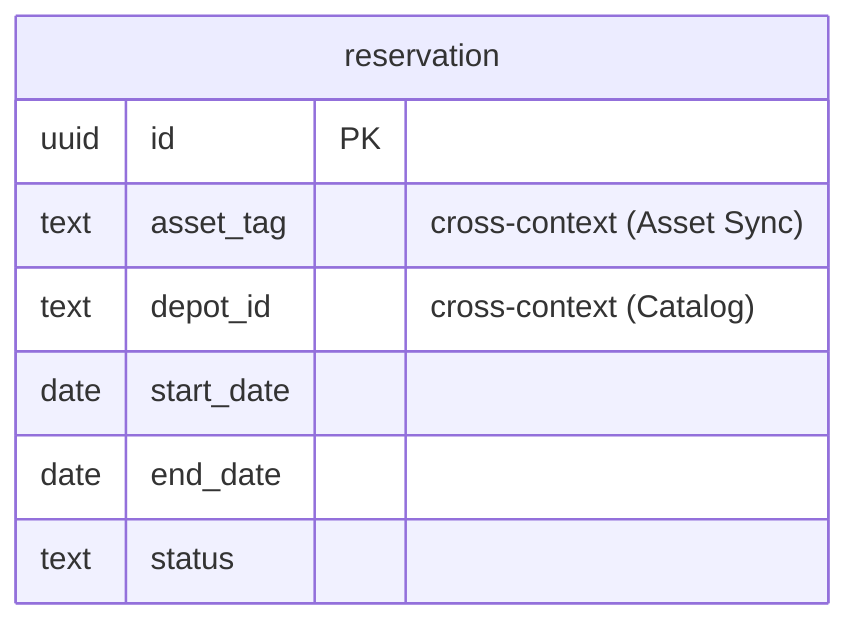

# Allocation — logical data model (DOMAIN-0001, core)

Canonical, dialect-agnostic. The `schema.postgres.sql` sibling is one labelled projection of this.
The **Reservation aggregate is the transaction boundary**; the no-double-commit invariant is
enforced *in the schema* by a range-exclusion constraint.

## Table: reservation  (aggregate root: Reservation, DOMAIN-0001)

| Column | Type | Key | Null | Notes |
|---|---|---|---|---|
| id | uuid | PK | no | surrogate |
| asset_tag | text | — | no | **cross-context** ref to Asset Sync clean asset (no FK); the physical unit |
| depot_id | text | — | no | **cross-context** ref to Catalog.depot (no FK); custodian-depot ownership projection |
| start_date | date | — | no | RentalWindow VO (inline) |
| end_date | date | — | no | RentalWindow VO (inline); exclusive; must be after start |
| status | enum[active, released] | — | no | value set is a **flagged assumption** — domain states `status` only (Q-D5) |
| created_at | timestamptz | — | no | audit (default ON) |
| updated_at | timestamptz | — | no | audit (default ON) |
| created_by | text | — | yes | acting rep (actor id) |
| updated_by | text | — | yes | acting rep |

### Constraints-as-intent (invariants → constraints)

| Invariant (domain) | Constraint |
|---|---|
| A rental window must be at least one day (`end` after `start`) | `CHECK (end_date > start_date)` |
| The same unit may never be committed twice for overlapping windows (even across depots) | **`EXCLUDE USING gist (asset_tag WITH =, daterange(start_date, end_date, '[)') WITH &&) WHERE (status = 'active')`** — set-based, exactly the domain invariant |
| A unit that is out of service cannot be committed | **Not expressible in-schema** — `out_of_service` lives in the Maintenance context (cross-context query). Application-enforced; flagged note, not a DB constraint. |

The exclusion constraint also **resolves the open consistency-boundary question** (Q-D1): whether
the boundary is a single `Reservation` or a per-asset reservation book, the constraint enforces
no-overlap across *all* live reservations for one `asset_tag` at the table level — so correctness
does not depend on choosing the aggregate grain.

Indexes: `(asset_tag)`, `(depot_id)`, `(status)`. The exclusion constraint provides the GiST index
that backs overlap checks.

## Flagged assumptions / gaps

- **Q-D5** `status` enum values `{active, released}` are inferred; domain names the field, not the
  set. Confirm.
- **Q-D4** optimistic-lock `version` column — proposed, not added (exclusion constraint already
  guards the core invariant).
- Out-of-service enforcement is cross-context (Maintenance) and cannot be a DB constraint here.

## ERD

No in-context FK — `reservation` is a single-table aggregate; `asset_tag` and `depot_id` are
cross-context id references (no `REFERENCES`).
