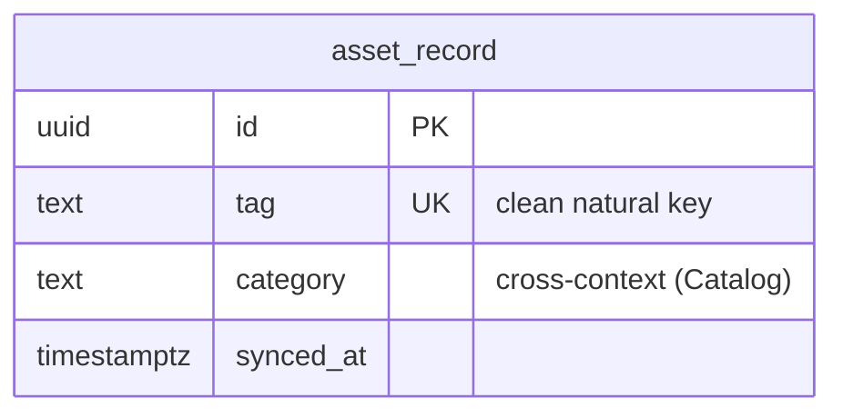

# Asset Sync — logical data model (DOMAIN-0009, supporting)

A **clean read model** of the fleet, produced by the anti-corruption layer over the legacy ERP. The
ERP is the system of record; this table holds only translated `AssetRecord` shapes. No aggregate.
Sync-populated, so audit is `synced_at` (writer is the nightly SOAP job).

## Table: asset_record  (read model; no aggregate, DOMAIN-0009)

| Column | Type | Key | Null | Notes |
|---|---|---|---|---|
| id | uuid | PK | no | surrogate |
| tag | text | UNIQUE | no | clean natural key (the asset tag other contexts reference) |
| category | text | — | no | **cross-context** ref to Catalog.category code (no FK); clean value post-translation |
| created_at | timestamptz | — | no | audit (row first seen) |
| updated_at | timestamptz | — | no | audit |
| synced_at | timestamptz | — | no | last nightly SOAP-pull timestamp |

### Constraints-as-intent
- `UNIQUE (tag)` — clean asset tag is the natural key.
- **No raw ERP columns.** `ASSET_NO` / `assetNo` / nulls / reordered columns are quarantined inside
  the sync job; the schema exposes only the translated shape. That quarantine *is* the ACL.

Indexes: `UNIQUE (tag)`, `(category)`.

## Flagged assumptions / gaps
- The ERP is the source of truth; there is **no application write path** and no `Asset` aggregate is
  invented (domain states no invariants on our side). If we later need to hold richer asset
  attributes, extend the clean shape here — flagged (Q-D12), never by leaking ERP fields.

## ERD

