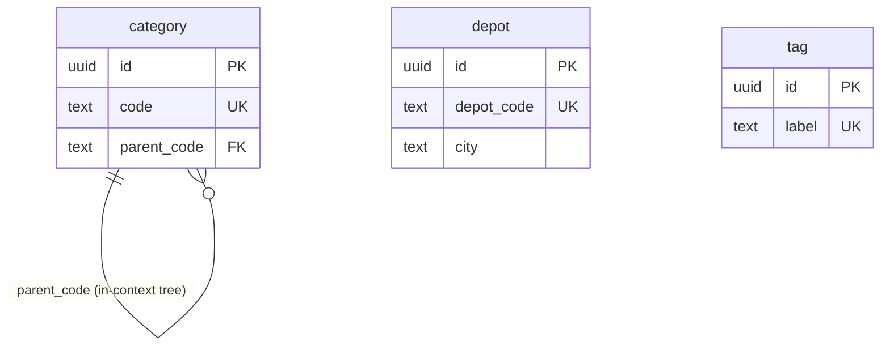

# Catalog — logical data model (DOMAIN-0006, generic / reference)

Master-data lookups. No aggregates, no events, no business rules. Three independent reference tables.
This context holds the model's **only in-schema FK** — `category.parent_code → category.code` — a
self-referential tree *within* the same context (allowed; not a cross-context link).

## Table: category  (reference, DOMAIN-0006)

| Column | Type | Key | Null | Notes |
|---|---|---|---|---|
| id | uuid | PK | no | surrogate |
| code | text | UNIQUE | no | natural key (e.g. `EXCAVATOR-20T`) |
| parent_code | text | FK→category.code | yes | in-context tree parent; null at root; `ON DELETE RESTRICT` |
| created_at / updated_at | timestamptz | — | no | audit |
| created_by / updated_by | text | — | yes | admin actor |

## Table: depot  (reference, DOMAIN-0006)

| Column | Type | Key | Null | Notes |
|---|---|---|---|---|
| id | uuid | PK | no | surrogate |
| depot_code | text | UNIQUE | no | natural key (e.g. `DEPOT-LEEDS`) — what other contexts reference as `depot_id` |
| city | text | — | no | location |
| created_at / updated_at | timestamptz | — | no | audit |
| created_by / updated_by | text | — | yes | admin actor |

## Table: tag  (reference, DOMAIN-0006)

| Column | Type | Key | Null | Notes |
|---|---|---|---|---|
| id | uuid | PK | no | surrogate |
| label | text | UNIQUE | no | free-form label |
| created_at / updated_at | timestamptz | — | no | audit |
| created_by / updated_by | text | — | yes | admin actor |

### Constraints-as-intent
- `UNIQUE (category.code)`, `UNIQUE (depot.depot_code)`, `UNIQUE (tag.label)` — natural keys.
- `category.parent_code REFERENCES category(code) ON DELETE RESTRICT` — in-context tree; prevents
  orphaning children.

Indexes: `UNIQUE(code)`, `(parent_code)`; `UNIQUE(depot_code)`; `UNIQUE(label)`.

## Flagged assumptions / gaps
- Other contexts reference a depot by its **code** (`DEPOT-LEEDS`), so `depot_code` carries the
  natural key while `id` is the surrogate PK. If callers should reference the surrogate `id` instead,
  flag (Q-D10). Kept faithful to the domain's `Depot.id = code` string.

## ERD

