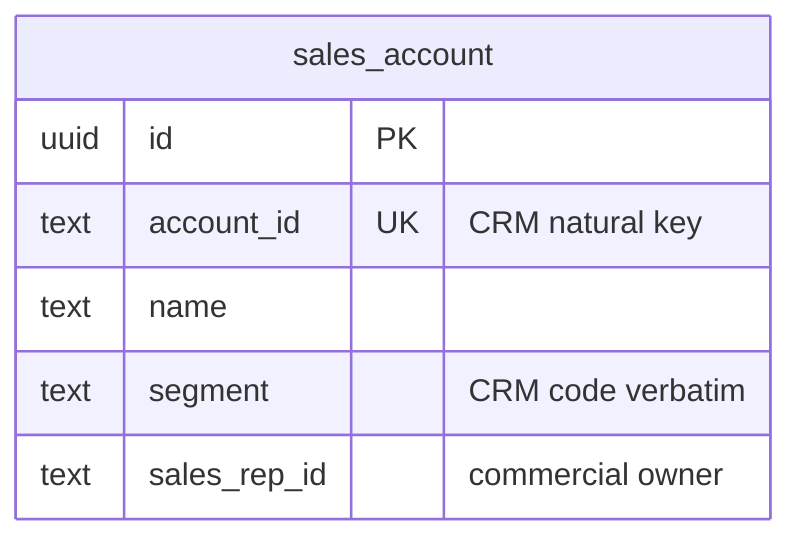

# Customer Accounts — logical data model (DOMAIN-0008, supporting)

Customer master data **conformed verbatim** from the third-party CRM (nightly import). No aggregate.
Because this is a sync-populated read model, the audit columns are `synced_at` (writer is a job), not
`created_by` / `updated_by`.

## Table: sales_account  (record; no aggregate, DOMAIN-0008)

| Column | Type | Key | Null | Notes |
|---|---|---|---|---|
| id | uuid | PK | no | surrogate |
| account_id | text | UNIQUE | no | CRM natural key, **verbatim format** |
| name | text | — | no | from CRM |
| segment | text | — | no | CRM segment code, **verbatim** — deliberately NOT constrained to an enum (conformist) |
| sales_rep_id | text | — | yes | commercial-owner projection (rep who owns the relationship) |
| created_at | timestamptz | — | no | audit (row first seen) |
| updated_at | timestamptz | — | no | audit |
| synced_at | timestamptz | — | no | last nightly-import timestamp (writer is a job, not a human) |

### Constraints-as-intent
- `UNIQUE (account_id)` — CRM id is the natural key.
- **No `CHECK` on `segment`.** Conformist: constraining the CRM's codes to our own set would break
  the moment the CRM adds a code. Left as free text on purpose (documented, not an oversight).

Indexes: `UNIQUE (account_id)`, `(segment)`, `(sales_rep_id)`.

## Flagged assumptions / gaps
- **Conformist fragility (Q-D11):** shapes shift when the CRM shifts; there is no ACL here (contrast
  Asset Sync). Widening/renaming a column follows the CRM, not our decision.
- No write path from the application — the nightly sync is the only writer.

## ERD

