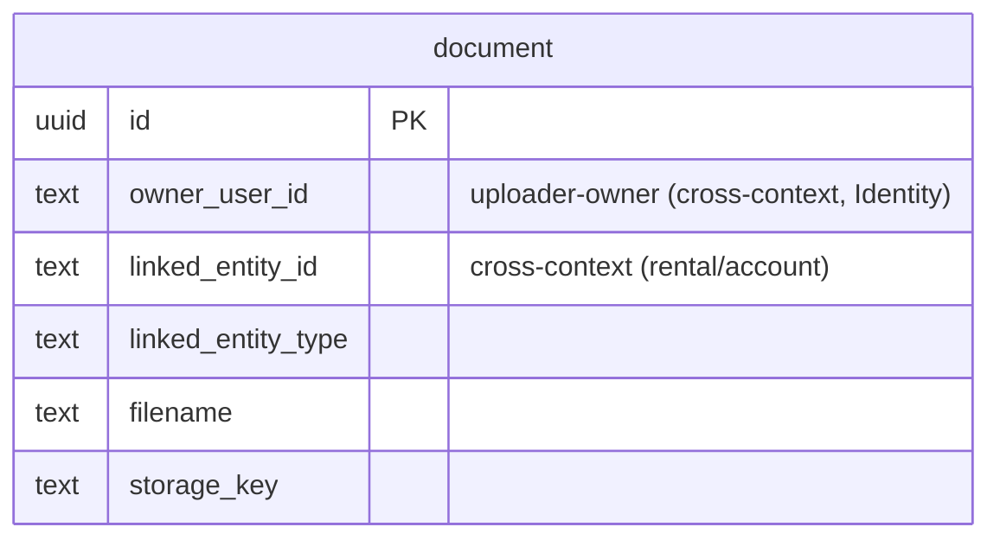

# Documents — logical data model (DOMAIN-0010, supporting)

Files attached to rentals and accounts. No aggregate — CRUD plus one authorization rule. The file
bytes live in a blob store; this table holds metadata + a storage pointer.

## Table: document  (record; no aggregate, DOMAIN-0010)

| Column | Type | Key | Null | Notes |
|---|---|---|---|---|
| id | uuid | PK | no | surrogate |
| owner_user_id | text | — | no | uploader-owner projection (who may delete); **cross-context** ref to Identity user (no FK) |
| linked_entity_id | text | — | no | the rental or account this file attaches to; **cross-context** ref (no FK) |
| linked_entity_type | enum[rental, account] | — | yes | **flagged** — domain says "rental or account" but states no discriminator (Q-D13) |
| filename | text | — | no | original name |
| content_type | text | — | yes | MIME type |
| size_bytes | bigint | — | yes | file size |
| storage_key | text | — | no | pointer into the blob store (files are not in the DB) |
| created_at | timestamptz | — | no | audit (upload time) |
| updated_at | timestamptz | — | no | audit |

`owner_user_id` doubles as the actor for this row, so a separate `created_by` is redundant and omitted.

### Constraints-as-intent
- **Authorization rule (not a DB constraint):** "only the owner (uploader) or an admin may delete."
  This is a *runtime authorization* check keyed on `owner_user_id` vs the caller — it cannot be a
  table constraint and is enforced in the Documents service. Recorded as a flagged note, not
  invented as SQL.

Indexes: `(linked_entity_id)`, `(owner_user_id)`.

## Flagged assumptions / gaps
- **Q-D13** `linked_entity_type` discriminator: added as nullable because a polymorphic
  `linked_entity_id` (rental OR account) is otherwise ambiguous — but the domain does not state it.
  Confirm whether to make it `NOT NULL`.
- **Blob storage (Q-D14):** `storage_key` assumes files live in an external object store, not the
  DB. Domain does not state where bytes live; flagged.
- **Q-D3** `deleted_at` soft delete — candidate (delete is a real, authorized operation here); not
  added.

## ERD

