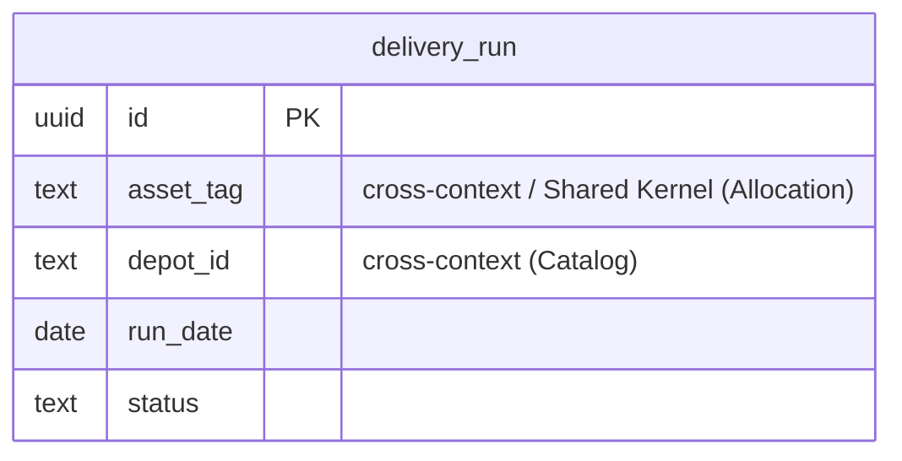

# Logistics — logical data model (DOMAIN-0004, supporting)

No aggregate in the domain — a transaction script over `DeliveryRun` records built from Allocation's
`EquipmentAllocated` event. One table.

## Table: delivery_run  (record; no aggregate, DOMAIN-0004)

| Column | Type | Key | Null | Notes |
|---|---|---|---|---|
| id | uuid | PK | no | surrogate |
| asset_tag | text | — | no | **cross-context** ref (Shared Kernel from Allocation's EquipmentAllocated) — id only, **no FK** |
| depot_id | text | — | no | **cross-context** ref (Catalog.depot) — no FK |
| run_date | date | — | no | the planned delivery date |
| status | enum[planned, handed_off, delivered] | — | no | **flagged assumption** — domain names DeliveryRun/Hand-off, not the lifecycle (Q-D8) |
| created_at | timestamptz | — | no | audit |
| updated_at | timestamptz | — | no | audit |
| created_by | text | — | yes | planner |
| updated_by | text | — | yes | planner |

### Shared Kernel note

Logistics and Allocation share the `Reservation` / `EquipmentAllocated` *shapes* by Partnership (one
Fulfilment squad). **Sharing model types is not sharing a database** — `asset_tag` is still a
cross-context id reference with **no FK** (each context is a candidate separate schema). The coupling
is at the type/contract layer, recorded on the context map.

Indexes: `(asset_tag)`, `(depot_id)`, `(run_date)`, `(status)`.

## Flagged assumptions / gaps

- **Q-D8** `status` enum values inferred; domain does not state the full lifecycle.
- No invariant asserted (domain states none).

## ERD

