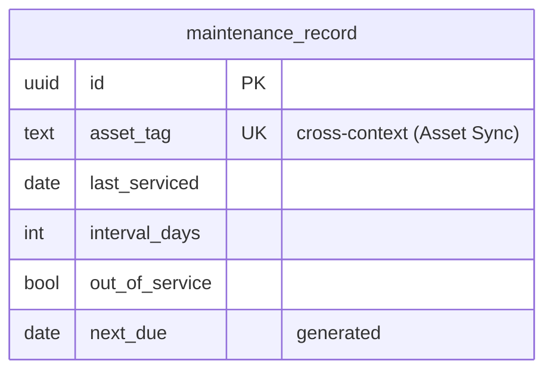

# Maintenance — logical data model (DOMAIN-0005, supporting)

No aggregate — CRUD over one service record per unit, plus the single `NextDue` calculation.

## Table: maintenance_record  (record; no aggregate, DOMAIN-0005)

| Column | Type | Key | Null | Notes |
|---|---|---|---|---|
| id | uuid | PK | no | surrogate |
| asset_tag | text | UNIQUE | no | natural key — one record per unit; **cross-context** ref (Asset Sync) — no FK |
| last_serviced | date | — | no | when the unit was last serviced |
| interval_days | integer | — | no | service interval; `CHECK >= 1` |
| out_of_service | boolean | — | no | default `false`; the flag Allocation queries before committing |
| next_due | date | — | no | **computed** `last_serviced + interval_days` (generated column) |
| created_at | timestamptz | — | no | audit |
| updated_at | timestamptz | — | no | audit |
| created_by | text | — | yes | technician (nullable — records may also arrive via asset sync) |
| updated_by | text | — | yes | technician |

### Constraints-as-intent

- `UNIQUE (asset_tag)` — one maintenance record per physical unit.
- `CHECK (interval_days >= 1)` — a service interval must be positive.
- `next_due` is a **stored generated column** = `last_serviced + interval_days` — the domain's one
  calculation, pushed into the schema so it can be indexed and queried (`dueBefore`).

Indexes: `UNIQUE (asset_tag)`, `(out_of_service)`, `(next_due)`.

## Flagged assumptions / gaps

- `asset_tag` as a natural UNIQUE key assumes exactly one open service record per unit (a
  record-keeping model, not a service-event log). If a full service *history* is wanted, this
  becomes a child `service_event` table — flagged (Q-D9), not assumed.

## ERD

