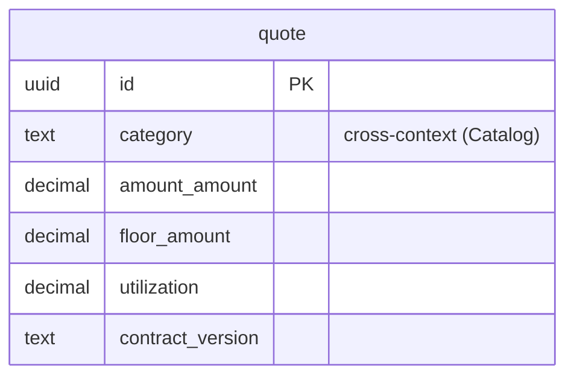

# Pricing — logical data model (DOMAIN-0002, core)

## Stateless today — the whole schema is PROVISIONAL (Q-D6 / domain open question)

The domain states Pricing is currently a **stateless domain service** (`PricingEngine`): it computes
and publishes `PriceQuoted` on a versioned contract, and **there is no persisted `Quote` entity**.
So, faithfully: **Pricing has no tables today.** The `quote` table below is the *target* projection
**iff** the entity-vs-value-object decision makes `Quote` an entity (identity + lifecycle,
referenced by `RentalOrder`). It is emitted as a clearly-flagged provisional design, not asserted as
current state — materialising persistence the domain says does not exist would be fabrication.

## Table: quote  (aggregate root: Quote, DOMAIN-0002) — PROVISIONAL

| Column | Type | Key | Null | Notes |
|---|---|---|---|---|
| id | uuid | PK | no | surrogate (only exists if Quote becomes an entity) |
| category | text | — | no | **cross-context** ref to Catalog.category (no FK) |
| amount_amount | decimal(12,2) | — | no | Money VO (inline) — the honoured price |
| amount_currency | char(3) | — | no | Money VO (inline), CHECK ISO-4217 shape |
| floor_amount | decimal(12,2) | — | no | PriceFloor VO (inline) |
| floor_currency | char(3) | — | no | PriceFloor VO (inline) |
| utilization | decimal(4,3) | — | no | Utilization VO (inline), 0..1 |
| contract_version | enum[v1, v2] | — | no | Published Language contract version (v2 current) |
| created_at | timestamptz | — | no | audit |
| updated_at | timestamptz | — | no | audit |
| created_by | text | — | yes | acting rep |

### Constraints-as-intent

| Invariant (domain) | Constraint |
|---|---|
| A quote may never fall below the utilization floor | `CHECK (amount_amount >= floor_amount)` (both in the same currency) |
| Utilization is a ratio 0..1 | `CHECK (utilization >= 0 AND utilization <= 1)` |

The floor **formula** (`listRate × (0.60 + 0.40 × utilization)`) is computed by the engine, not the
DB — the DB only guarantees the stored `amount` is not below the stored `floor`.

Indexes: `(category)`.

## Flagged assumptions / gaps

- **Q-D6** Persist `Quote` at all? Today it is transient. If the answer is "no", this context has
  **zero tables** and the file above is dropped.
- **No rate-card / list-rate table is invented.** `listRate` is an *input* to the calculation; the
  domain states no stored category rate table. If a rate card is later needed, model it in Catalog
  or Pricing — flagged, not fabricated here.

## ERD

