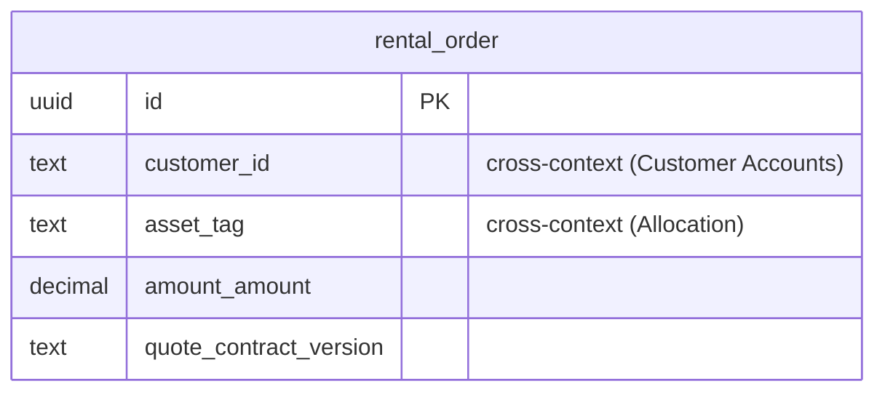

# Rentals — logical data model (DOMAIN-0003, supporting)

A deliberately light transaction script: one aggregate that mainly carries the `RentalOrderPlaced`
event. **No invariants are stated in the domain, so none are asserted as constraints.**

## Table: rental_order  (aggregate root: RentalOrder, DOMAIN-0003)

| Column | Type | Key | Null | Notes |
|---|---|---|---|---|
| id | uuid | PK | no | surrogate (orderId) |
| customer_id | text | — | no | **cross-context** ref to Customer Accounts `sales_account.account_id` (no FK); business ownership |
| asset_tag | text | — | no | **cross-context** ref to the committed unit (Allocation / Asset Sync) (no FK) |
| amount_amount | decimal(12,2) | — | no | Money VO (inline) — the agreed price consumed from PriceQuoted |
| amount_currency | char(3) | — | no | Money VO (inline) |
| quote_contract_version | enum[v1, v2] | — | yes | provenance of the consumed PriceQuoted contract |
| created_at | timestamptz | — | no | audit |
| updated_at | timestamptz | — | no | audit |
| created_by | text | — | yes | acting rep |
| updated_by | text | — | yes | acting rep |

### Constraints-as-intent

Only the Money-shape guard (`CHECK amount_currency ~ ISO-4217`). **No placement rule is invented** —
the domain explicitly warns against asserting "an order needs a committed reservation + a valid
quote" (Q-D7). If that rule is confirmed, it would be a cross-context check (application-enforced),
not a DB FK.

Indexes: `(customer_id)`, `(asset_tag)`.

## Flagged assumptions / gaps

- **Q-D7** No placement invariant asserted (domain states none).
- **Q-D3** `deleted_at` soft delete — proposed candidate (orders are rarely hard-deleted); not added.
- The `TODO` to share Catalog's `Equipment` entity is **not** enacted — Rentals references the unit
  by `asset_tag` id, never a shared row (avoids Shared Kernel coupling).

## ERD

Single-table aggregate; both references are cross-context ids (no `REFERENCES`).
