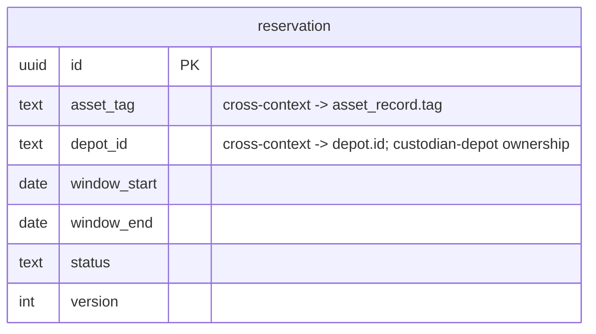

# Allocation — Logical Data Model

Source: `docs/domain/allocation/` (DOMAIN-0001). Sub-domain type: **core**. Status: draft,
owner: TBD. Cross-cutting policy: see `docs/data/INDEX.md` (single-tenant, audit columns on,
no soft-delete, `version` proposed here).

## Table: reservation (aggregate root: Reservation, DOMAIN-0001)

| Column | Type | Key | Null | Notes |
|---|---|---|---|---|
| id | uuid | PK | no | Domain names `id` verbatim (`model.yaml` attributes list) |
| asset_tag | text | — (indexed) | no | The physical unit. **Cross-context ref** → Asset Sync `asset_record.tag`, no FK |
| depot_id | text | — (indexed) | no | **Custodian Depot** — business-ownership projection (`reservation:custodian-depot`), not audit metadata. Cross-context ref → Catalog `depot.id`, no FK |
| window_start | date | — | no | `RentalWindow` VO (inline) |
| window_end | date | — | no | `RentalWindow` VO (inline). `CHECK (window_end > window_start)` |
| status | enum[committed, released] | — | no | default `committed` |
| version | integer | — | no | default 1. **Proposed** optimistic-locking column (see INDEX cross-cutting policy) — confirm |
| created_at | timestamptz | — | no | default now() |
| updated_at | timestamptz | — | no | default now() |
| created_by | text | — | yes | Identity/Auth0 subject id, no FK |
| updated_by | text | — | yes | Identity/Auth0 subject id, no FK |

Indexes: `(asset_tag)`, `(depot_id)`, `(status)`.

## Invariants → constraints

| Domain invariant | Schema expression |
|---|---|
| Same unit never committed twice for overlapping windows, not even from a different depot | `EXCLUDE USING gist` (temporal-overlap exclusion constraint, requires `btree_gist`) over `(asset_tag, daterange(window_start, window_end))` `WHERE status = 'committed'` — see `schema.postgres.sql` |
| A rental window must be at least one day | `CHECK (window_end > window_start)` |
| A unit that is out of service cannot be committed | **Not a DB constraint.** This invariant depends on Maintenance's `outOfService` state — a different bounded context. Per the cross-context rule (no physical FK/coupling across contexts), this is enforced **at the application layer** (Allocation's write path synchronously queries `docs/api/maintenance/openapi.yaml#/paths/~1maintenance-records~1{assetTag}`) — flagged, not modelled as a DB-level check. |

## ERD

## Assumptions & gaps (flagged, not silently decided)

- **Consistency-boundary caveat carried over from the domain model.** The no-overlap invariant is
  set-based over *all* live reservations for one asset; the domain model itself flags that the
  true consistency boundary might be a per-asset reservation book rather than a single
  `Reservation` row. This schema still models one row per reservation with a DB-level exclusion
  constraint (which correctly enforces the invariant regardless of aggregate framing) — if the
  boundary is later redrawn, the table shape may need revisiting. Not decided here.
- **`version` (optimistic locking) is proposed, not confirmed** — see cross-cutting policy.
- **`id` type assumed `uuid`** — the domain names the attribute `id` but gives no format; `uuid`
  is the stated default absent other guidance (`references/domain-to-schema.md` §Keys).
