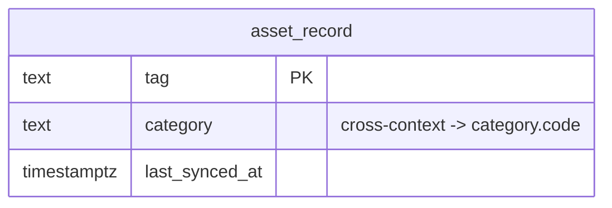

# Asset Sync — Logical Data Model

Source: `docs/domain/asset-sync/` (DOMAIN-0009). Sub-domain type: **supporting**
(anti-corruption layer, no aggregate). Status: draft, owner: TBD. Cross-cutting policy: see
`docs/data/INDEX.md` (with one exception noted below).

## Table: asset_record

| Column | Type | Key | Null | Notes |
|---|---|---|---|---|
| tag | text | PK | no | Domain names `tag` verbatim as the identifying attribute of the clean `AssetRecord` shape. Used directly as PK |
| category | text | — (indexed) | no | Cross-context ref → Catalog `category.code`, no FK |
| last_synced_at | timestamptz | — | no | **Exception to the default audit-column policy** — populated by the nightly ERP SOAP sync, not a human actor |
| created_at | timestamptz | — | no | default now() |
| updated_at | timestamptz | — | no | default now() |

Indexes: `(category)`.

## Invariants → constraints

**None.** "The ERP is the system of record for assets; we hold a clean read-model" — no `Asset`
aggregate/invariant is invented on our side.

## ERD

## Assumptions & gaps (flagged, not silently decided)

- **No raw ERP fields anywhere in this schema** — by design (the quarantine boundary). `ErpRow`
  is never persisted; "nothing past this context sees it," including this table.
- **No `created_by`/`updated_by`** — replaced with `last_synced_at`, same rationale as Customer
  Accounts (automated nightly sync, not a human actor).
