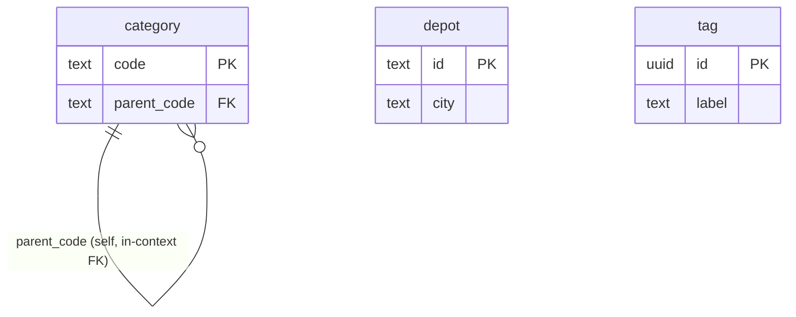

# Catalog — Logical Data Model

Source: `docs/domain/catalog/` (DOMAIN-0006). Sub-domain type: **generic** (master-data /
reference). Status: draft, owner: TBD. Cross-cutting policy: see `docs/data/INDEX.md`.

Aggregates, repositories, and domain events are **explicitly declined** in the domain model — an
empty aggregate list is the correct, complete output for a reference context, not a gap. Plain
lookup tables only, no invariants beyond keys.

## Table: category

| Column | Type | Key | Null | Notes |
|---|---|---|---|---|
| code | text | PK | no | Domain names `code` verbatim as the identifying attribute — used directly as PK, no redundant surrogate added |
| parent_code | text | FK → category(code) | yes | Domain names `parentCode` verbatim. Self-referential, in-context FK, `ON DELETE RESTRICT` (assumption: don't allow deleting a category that still has children — flagged) |
| created_at | timestamptz | — | no | default now() |
| updated_at | timestamptz | — | no | default now() |
| created_by | text | — | yes | Identity/Auth0 subject id, no FK |
| updated_by | text | — | yes | Identity/Auth0 subject id, no FK |

## Table: depot

| Column | Type | Key | Null | Notes |
|---|---|---|---|---|
| id | text | PK | no | Domain names `id` verbatim as the identifying attribute; typed `text` (not `uuid`) since Depot is reference/master data like Category — **flagged type assumption**, domain only says "id", confirm format |
| city | text | — | no | |
| created_at | timestamptz | — | no | default now() |
| updated_at | timestamptz | — | no | default now() |
| created_by | text | — | yes | Identity/Auth0 subject id, no FK |
| updated_by | text | — | yes | Identity/Auth0 subject id, no FK |

## Table: tag

| Column | Type | Key | Null | Notes |
|---|---|---|---|---|
| id | uuid | PK | no | **Surrogate, added** — the domain names no identifying attribute for Tag at all ("a free-form label"), so the fallback rule applies |
| label | text | UNIQUE | no | **Assumption:** a canonical tag vocabulary (label is unique) rather than free per-use text — flagged, confirm |
| created_at | timestamptz | — | no | default now() |
| updated_at | timestamptz | — | no | default now() |
| created_by | text | — | yes | Identity/Auth0 subject id, no FK |
| updated_by | text | — | yes | Identity/Auth0 subject id, no FK |

## Invariants → constraints

**None** beyond keys — "no rules to enforce," per the domain model.

## ERD

## Assumptions & gaps (flagged, not silently decided)

- **`depot.id` typed `text`, not `uuid`** — the domain gives no format for Depot's `id`; reference
  data of this kind (like Category's `code`) is normally a short, human-meaningful code. Confirm.
- **`category.parent_code ON DELETE RESTRICT`** is a modelling choice (prevent orphaning a
  subtree by silently cascading a parent delete) — not stated in the domain model, flagged.
- **`tag.label` assumed UNIQUE** (a canonical vocabulary) — the domain doesn't say whether the
  same label text can be created twice; flagged, confirm.
