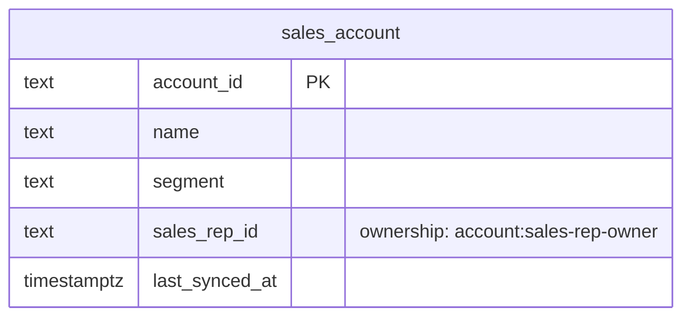

# Customer Accounts — Logical Data Model

Source: `docs/domain/customer-accounts/` (DOMAIN-0008). Sub-domain type: **supporting**
(Conformist CRUD, no aggregate). Status: draft, owner: TBD. Cross-cutting policy: see
`docs/data/INDEX.md` (with one exception noted below).

## Table: sales_account

| Column | Type | Key | Null | Notes |
|---|---|---|---|---|
| account_id | text | PK | no | Domain names `accountId` verbatim. **Conformist: "the CRM's id format, taken verbatim"** — typed `text`, used directly as PK, no surrogate added (the domain explicitly says not to translate this field) |
| name | text | — | no | |
| segment | text | — (indexed) | no | "The CRM's segment code, taken verbatim" |
| sales_rep_id | text | — (indexed) | yes | **Business ownership** — SalesRep projection (`account:sales-rep-owner`), not audit metadata. External CRM rep id, no FK (no `SalesRep` entity is modelled anywhere) |
| last_synced_at | timestamptz | — | no | **Exception to the default audit-column policy** (see below): this table is populated by an automated nightly CRM import, not a human actor — `created_by`/`updated_by` would have no real value to hold |
| created_at | timestamptz | — | no | default now() — when RentField's DB first saw this row |
| updated_at | timestamptz | — | no | default now() — when RentField's DB last touched this row |

Indexes: `(segment)`, `(sales_rep_id)`.

## Invariants → constraints

**None.** "CRUD over conformed records; no stated invariant."

## ERD

## Assumptions & gaps (flagged, not silently decided)

- **No `created_by`/`updated_by`** — replaced with `last_synced_at`, since the nightly import is
  the write path, not a human actor (see `docs/data/INDEX.md` cross-cutting policy exceptions).
- **Read-only from the public API's perspective** (see `docs/api/customer-accounts/README.md`
  Flags) — this schema still has a natural write path (the nightly import job), just not through
  the public API surface. Not a contradiction: the DB table is written by the sync job, read by
  the API.
