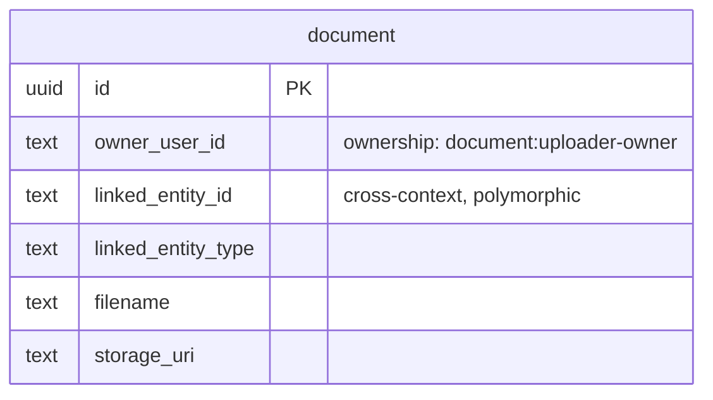

# Documents — Logical Data Model

Source: `docs/domain/documents/` (DOMAIN-0010). Sub-domain type: **supporting** (transaction
script — CRUD + one authorization rule). Status: draft, owner: TBD. Cross-cutting policy: see
`docs/data/INDEX.md`.

## Table: document

| Column | Type | Key | Null | Notes |
|---|---|---|---|---|
| id | uuid | PK | no | **Surrogate, added** — the domain names no identifying attribute for `Document` itself (`OwnerUserId`/`LinkedEntityId` are relationship attributes, not Document's own identity) |
| owner_user_id | text | — (indexed) | no | **Business ownership** — uploader-owner projection (`document:uploader-owner`), not audit metadata. External Identity subject id, no FK |
| linked_entity_id | text | — (indexed) | no | The rental or account this document is attached to. Cross-context ref, polymorphic (no single FK target) |
| linked_entity_type | text | — | no | **Mechanical addition, not stated verbatim** — needed to disambiguate which table `linked_entity_id` points at. `CHECK (linked_entity_type IN ('rental','account'))` |
| filename | text | — | no | **Flagged mechanical addition** — not stated verbatim in the domain model, but required for "an uploaded file" to be representable as a row at all |
| content_type | text | — | yes | Same rationale as `filename` |
| storage_uri | text | — | no | Same rationale as `filename` — where the actual file bytes live (object storage), not modelled by the domain |
| uploaded_at | timestamptz | — | no | default now() (`created_at`, named to match the domain's `Upload` verb) |

Note: `owner_user_id` already fulfils the "who created this row" role the standard audit
`created_by` column would — no separate `created_by` is added (would duplicate the same fact
under two names). There is no `updated_by`/`updated_at` either: the domain states only `Upload`
and `Delete`, no update operation.

Indexes: `(owner_user_id)`, `(linked_entity_id)`.

## Invariants → constraints

| Domain rule | Schema expression |
|---|---|
| Only the document owner (uploader) or an admin may delete it | **Not a DB constraint** — "admin" is an authorization-role concept resolved by Identity/authorization, not data this table can check by itself. Enforced at the application layer (`DELETE /documents/{id}` compares the caller's identity against `owner_user_id`, or checks an admin role) |

## ERD

## Assumptions & gaps (flagged, not silently decided)

- **`linked_entity_type` is a mechanical disambiguator**, added because the domain names only
  `LinkedEntityId` (singular, untyped) — flagged, confirm this is the intended design rather than
  two separate FK-shaped columns (`rental_id`, `account_id`, mutually exclusive via CHECK).
- **`filename`/`content_type`/`storage_uri` are inferred, not domain-stated** — "an uploaded file"
  needs somewhere to point at its bytes; not new business meaning, but flagged since not verbatim.
- **No soft delete** — per the system-wide policy (`docs/data/INDEX.md`); `DELETE` is a hard
  delete. If document retention ever becomes a legal requirement, revisit both this and the
  cross-cutting policy together.
