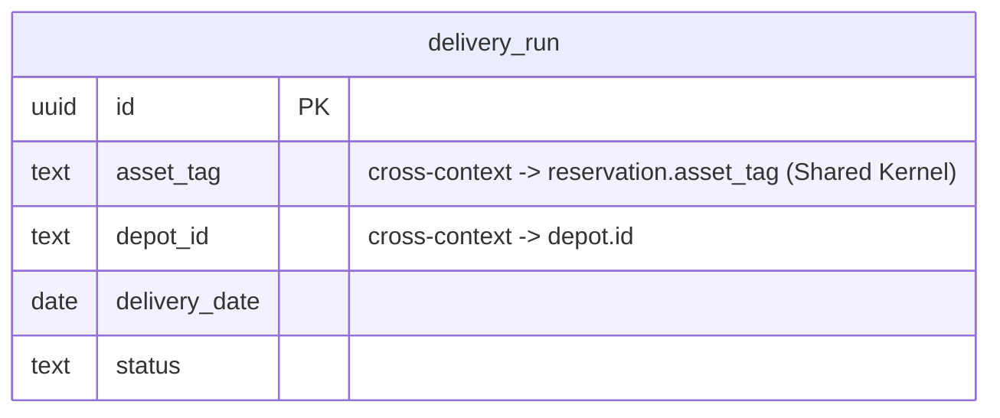

# Logistics — Logical Data Model

Source: `docs/domain/logistics/` (DOMAIN-0004). Sub-domain type: **supporting** (transaction
script, no aggregate). Status: draft, owner: TBD. Cross-cutting policy: see `docs/data/INDEX.md`.

## Table: delivery_run

| Column | Type | Key | Null | Notes |
|---|---|---|---|---|
| id | uuid | PK | no | **Surrogate, added** — the domain gives no attribute list for `DeliveryRun` at all (no aggregate, no entities list in `model.yaml`); columns below are inferred directly from the ubiquitous-language description, flagged |
| asset_tag | text | — (indexed) | no | Same identifier Allocation uses (**Shared Kernel**). Cross-context ref → Allocation `reservation.asset_tag`, no FK even under Shared Kernel |
| depot_id | text | — (indexed) | no | Cross-context ref → Catalog `depot.id`, no FK |
| delivery_date | date | — (indexed) | no | |
| status | enum[planned, handed-off] | — | no | default `planned`. `Hand-off` maps onto a status transition, not an invented domain event |
| created_at | timestamptz | — | no | default now() |
| updated_at | timestamptz | — | no | default now() |
| created_by | text | — | yes | Identity/Auth0 subject id, no FK |
| updated_by | text | — | yes | Identity/Auth0 subject id, no FK |

Indexes: `(asset_tag)`, `(depot_id)`, `(delivery_date)`.

## Invariants → constraints

**None.** "Nothing to keep atomically consistent beyond… no aggregate" — no CHECK beyond
NOT NULL/type shape.

## ERD

## Assumptions & gaps (flagged, not silently decided)

- **`id`, `asset_tag`, `depot_id`, `delivery_date`, `status` are inferred columns**, not a
  verbatim attribute list from `model.yaml` (Logistics has neither an aggregate nor an entities
  list). They are derived only from the ubiquitous-language prose ("a planned delivery of a
  committed unit from a depot on a date"), not new business meaning — flagged for confirmation.
- **Shared Kernel, still no physical FK.** `asset_tag` is the exact identifier Allocation uses
  (real coupling, per the context map), but this schema still treats Logistics as its own
  candidate service/schema — no `REFERENCES reservation(asset_tag)` is added, consistent with the
  cross-context rule applying even to Shared Kernel relationships.
