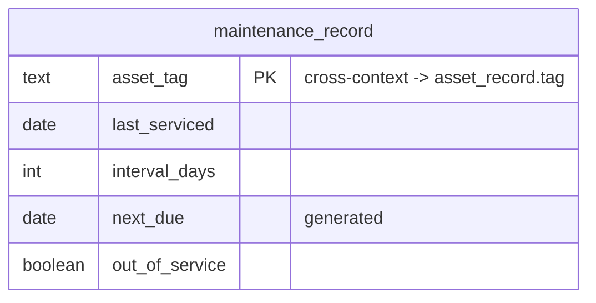

# Maintenance — Logical Data Model

Source: `docs/domain/maintenance/` (DOMAIN-0005). Sub-domain type: **supporting** (transaction
script — CRUD + one calculation). Status: draft, owner: TBD. Cross-cutting policy: see
`docs/data/INDEX.md`.

## Table: maintenance_record

| Column | Type | Key | Null | Notes |
|---|---|---|---|---|
| asset_tag | text | PK | no | **Used directly as the natural key** — the domain implies one record per physical unit (Allocation queries `IsOutOfService(assetTag)`); no separate surrogate id is added (flagged inference, domain does not literally label `assetTag` "the identifier") |
| last_serviced | date | — | no | |
| interval_days | integer | — | no | `CHECK (interval_days > 0)` |
| next_due | date | — (generated) | no | **Generated column**: `last_serviced + interval_days`. `NextDue = LastServiced + IntervalDays` — the one stated calculation |
| out_of_service | boolean | — (indexed) | no | default `false`. Read by Allocation before committing |
| created_at | timestamptz | — | no | default now() |
| updated_at | timestamptz | — | no | default now() |
| created_by | text | — | yes | Identity/Auth0 subject id, no FK |
| updated_by | text | — | yes | Identity/Auth0 subject id, no FK |

`asset_tag` is also a **cross-context reference** → Asset Sync `asset_record.tag` — no FK, even
though it doubles as this table's own primary key.

## Invariants → constraints

**None beyond the calculation.** "Nothing to keep atomically consistent beyond a single record" —
`next_due` is derived, not a business rule to enforce across rows.

## ERD

## Assumptions & gaps (flagged, not silently decided)

- **`asset_tag` as PK is an inference**, not a verbatim-stated identifier — flagged for
  confirmation (see table note above).
- **`next_due` modelled as a Postgres `GENERATED ALWAYS AS … STORED` column** rather than computed
  in application code — a projection choice, not a new business rule (the domain states the exact
  formula).
