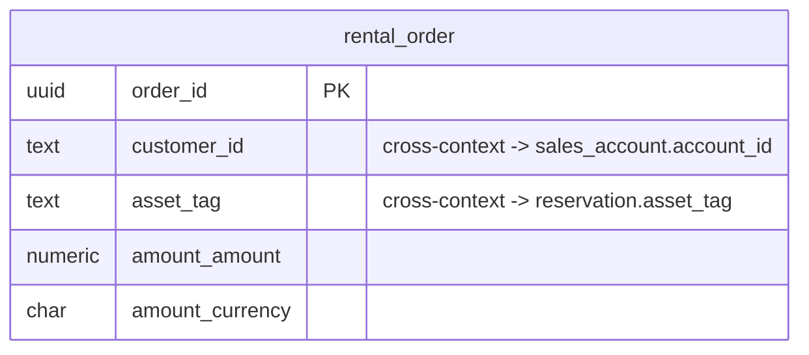

# Rentals — Logical Data Model

Source: `docs/domain/rentals/` (DOMAIN-0003). Sub-domain type: **supporting** (transaction
script). Status: draft, owner: TBD. Cross-cutting policy: see `docs/data/INDEX.md`.

## Table: rental_order (aggregate root: RentalOrder, DOMAIN-0003)

| Column | Type | Key | Null | Notes |
|---|---|---|---|---|
| order_id | uuid | PK | no | Domain names `orderId` verbatim |
| customer_id | text | — (indexed) | no | Cross-context ref → Customer Accounts `sales_account.account_id`, no FK |
| asset_tag | text | — (indexed) | no | Cross-context ref → Allocation `reservation.asset_tag`, no FK |
| amount_amount | numeric(12,2) | — | no | `Money` VO (inline) |
| amount_currency | char(3) | — | no | `Money` VO (inline). `CHECK (length(amount_currency) = 3)` |
| created_at | timestamptz | — | no | default now() |
| updated_at | timestamptz | — | no | default now() |
| created_by | text | — | yes | Identity/Auth0 subject id, no FK |
| updated_by | text | — | yes | Identity/Auth0 subject id, no FK |

Indexes: `(customer_id)`, `(asset_tag)`.

## Invariants → constraints

**None.** The domain model states no business rules for Rentals ("None captured yet — the input
states none"). No CHECK beyond NOT NULL/type shape is added. Do not invent an "order needs a
committed reservation + a valid quote" gate here — that is an explicit open question in the
domain model (`QUESTIONS.md`), not a decided invariant.

## ERD

## Assumptions & gaps (flagged, not silently decided)

- **No `version` (optimistic locking) column** — not proposed here, unlike `reservation`; this
  is a light transaction script, not the domain's flagged core/high-risk aggregate.
- **No reference to a `Quote`/`Invoice` id.** The domain model's `RentalOrder` attributes are
  exactly `[orderId, customerId, assetTag, amount]` — no `quoteId`/`invoiceId` field is stated,
  so none is added, even though Rentals functionally consumes a quote and drives an invoice.
