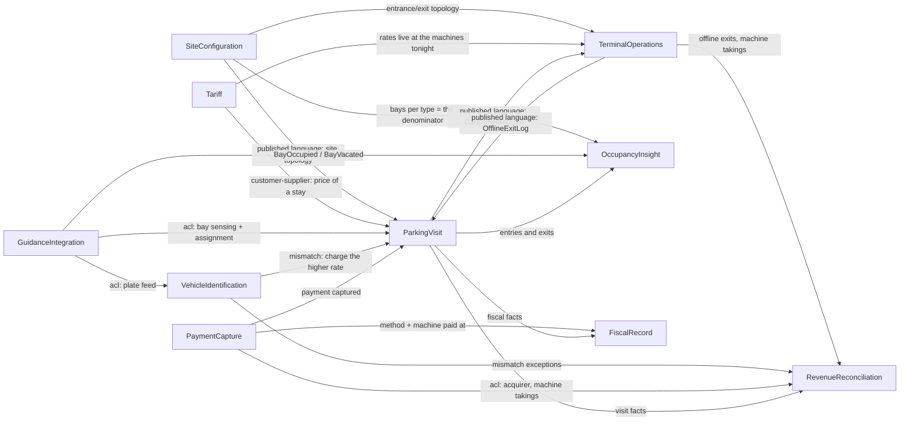

First-pass decomposition. Input: `INPUT.md`, `EXPERT.md` (2026-07-27), `business-model.md`,
`discovery/` (timeline elements 1–69, hotspots H1–H19). No code, no schema, no wiki.
Event and policy names are reused verbatim from `discovery/timeline.md`; nothing was renamed and no
event was added that the storm did not record. Boundaries are a draft to argue with, not a truth.

## Context map

## Sub-domain classification

| Bounded Context | Sub-domain type | Tactical pattern | Why |
|---|---|---|---|
| ParkingVisit | core | full-domain-model | Owns the invariants nobody else can hold: admission and substitution, amount owed, paid-is-the-truth, the 15-minute window. Both paid-for capabilities are projections of the facts it emits. |
| TerminalOperations | core | full-domain-model | Owns the stated differentiator — "the barrier must open when the network is down" — and the offline log that makes the next morning's reconciliation possible. Custom-built, deliberately priced (4–5 abuses in 15 years vs never trapping a driver). |
| RevenueReconciliation | core | full-domain-model | One of the two things the operator said they would pay for; 4 h/week/site by hand today, no product named. |
| OccupancyInsight | core | transaction-script | The other stated pay-for (rent negotiation, repaint decisions) — but it owns **no state transitions**; it projects events from others. `aggregates: []` is deliberate, see below. |
| Tariff | supporting | transaction-script | Rate cards plus one calculation. "Everybody's system does them" — the deal-breaker is self-service liveness, not the model. |
| SiteConfiguration | supporting | crud | Standing setup, edited when the lines are repainted. Table stakes: loses the deal if bad, wins nothing if good. |
| VehicleIdentification | supporting | transaction-script | Plate → class via a supplier's lookup, plus two of our rules (higher rate on mismatch, 7-day deletion). Garage only. |
| FiscalRecord | supporting | transaction-script | Compliance-enforcer, no differentiation. Append-only record + a per-country retention parameter. |
| GuidanceIntegration | generic | bought-adapter | "It is bought… nobody has ever chosen us because of the signage." Three credible suppliers; we integrate behind an ACL. |
| PaymentCapture | generic | bought-adapter | Payment mechanics excluded by `INPUT.md` §7.3 and unknown to the expert (H9). |

Four core contexts is high for ten. It is not uniform ceremony: only **three** contexts carry
aggregates (ParkingVisit, TerminalOperations, RevenueReconciliation). OccupancyInsight is core by
business value and empty by construction — H14 (does a car in a truck bay count as a car or a
truck?) and H3 (a lot observes nothing at all) must be answered before any aggregate here would be
honest. Inventing one would fake the pay-for capability.

## The load-bearing extraction seam

**`CardStripeRecord` — the magnetic stripe, as a versioned contract.** It is the one artifact that
crosses a boundary physically: ParkingVisit defines what a card must carry, every terminal reads and
rewrites it, and offline it is *allowed to win* over the system. Publish it as **Published Language**
(versioned schema: spot, paid flag, and — H10, unknown — possibly the payment time) and extract
TerminalOperations behind it first. That split is what lets the edge keep opening barriers while the
centre is unreachable, which is the behaviour the business refuses to give up.

Declined as a context of its own: a contract owns no invariants. Its owner is ParkingVisit; its
second contract, `OfflineExitLog`, runs the other way and is owned by TerminalOperations.

## Shared artifacts and their sharing level

| Artifact | Between | Level | Cost / note |
|---|---|---|---|
| `CardStripeRecord` | ParkingVisit → TerminalOperations | Published Language | Versioned; each side translates at its edge. The seam above. |
| `OfflineExitLog` | TerminalOperations → ParkingVisit, RevenueReconciliation | Published Language | Late-arriving facts; the reconciliation input. |
| Site topology (site, bay/area, type, level, entrance, exit) | SiteConfiguration → 4 contexts | Published Language | Versioned read contract, not a shared model. |
| `VehicleClass` vocabulary | SiteConfiguration, Tariff, ParkingVisit, VehicleIdentification, OccupancyInsight | **Shared Kernel risk — flagged** | A domain concept live in five contexts. Changing the class list (H16: motorcycles were never discussed) would need mutual consent across all five, and each keeping its own copy invites drift. **Recommendation:** publish the vocabulary as a versioned enumeration from SiteConfiguration (Published Language) rather than accept a shared kernel. The vocabulary itself is contested — see Conflicts row 2. |
| `Money`, time/period types | everywhere | Building Blocks | No business meaning; version like a library. |

## Declined context candidates (capability-vs-context test)

| Candidate | Why declined | What would promote it |
|---|---|---|
| Exceptions / the exceptions list | A read-model over facts owned elsewhere (unmatched exits → RevenueReconciliation, mismatches → VehicleIdentification, stuck barriers → TerminalOperations). No invariants of its own. | Workflow state on an exception — assignment, SLA, escalation, an audited decision trail. |
| Entitlement enforcement (disabled, family bays) | The expert refused the rule outright: "the machine has no way to check a disabled badge… build the report, not a rule." Nothing to enforce, so nothing to invariant. | A jurisdiction that makes badge checking machine-verifiable, or fines the operator for misuse. |
| Card / plastic asset management | The card carries no stated identity (H13); refill is an ops task with no stated rule (no stock level, no threshold). Folded into TerminalOperations. | A stated stock rule, or per-card identity used to trace a visit. |
| Remote let-out / control room | One operator command on TerminalOperations (`RemoteExitGranted`). No model. | A financial consequence for a remote let-out (H9: is a captured payment reversed?). |
| Driver / customer account | Nobody used *reservation, booking, subscription, season ticket, refund, cancellation, customer account* — `ubiquitous-language.md` says do not introduce them. | The business selling a subscription or a season ticket. |
| Audit / activity history | Not raised by anyone. The regulated case that would normally promote it is already carved out as FiscalRecord. | — |

## The boundary decision this map does not settle: garage vs lot

Discovery's strongest finding is that **garage and lot are two domains wearing one vocabulary** —
bay vs area, sensed vs unknowable, released vs never held. This map takes the *cheaper* of the two
readings: one `ParkingVisit` context with a polysemic `AssignedSpot` value object, and the divergence
isolated in the contexts that simply do not exist for a lot (GuidanceIntegration) or cannot be
produced for one (OccupancyInsight, H3).

- **For a split** (`GarageParking` / `LotParking`): the language changes meaning at every step; the
  admission invariant "no ticket when full" may be *unimplementable* in a lot (H2 — nothing counts);
  the paid-for occupancy report has no source in a lot (H3); "managed bay", the revenue unit, may be
  meaningless in a lot (H17).
- **Against**: entry → ticket → pay → exit is stated identically for both; one tariff model, one
  fiscal record, one terminal fleet; a split duplicates the whole visit lifecycle to express three
  absences.

Answer H2, H3 and H17 before this is decided. If a lot turns out to have no admission control and no
occupancy source, the honest model is two contexts, not one with holes.

## Conflicts & reconciliation

| Concept | Source A | Source B | Chosen | Flag for human |
|---|---|---|---|---|
| Parking spot | `INPUT.md` §3, §5: one uniquely identified spot; the ticket carries a spot ID | Expert: bay in a garage, **area** in a lot — "same field, different meaning"; nothing is held in a lot | Expert | Confirm with the sponsor that the brief's single "spot" is dropped for a polysemic `AssignedSpot`. |
| Vehicle type | `INPUT.md` §2 lists handicapped and family-friendly *as vehicle types* | Expert: those are **entitlements of the person**, not the vehicle, and no machine rule exists for them | Expert | The brief's requirement is refused, not implemented. Needs the sponsor's sign-off. |
| Who assigns the bay | `INPUT.md` §11: the guiding system "recognizes the vehicle and guides it to the right parking spot" | Expert: the entrance ticket already names the bay ("level 3, bay 212") | **Unresolved (H1)** — provisionally: GuidanceIntegration supplies free bays and the assignment, ParkingVisit consumes it | Blocks the integration contract. Do not build until H1 is answered. |
| Retention period | `INPUT.md` §6: 10 years, flat | Expert: DE/AT 10, NL 7, FR unknown — "do not build ten years into the code" | Expert | Retention is per-country configuration; the number is a tax adviser's answer (H8). |
| Terminal types | `INPUT.md` §7 names three types | `INPUT.md` §7.1–7.4 describes four behaviours (H11) | **Unresolved** — `Terminal` carries a role; the role set is left open | Entrance topology and site setup depend on it. |
| Plate after 7 days | Expert: deletion at 7 days is "not negotiable", agreed with the works council | Expert: an unmatched exit is "occasionally… sent to the plate we captured" | **Unresolved (H7)** — both recorded, neither dropped | Legal/works council. A claim past day 7 has no subject. |

## Event-flow continuity check

Every emitted event, and who consumes it. Gaps are listed, not filled.

| Event (emitter) | Consumer |
|---|---|
| `SiteConfigured`, `SiteLayoutRevised` (SiteConfiguration) | ParkingVisit, TerminalOperations, OccupancyInsight, GuidanceIntegration |
| `TariffChanged` (Tariff) | ParkingVisit (pricing), TerminalOperations (live at the machines that evening) |
| `VehicleClassDeclared`, `TicketIssued`, `AreaAssigned`, `EntryRecorded` (ParkingVisit) | TerminalOperations (stripe write, barrier), OccupancyInsight |
| `TicketPaid`, `AdditionalPaymentCollected`, `LostTicketCharged`, `ReplacementCardIssued` (ParkingVisit) | TerminalOperations (stripe), RevenueReconciliation, FiscalRecord |
| `VehicleExited` (ParkingVisit) | OccupancyInsight, FiscalRecord, RevenueReconciliation |
| `SpotWrittenToStripe`, `PaidStatusWrittenToStripe`, `EntryBarrierOpened`, `ExitBarrierOpened`, `CardCollected` (TerminalOperations) | ParkingVisit |
| `OfflineExitGranted`, `OfflineExitLogged`, `OfflineExitLogUploaded` (TerminalOperations) | ParkingVisit (late exit), RevenueReconciliation (`UnmatchedExitFlagged`) |
| `BayOccupied`, `BayVacated`, `BayAssigned` (GuidanceIntegration) | OccupancyInsight; ParkingVisit (assignment, H1) |
| `PlateRead`, `VehicleClassLookedUp`, `VehicleClassMismatchDetected` (VehicleIdentification) | ParkingVisit (higher rate), RevenueReconciliation (exceptions) |
| `TakingsReconciled`, `UnmatchedExitFlagged`, `ExceptionWrittenOff`, `ClaimSentToPlateHolder` (RevenueReconciliation) | Site-manager read-models; `ClaimSentToPlateHolder` collides with the 7-day rule (H7) |
| `FiscalRecordRetained` (FiscalRecord) | Terminal by design — the consumer is the tax auditor, an external actor |

**Unconsumed or unowned — real modelling gaps, not omissions:**

- `EntryRefused` — reaches only the FULL sign at the entrance. Nobody said a refusal is counted,
  reported or reconciled; a lot may not be able to raise it at all (H2).
- `CardsRefilled` — nothing consumes it. No stock level, threshold or alert was ever stated.
- `BarrierStuckOpen` — appears on the exceptions list with **no stated emitter** (H5): sensor,
  control room or a person noticing? Until H5 is answered, no context can honestly own it.
- `RemoteExitGranted` — consumed by nobody. A driver leaves whose payment state is unknown, and
  no reversal or refund concept exists in the language (H9).
- `PatrolNoticeIssued` — emitted by a person outside the system, consumed by nobody. The report the
  expert actually asked for cannot be built as described (H6: no badge check, plates gone at 7 days,
  lots have no sensors).
