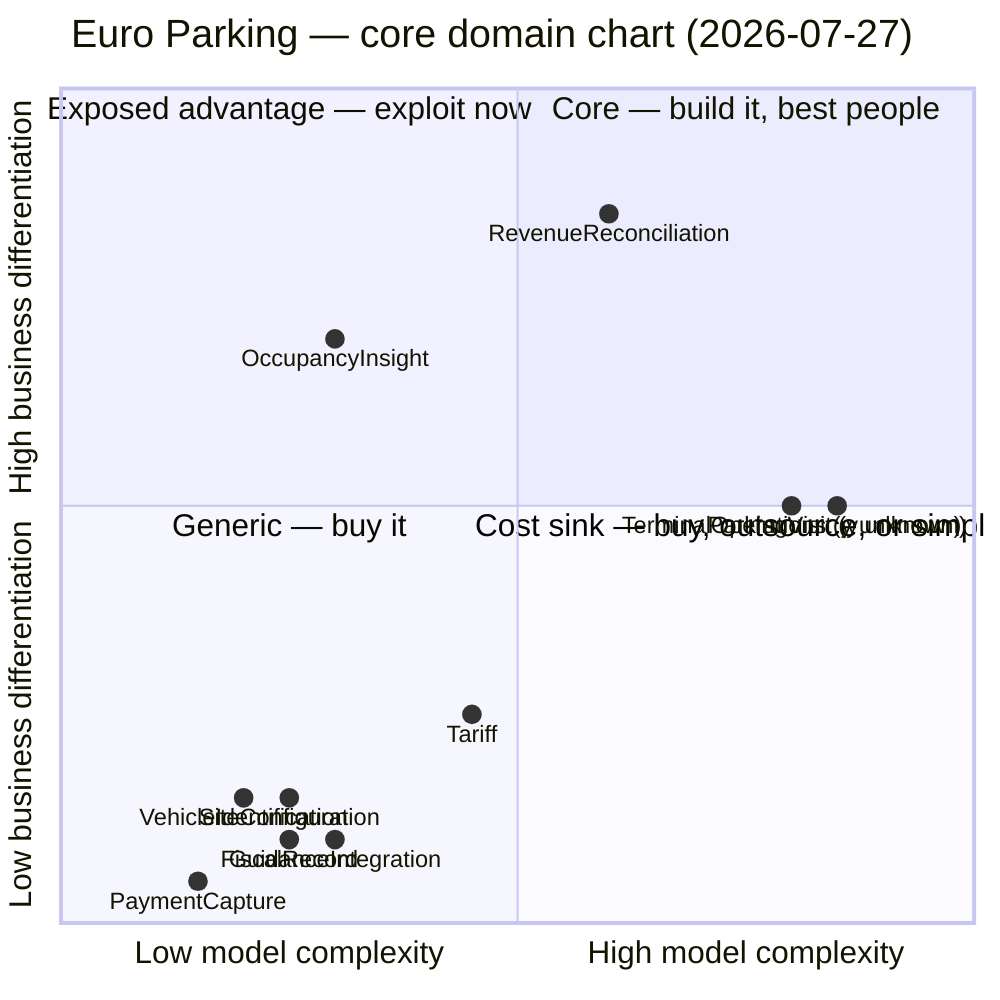

## How this was assessed

**Nobody was in the room.** Sources: the ten `model.yaml` files, `context-map.md`,
`message-flows/` (4 flows + counting checks), `business-model.md`, `EXPERT.md` (2026-07-27,
transcript). No code, no schema, no wiki; the expert is unavailable for follow-up.

- **x (complexity)** — counted from `model.yaml` and the flow tables, then adjusted with a stated
  reason. There is no implementation, so **accidental complexity cannot be assessed at all**: every
  x describes a model written yesterday, not software anyone has paid to maintain. The usual trap
  (thirty tables that nobody dared refactor) is absent by construction, and so is the evidence that
  would rule it out. Re-run this axis once code exists.
- **y (differentiation)** — taken only from the capability table in `business-model.md`, which is
  itself one expert's account relayed second-hand. No founder, no product owner, no operator buyer,
  no competitor scan. Two contexts stay `unknown` and are plotted on the mid-line to say so.
- **Who is missing, and it shows:** the founder (Q1, Q2, Q9–Q11), an operator's buyer (Q12), a
  market scan (Q14), a sensor field test (H4), a lot site manager (H2, H3). The strongest y claim
  in this chart — *reconciliation differentiates* — rests on one man's word and was never checked.

## Chart

The two dots on the mid-line are not a placement. They mark the conversation that has not happened.

## Placement

| Context | x | Evidence (measured) | Adjustment (judged) | y | Source | Quadrant |
|---|---|---|---|---|---|---|
| ParkingVisit | 0.85 | 1 agg · 6 VO · 10 events · **9 invariants** · 9 relationships; in 4/4 flows | +0.10 — pricing, the 15-min window and the substitution matrix are real rules and nothing buyable holds them; H16 says the matrix is still partial | **unknown** | business-model: "never asked whether a competitor doing this better costs deals" | *unplaced* — cost sink if y is low |
| TerminalOperations | 0.80 | 2 agg · 3 ent · 12 events · 5 invariants | +0.25 — partition-tolerant by requirement, not by choice: the barrier decides offline, a physical card fleet, tariff push live to the machines | **unknown** | brand damage from trapping a driver is severe (EXPERT); copy-difficulty and win-rate never asked | *unplaced* — cost sink if y is low |
| RevenueReconciliation | 0.60 | 1 agg · 4 events · 4 invariants | +0.25 — 4 h/week/site on a spreadsheet today, and 2 of the 3 match legs (bank, coin box) have **no emitter at all** (flow finding 4.3). Operational complexity the software has not absorbed | 0.85 | EXPERT: one of two stated pay-fors, no product named — unchecked (Q14) | **Core** |
| OccupancyInsight | 0.30 | 0 agg · 0 events · 0 invariants | +0.20 — the hard part is definitional, not structural: H14 (car in a truck bay counts as which?), H3 (a lot observes nothing), H4 (are sensors trustworthy) | 0.70 | EXPERT: the other pay-for; the number taken to the landlord | **Exposed advantage** |
| Tariff | 0.45 | 0 agg · 4 terms · 1 calculation | +0.30 — per started 15 min · free-first-15 · daily cap · night/weekend · per site per class, plus live-to-the-edge propagation and H15 (rate change mid-stay). Under-modelled, not simple | 0.25 | "everybody's system does them"; self-service liveness is a purchase condition, not an advantage | Generic (mission-critical parity) |
| GuidanceIntegration | 0.30 | 0 agg · 3 events · 4 relationships | +0.15 — three suppliers behind one ACL; garage only | 0.10 | "nobody has ever chosen us because of the signage" | Generic |
| SiteConfiguration | 0.25 | 0 agg · 7 terms · 4 consumers | +0.10 — publishes the `VehicleClass` vocabulary into 5 contexts (shared-kernel risk, context-map) | 0.15 | "loses the deal if bad, wins nothing if good" | Generic (parity) |
| FiscalRecord | 0.25 | 0 agg · 2 terms · 1 event | +0.15 — per-country retention (DE/AT 10, NL 7, FR unknown — H8), 10-year immutability, and H13: nothing identifies the visit it belongs to | 0.10 | compliance-enforcer, recorded `no` | Generic (mission-critical parity) |
| VehicleIdentification | 0.20 | 0 agg · 3 terms · 2 rules + a deletion timer | none — the supplier does the lookup | 0.15 | recorded `no` | Generic |
| PaymentCapture | 0.15 | 0 agg · 0 events · 0 invariants | **floor, not a value** — `INPUT.md` §7.3 excludes the mechanics and H9 is open; x here measures our ignorance | 0.05 | commodity, recorded `no` | Generic |

## Decisions

| Context | Build / buy / outsource | Modelling rigour | Team type implied | Rationale |
|---|---|---|---|---|
| RevenueReconciliation | **Build** | Full domain model — it has one thin aggregate and deserves more | Long-lived stream-aligned owner | The only context that clears both axes on sourced evidence. Kill criterion: if Q14 returns "two vendors already ship this", it drops to parity and this whole chart is re-run. |
| OccupancyInsight | **Build thin, ship fast** | Deliberately light; a projection, no aggregate | Small pioneer team, fixed budget, permission to fail | A report over events others emit. Real advantage, cheap to copy — and the sensors belong to a supplier who could ship the same report. Do not architect it. |
| ParkingVisit | **Build** (nothing buyable holds these invariants) | **Decision deferred** — how deep a model it earns depends on a y nobody has sourced | Cannot be decided yet | Core by necessity and by inevitability, not by demonstrated differentiation. Building it is forced; over-investing in it is a choice nobody has justified. |
| TerminalOperations | **Build** the edge behaviour; hardware is already bought at cost | **Decision deferred** — same reason | Cannot be decided yet | Do not outsource regardless: it is the load-bearing extraction seam (`CardStripeRecord`), and offline autonomy is the behaviour the business refuses to give up. |
| Tariff | Build thin | Transaction script + versioning (H15) | Service consumed | The deal-breaker is *liveness* — a deployment property — not the model. Build the propagation path, not the domain model. |
| SiteConfiguration · FiscalRecord · VehicleIdentification · GuidanceIntegration · PaymentCapture | **Buy / adapt** — thin adapters, contract tests at the seam | No domain model | Nobody's full-time job | Four are already someone else's product (guidance, plate lookup, acquirer, archival storage). FiscalRecord is mission-critical parity: a GoBD failure loses Germany, and Germany is the first market. |

At start-up size these are **sequencing instructions, not an org chart**: one team will build most of
this. The chart says what to model deeply and what to keep thin, not who to hire.

## Investment mismatch

> **The two capabilities the operator said they would pay for carry 4 of the 26 declared domain
> events (15%) and 4 of the 18 invariants (22%) between them — one has a single thin aggregate,
> the other has none at all. Meanwhile 78% of the invariants and 85% of the events sit in two
> contexts whose differentiation nobody has ever assessed.**

| Context | Model mass | Differentiation | Mismatch |
|---|---|---|---|
| ParkingVisit + TerminalOperations | 3 of 4 aggregates · 22 of 26 events · 14 of 18 invariants | **unknown** | Effort is concentrated where the commercial question was never asked. If y is low, this is the system's cost sink and it is already 78% of the model. |
| RevenueReconciliation | 1 aggregate, 4 invariants; `model.yaml` calls it "thinnest aggregate relative to its business value" | 0.85 (highest sourced) | **The differentiator is under-invested** — and it is the more urgent direction. Two of its three reconciliation legs have no emitter anywhere in the model. |
| OccupancyInsight | 0 aggregates, 0 events, 0 invariants | 0.70 | The second pay-for is entirely unmodelled. Partly honest (H3, H4, H14 block it), which makes the block itself the priority, not the model. |
| Tariff | 0 aggregates, 4 terms | 0.25 | Inverse but benign: low mass, low differentiation. The risk is the opposite one — the +0.30 adjustment says it is more complex than the model admits, so it is under-modelled for its own complexity. |

This is not a new finding. `discovery/README.md` finding 5 already says the two pay-fors are the two
the session covered least. The chart converts that observation into counts, and shows the same
imbalance survived decomposition and message-flow modelling unchanged.

## Trajectory

| Context | Today | Expected | Trigger that confirms the move |
|---|---|---|---|
| RevenueReconciliation | Core (custom-built; done by hand across the industry) | Parity within 2–3 years once someone productises it | A competitor's release notes, or an operator saying "X already does this". Q14 means the clock may have run out already. |
| OccupancyInsight | Exposed advantage (custom-built) | Generic — or core, one of the two | Down: a guidance supplier ships occupancy reporting off their own sensors; they are better placed than we are. Up: the H4 field test passes and occupancy-based pricing becomes real. |
| ParkingVisit / TerminalOperations | Unplaced | Resolves to core or cost sink; no middle | The first competitive loss with a stated reason — that is the cheapest evidence available and it costs nothing to start recording it. |
| Tariff | Product-stage parity | Stays | None plausible. |
| FiscalRecord | Parity | Cost sink | A fourth country with a fifth rule, or an auditor demanding a certified archive format. Externalise the retention period now (H8) and the move stays cheap. |
| GuidanceIntegration / PaymentCapture | Commodity | Stays | — |

The migration-planning variant of this chart does not apply: there is no existing architecture to
migrate from. Build order is already named in `business-model.md` — one garage, setup → tariff →
ticket → pay → exit → next-morning reconciliation.

## Disagreements with the current classification

| Context | `subdomain_type` today | Chart says | Proposed delta |
|---|---|---|---|
| TerminalOperations | `core` — justified as "owns the stated differentiator: the barrier must open when the network is down" | **Not sourced.** The expert called it the worst thing that can happen to them, never something customers choose them for; `business-model.md` records that capability's differentiation as `unknown`. A no-trap fallback is also a policy a competitor implements in a sprint. | Downgrade to `supporting` **pending an answer**, or add `differentiation: unsourced` to the record. At x 0.80 with a low y this is the cost sink of the system. |
| ParkingVisit | `core` | Agrees on the label, disagrees on the reason. It is core because it holds invariants nothing buyable holds — necessity, not demonstrated advantage. | Keep `core`; record that the justification is inevitability. It changes the *depth* decision, not the label. |
| OccupancyInsight | `core` + `transaction-script` | Agrees. High y, low x — the three-way label cannot express *exposed advantage*, but the tactical pattern already does. | None. Add the trajectory note: exploit now, expect parity. |
| Whole map | **4 core contexts of 10** | On sourced evidence, **one** is core (RevenueReconciliation) and one is an exposed advantage (OccupancyInsight). The other two "core" labels rest on complexity and on an unsourced differentiation claim. | Neither of the two contexts holding 78% of the invariants is core on evidence. That is the finding this step exists to produce. |

## Open questions

- **Q14 (business-model) — does any competitor already productise reconciliation?** The single load-bearing y value in this chart. *A market scan; whoever will sell this.*
- **The question never asked at all: does a competitor doing entry/exit or offline exit better cost us deals?** Until someone answers it, 78% of the model is unplaced. *The founder, plus win/loss notes from the first ten sales conversations.*
- **H4 — are the bay sensors accurate enough to report, let alone bill, from?** Decides whether OccupancyInsight is an advantage or a liability. *Sensor supplier + a field test.*
- **H2, H3, H17 — does any of this hold for a lot?** A lot has no occupancy source, possibly no admission control, and possibly no meaningful "managed bay" — the revenue unit itself. If the answers are no, half this chart is a garage chart. *A lot site manager + the founder.*
- **Q1, Q9–Q12 — cost structure, key resources, segments, fee level, who signs.** Build/buy economics are unpriced without them. *The founder.*
- **Who has to be in the room to close this:** the founder and whoever sells, for one hour, on the y axis alone. No engineer can supply it, and this chart should not be acted on until they have.
