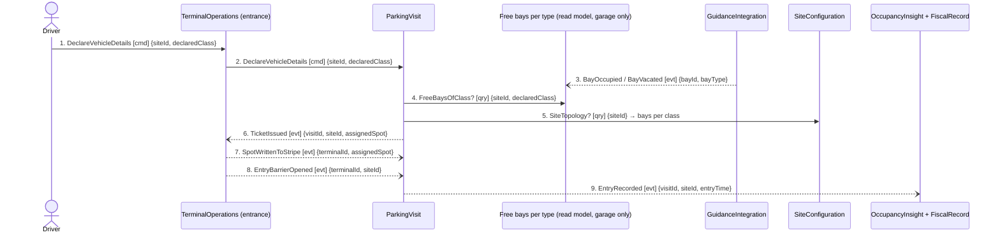

## Scenario

A driver arrives at a **garage** entrance, types their vehicle class into the terminal, and is
admitted: the card is written with a bay ("level 3, bay 212"), the barrier opens, and the entry time
is recorded. "Done" is the driver inside the site with a card that names where to park. This is the
design's own story — the path the whole product assumes. The **lot** variant of this scenario is
deliberately not drawn as a second flow; where it diverges is a finding below.

## Flow

| # | From | Message | Type | Contents | To |
|---|---|---|---|---|---|
| 1 | Driver | `DeclareVehicleDetails` | command | siteId, declaredClass | TerminalOperations (entrance) |
| 2 | TerminalOperations | `DeclareVehicleDetails` | command | siteId, declaredClass | ParkingVisit |
| 3 | GuidanceIntegration | `BayOccupied` / `BayVacated` | event | bayId, bayType | free-bays read model *(arrives out of band, before the driver)* |
| 4 | ParkingVisit | `FreeBaysOfClass?` * | query | siteId, declaredClass → count per type | free-bays read model |
| 5 | ParkingVisit | `SiteTopology?` * | query | siteId → bays per class, entrances | SiteConfiguration |
| 6 | ParkingVisit | `TicketIssued` | event | visitId, siteId, assignedSpot | TerminalOperations |
| 7 | TerminalOperations | `SpotWrittenToStripe` | event | terminalId, assignedSpot | ParkingVisit |
| 8 | TerminalOperations | `EntryBarrierOpened` | event | terminalId, siteId | ParkingVisit |
| 9 | ParkingVisit | `EntryRecorded` | event | visitId, siteId, entryTime | OccupancyInsight, FiscalRecord |

Provenance: every named message is `discovery/timeline.md` (7, 11, 12, 14, 15, 16, 23, 24) or the
emitting context's `model.yaml`. Queries marked `*` carry a modeller's name — the *relationship* is
typed `query` in `parking-visit/README.md`, but no source names the message. Queries are drawn with
their response as one message, per the notation.

**Counts:** 9 messages (at the ceiling, not over it) · 6 distinct contexts · 2 cross-boundary queries
· longest synchronous chain 3 hops (Driver → Terminal → ParkingVisit → SiteConfiguration).

## Findings

| # | Smell | Evidence (messages) | What it suggests | Proposed change |
|---|---|---|---|---|
| 1.1 | Distributed invariant | 3 → 4 → 6: "no ticket when the site is full" is ParkingVisit's invariant, but the capacity truth is the supplier's sensors, reached through a projection | the rule is enforced against stale state; the expert named a compensation only for the *taken bay* case (timeline #25 — "drive on, take the next"), never for a ticket issued into a full site | PC-2: ParkingVisit owns the free-bay projection explicitly **and** the business names the compensation for admitting into a full site. Gated on H4 (are sensors trustworthy?) |
| 1.2 | Pass-through | 1 → 2: the entrance terminal forwards the declaration and decides nothing | a hop, on the read of this flow alone | **Do not delete it yet** — H18 is open: if the entrance terminal must issue a ticket with the network down, it decides alone and the hop is a boundary. Answer H18 first |
| 1.3 | Too many contexts | 6 distinct contexts for one admission (threshold 4); 4 of them before the barrier opens | one capability spread across four owners on the critical path | folded into PC-2 — a projection inside ParkingVisit removes GuidanceIntegration and SiteConfiguration from the synchronous path |
| 1.4 | Flow does not render for a lot | 3, 4 have no source in a lot (no sensors — H2/H3); 6's `assignedSpot` degrades from bay to area | garage and lot are not one flow with a flag: 2 of 9 messages simply do not exist | PC-5: evidence for the garage/lot split the context map left undecided. Still blocked on H2, H3, H17 |
| 1.5 | Ownership unresolved | 6 assumes ParkingVisit chooses the bay | if the supplier's guidance system assigns (H1, `INPUT.md` §11), 4 and 6 reverse and GuidanceIntegration becomes upstream of admission | none — H1 blocks the integration contract; do not build |

Message 6 is a broadcast fact and messages 7–9 need no response, so the *post*-decision half of this
flow is clean. The coupling is all in messages 3–5.

## Open questions

- H1 — does our terminal choose the bay, or the supplier's guidance system? *Expert + a guidance supplier.*
- H2 / H3 — in a lot, what makes "full" knowable, and what produces occupancy at all? *Expert / a lot site manager.*
- H4 — are the bay sensors accurate enough to decide admission from? *Sensor supplier + field test.*
- H18 — what does an entrance terminal do when the network is down: refuse, or issue a ticket it cannot register? *Expert.*
- H13 — message 6 carries `visitId`, which is the modeller's invention; nobody named what identifies a visit. *Expert.*
