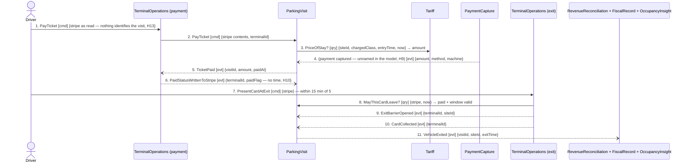

## Scenario

The driver pays at a payment terminal, walks to the car and drives out through an exit terminal
**within fifteen minutes**. This is the scenario the money runs through: the operator's parking
revenue, the fiscal record a tax auditor will ask for in ten years, and the machine takings that the
next morning's reconciliation matches. "Done" is the barrier open, the card kept by the machine, and
one fiscal record written. Temporal relation: **within** 15 minutes of message 5 — past it the exit
refuses the card (drawn as `DOMAIN-FLOW-0003`).

## Flow

| # | From | Message | Type | Contents | To |
|---|---|---|---|---|---|
| 1 | Driver | `PayTicket` | command | the stripe as read: assignedSpot, paidFlag — **nothing on it identifies the visit** (H13) | TerminalOperations (payment) |
| 2 | TerminalOperations | `PayTicket` | command | stripe contents, terminalId | ParkingVisit |
| 3 | ParkingVisit | `PriceOfStay?` * | query | siteId, chargedClass, entryTime, now → amount | Tariff |
| 4 | PaymentCapture | *(payment captured — no name exists)* | event | amount, method, machine paid at | ParkingVisit |
| 5 | ParkingVisit | `TicketPaid` | event | visitId, amount, paidAt | TerminalOperations, RevenueReconciliation, FiscalRecord |
| 6 | TerminalOperations | `PaidStatusWrittenToStripe` | event | terminalId, paidFlag | ParkingVisit |
| 7 | Driver | `PresentCardAtExit` | command | stripe | TerminalOperations (exit) |
| 8 | TerminalOperations | `MayThisCardLeave?` * | query | stripe, now → paid, window still valid | ParkingVisit |
| 9 | TerminalOperations | `ExitBarrierOpened` | event | terminalId, siteId | ParkingVisit |
| 10 | TerminalOperations | `CardCollected` | event | terminalId | ParkingVisit |
| 11 | ParkingVisit | `VehicleExited` | event | visitId, siteId, exitTime | FiscalRecord, RevenueReconciliation, OccupancyInsight |

Provenance: named messages from `discovery/timeline.md` (28, 29, 35, 37, 38) and the emitting
`model.yaml`. `*` = the relationship is typed `query` in the decompose READMEs but no source names
the message. Message 4 is drawn **unnamed on purpose** — see finding 2.3.

**Counts:** **11 messages** · 7 distinct contexts · 2 cross-boundary queries · ParkingVisit ↔
TerminalOperations exchange 2, 5, 6, 8, 9, 10 = **6 of 11**.

## Findings

| # | Smell | Evidence (messages) | What it suggests | Proposed change |
|---|---|---|---|---|
| 2.1 | **Over the message budget** | 11 messages in one scenario | **more than 9 messages in one scenario ⇒ go back and re-cut.** Not two scenarios: pay and exit are held together by the 15-minute window, and `parking-visit/README.md` states they must stay in one aggregate for exactly that reason. So the overflow is the boundary, not the scenario | PC-1 |
| 2.2 | Chatty pair | 6 of 11 messages are ParkingVisit ↔ TerminalOperations (threshold ≥5), more than either exchanges with anyone else; the pair is already typed `partnership` | high cohesion the boundary cuts through — but the split is deliberate (the offline seam, `DOMAIN-FLOW-0004`) | PC-1: move the exit decision to the edge rather than merge — the same decision is taken alone in 4 messages offline |
| 2.3 | The money leg has no message | 4: `PaymentCapture` has `aggregates: []` and emits no named event anywhere in `docs/domain/`; the context map records the edge only as "payment captured" | the flow the business is paid through cannot be drawn without inventing an event. Inventing `PaymentCaptured` here would validate the design against fiction | D-1 to `2-discover`: get the fact named. Gated on H9 |
| 2.4 | No correlation identity | 1: the card carries `assignedSpot` and `paidFlag`; the same plastic serves ~100 visits | messages 1–2 cannot state what visit they are about, yet message 11 must produce a fiscal record that outlives the card by a decade | D-5 / H13 — the identity of the central concept is unnamed |
| 2.5 | One rule, two enforcements | 6 writes `paidFlag` and **not** `paidAt` (H10); 8 enforces the window from the system | the exit obeys a different rule online (system, window enforced) and offline (stripe, window unenforceable). Nobody stated that the window is dropped offline | PC-1 option A depends on resolving this: a stripe carrying `paidAt` makes one rule serve both |
| 2.6 | Too many contexts | 7 distinct contexts (threshold 4); 4 of them are terminal consumers of broadcasts (5, 11) | the fan-out is fine — it is events, no responses. The cost is concentrated in 2–8 | none |

## Open questions

- H9 — how does a terminal reach the acquirer, and what is the captured payment's fact called? *Terminal / acquirer supplier.*
- H10 — does the stripe carry the payment time? *Expert + terminal supplier.*
- H13 — what identifies a visit, as distinct from the card it was written on? *Expert.*
- H15 — message 3 prices a stay that may have crossed a rate change or a night/weekend boundary. *Expert.*
- New — is message 8 a query at all, or does the exit terminal always decide from the stripe and let the system correct it later? Nobody described the online exit; only the offline one. *Expert.*
