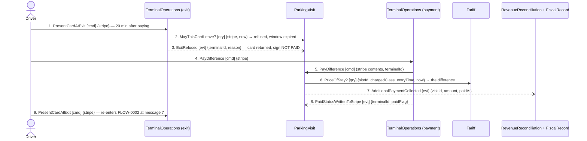

## Scenario

The driver paid, then took twenty minutes to reach the exit. The exit terminal gives the card back
and the barrier stays down; the driver walks to the payment machine before the exit, pays the
difference, and comes back. "Done" is the driver out, having paid twice. The expert called this "a
standing complaint from customers and we are not changing it" — the round trip is a business
decision, so this flow is not asking whether to remove it. It is asking what the model has to say
while it happens. Temporal relation: **within** 15 minutes of the payment; this flow is the branch
where that deadline expired.

## Flow

| # | From | Message | Type | Contents | To |
|---|---|---|---|---|---|
| 1 | Driver | `PresentCardAtExit` | command | stripe | TerminalOperations (exit) |
| 2 | TerminalOperations | `MayThisCardLeave?` * | query | stripe, now → refused: window expired | ParkingVisit |
| 3 | TerminalOperations | `ExitRefused` | event | terminalId, reason | ParkingVisit |
| 4 | Driver | `PayDifference` | command | stripe | TerminalOperations (payment) |
| 5 | TerminalOperations | `PayDifference` | command | stripe contents, terminalId | ParkingVisit |
| 6 | ParkingVisit | `PriceOfStay?` * | query | siteId, chargedClass, entryTime, now → **the difference** — the deduction rule is unstated | Tariff |
| 7 | ParkingVisit | `AdditionalPaymentCollected` | event | visitId, amount, paidAt | TerminalOperations, RevenueReconciliation, FiscalRecord |
| 8 | TerminalOperations | `PaidStatusWrittenToStripe` | event | terminalId, paidFlag | ParkingVisit |
| 9 | Driver | `PresentCardAtExit` | command | stripe | TerminalOperations (exit) |

Provenance: `discovery/timeline.md` (29, 32, 33, 35, 36) and the emitting `model.yaml`. `*` = query
relationship typed in the decompose READMEs, message name is the modeller's. The payment leg
(`PaymentCapture`) is omitted here for the same reason it is unnamed in `DOMAIN-FLOW-0002` (H9);
drawing it twice would not add evidence.

**Counts:** 9 messages (at the ceiling) · 5 distinct contexts · 2 cross-boundary queries ·
ParkingVisit ↔ TerminalOperations exchange 2, 3, 5, 7, 8 = **5 of 9** · longest synchronous chain 3
hops (Driver → payment terminal → ParkingVisit → Tariff).

## Findings

| # | Smell | Evidence (messages) | What it suggests | Proposed change |
|---|---|---|---|---|
| 3.1 | Two refusals, one event | 3: `ExitRefused {terminalId, reason}` covers both "unpaid" and "paid but the window expired". The expert stated the sign text — NOT PAID — only for the **unpaid** case | a driver who has paid is told NOT PAID. Two different domain outcomes wearing one name, and the second one's words were never spoken | D-2 to `2-discover`: is the expired-window refusal a distinct event, and what does the sign say? |
| 3.2 | Priced by an unstated rule | 6 asks Tariff for "the difference" — no source says whether it is priced from `paidAt` or from entry with the first payment deducted, nor whether the daily cap applies a second time | the message exists in the language (`AdditionalPaymentCollected`, timeline #33) but its amount does not. This is a gap, not an inference to fill | D-3 to `2-discover` |
| 3.3 | Chatty pair — corroborated | 5 of 9 between ParkingVisit and TerminalOperations, after 6 of 11 in `DOMAIN-FLOW-0002` | the heuristic says check the other flows before calling a chatty pair; two flows out of four now clear the threshold, and a third (`DOMAIN-FLOW-0004`) shows the pair silent because the link is down | PC-1 — the evidence is now cross-flow, not one diagram |
| 3.4 | Return to start, by design | 1 and 9 are the same message; the scenario ends where it began | not a boundary defect: the expert priced this round trip and refused to change it. Recorded so the next reviewer does not re-open it | none — declined by the business in advance |
| 3.5 | Missing message at the end | after 8, nothing states whether a **fresh** 15-minute window starts | if it does not, a slow driver can be refused twice; if it does, `paidAt` is overwritten and the fiscal record's payment time changes | D-3 (same question, same person) |

The two queries are not chained, and no context on this path decides something it does not own —
the refusal is TerminalOperations' to make and the amount is ParkingVisit's to compute. The
coupling cost here is lower than in `DOMAIN-FLOW-0002`; what this flow exposes is missing language,
not a misplaced boundary.

## Open questions

- New (D-2) — is the expired-window refusal its own event, and what does the sign show a driver who has already paid? *Expert.*
- New (D-3) — how is the difference computed, does the daily cap apply again, and does a fresh window start? *Expert.*
- H15 — message 6 reprices a stay that may have crossed a rate change. *Expert.*
- H12 — the same two questions bite harder for the lost-ticket path (the daily cap "for that vehicle class", chosen with no visit to look up). Not drawn here; it is a fourth scenario nobody has answered enough to model. *Expert.*
