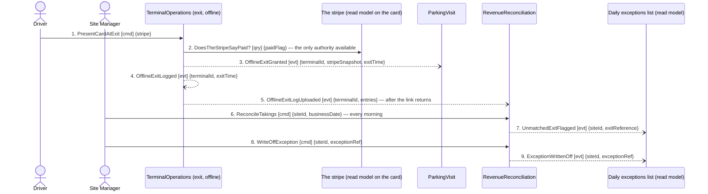

## Scenario

The exit terminal cannot reach the system. It reads the stripe, the stripe says paid, the barrier
opens — "a driver trapped in a garage at 2am … ends up in the local paper." The terminal logs what
it did and uploads it when the link returns; the next morning the site manager reconciles and works
the exceptions list. "Done" is the driver out at 2am and the exception resolved by a human by 09:00.
Chosen as the fourth flow because it is the hotspot: the stated differentiator, the load-bearing
extraction seam, and one of the two capabilities operators said they would pay for. Temporal
relations: message 5 **after** the link returns (no stated bound); message 6 **every** morning.

## Flow

| # | From | Message | Type | Contents | To |
|---|---|---|---|---|---|
| 1 | Driver | `PresentCardAtExit` | command | stripe | TerminalOperations (exit) |
| 2 | TerminalOperations | `DoesTheStripeSayPaid?` * | query | paidFlag → yes | the stripe (read model on the card) |
| 3 | TerminalOperations | `OfflineExitGranted` | event | terminalId, stripeSnapshot, exitTime | (nobody, until 5) |
| 4 | TerminalOperations | `OfflineExitLogged` | event | terminalId, exitTime | own `OfflineExitLog` |
| 5 | TerminalOperations | `OfflineExitLogUploaded` | event | terminalId, entries | ParkingVisit, RevenueReconciliation |
| 6 | Site Manager | `ReconcileTakings` | command | siteId, businessDate | RevenueReconciliation |
| 7 | RevenueReconciliation | `UnmatchedExitFlagged` | event | siteId, exitReference | daily exceptions list |
| 8 | Site Manager | `WriteOffException` | command | siteId, exceptionRef | RevenueReconciliation |
| 9 | RevenueReconciliation | `ExceptionWrittenOff` | event | siteId, exceptionRef | daily exceptions list |

Provenance: `discovery/timeline.md` (35, 39, 41, 42, 45, 47, 48, 51) and the emitting `model.yaml`.
`*` = the stripe read is stated behaviour ("it reads the stripe") but no source names the message.

**Counts:** 9 messages · **3 distinct contexts** · 0 queries crossing a *context* boundary (message 2
reads a card in the terminal's own hand) · longest synchronous chain 1 hop.

## Findings

| # | Smell | Evidence (messages) | What it suggests | Proposed change |
|---|---|---|---|---|
| 4.1 | **Clean — record it** | 1–4: the exit decision is taken at the edge in four messages with no boundary crossed, against the six it took in `DOMAIN-FLOW-0002` | the TerminalOperations / ParkingVisit split earns its keep offline and costs six messages online. The seam the context map calls load-bearing is confirmed by motion, not by opinion | none — evidence *for* the boundary |
| 4.2 | Consumer with no consequent | 5 delivers the exit to ParkingVisit and nothing follows: no `VehicleExited`, no exit time reaching FiscalRecord | the fiscal record must hold an exit time for ten years, and this path produces none. A driver who leaves offline may have no compliant record at all | D-4 to `2-discover`: what does ParkingVisit do with an uploaded offline exit? Do not infer a `VehicleExited` here |
| 4.3 | The paid-for capability is one leg of three | 6 needs machine takings **vs bank vs coin box**; only machine takings have an emitter. Bank (timeline #67) and coin box (#68) are external systems no context adapts; `PaymentCapture` has `aggregates: []` and no events | the reconciliation the operator would buy cannot be modelled end to end. Two thirds of the three-way match is outside the model | PC-4: a context must own the bank and cash-collection facts, or `PaymentCapture`'s ACL must widen. Gated on H9 |
| 4.4 | Rule silently dropped | 2 reads `paidFlag` only; the stripe carries no payment time (H10) | offline, the 15-minute window cannot be checked. The exit obeys one rule online and another offline, and nobody said that was intended | PC-1 / H10 — if the stripe carried `paidAt`, one rule would serve both paths |
| 4.5 | Unbounded delay meets a hard deletion | 5 is `after` the link returns with no stated bound; the alternative to 8 is `ClaimSentToPlateHolder`, which needs a plate deleted at 7 days ("not negotiable") | if a terminal is offline for more than a week, pursuit is impossible by construction — the exception arrives after its only evidence is gone | D-6 / H7: is there an upload deadline, and does the claim path survive the retention rule? |
| 4.6 | God-context check — cleared | ParkingVisit and TerminalOperations each appear in all four flows | the test is whether the context **decides**: ParkingVisit owns admission, price and paid status; TerminalOperations owns the barrier, the stripe and the offline call. Both decide, so neither is a hop | none — except the entrance forward in `DOMAIN-FLOW-0001` (finding 1.2) |

## Open questions

- H10 — does the stripe carry the payment time? Without it the window is unenforceable offline. *Expert + terminal supplier.*
- H7 — how does a claim against a captured plate survive the 7-day deletion? *Legal / works council + Expert.*
- H9 — no reversal or refund concept exists; `RemoteExitGranted` (a driver let out after paying) is consumed by nobody and is not drawn here for that reason. *Terminal / acquirer supplier.*
- H5 — `BarrierStuckOpen` is on the same exceptions list with no stated emitter, so it cannot be drawn into this flow. *Expert / barrier supplier.*
- New (D-4) — what does ParkingVisit do with message 5, and does an offline exit produce a fiscal record? *Expert.*
