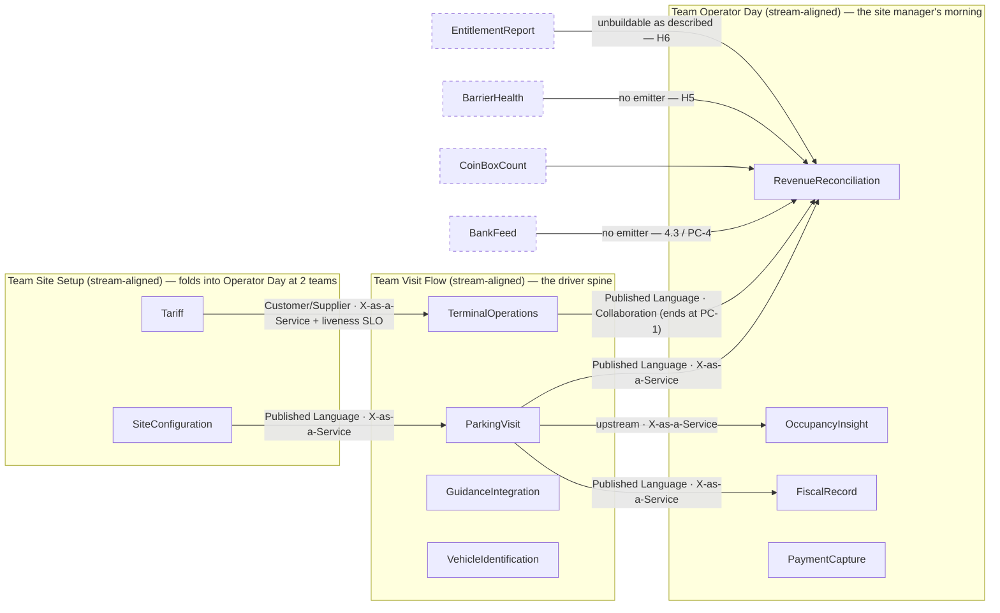

## Reality check

**Engineers: 0. Existing teams: 0. Contexts: 10.** There is no organisation behind this yet — no
headcount, no named people, no team that could be consulted, and the expert is unavailable. The
`6-organise` inputs table says a topology without headcount is a template, not a proposal. That is
what this is, and the honest response is not to invent a company: **every ownership row below is
`proposed — unstaffed`**, and the shape is written as a function of headcount rather than as a plan.

`core-domain-chart.md` already reached the same place from the other side: *"at start-up size these
are sequencing instructions, not an org chart: one team will build most of this."* This document adds
the arithmetic, the split order, and the one boundary that must never be split across two teams.

| | Shape 1 — **day one** (≤ 8 engineers) | Shape 2 — **at the split** (~12–18 engineers) |
|---|---|---|
| Teams | 1 stream-aligned team owns all 10 contexts | 3 stream-aligned teams (Site Setup last) |
| Basis | thinnest slice in `business-model.md`: one garage, setup → tariff → ticket → pay → exit (incl. offline) → next-morning reconciliation | persona fracture plane: the **driver spine** vs the **site manager's day** |
| Verdict | over the cognitive-load rule of thumb (4 core contexts), and still the right call — a second team before the seams are known buys Conway seams, not throughput | the first split that does not cut a chatty pair |
| Trigger to move | the one team can no longer ship the reconciliation morning and the entry/exit spine in the same iteration — the mismatch in Finding 3 becoming observable | — |

No platform team and no complicated-subsystem team is proposed. Platform work exists (per-site edge
deploy, terminal fleet, tariff propagation, 10-year retention storage) but nobody is duplicating it
yet; propose it when a **third** team ships to the terminal fleet independently. The
complicated-subsystem candidate — partition-tolerant edge behaviour — is refused deliberately: it is
the load-bearing seam (`CardStripeRecord`), and putting it behind a handoff removes the autonomy the
seam exists to create.

## Ownership

Team names are Shape 2. In Shape 1 all ten rows collapse into one team; nothing else changes.

| Context | Proposed team | Team type | Sub-domain type | Load contribution | Notes |
|---|---|---|---|---|---|
| ParkingVisit | Visit Flow | stream-aligned | core | 1 agg · 10 ev · **9 inv** · 8 terms | the invariant mass of the system |
| TerminalOperations | Visit Flow | stream-aligned | core (disputed — chart) | 2 agg · 12 ev · 5 inv · 6 terms | plus a physical fleet and 2am on-call |
| GuidanceIntegration | Visit Flow | stream-aligned | generic | ACL only, 3 terms | an ACL is downstream's code; garage only |
| VehicleIdentification | Visit Flow | stream-aligned | supporting | 2 rules + a 7-day timer, 3 terms | feeds PV's higher-rate rule |
| RevenueReconciliation | Operator Day | stream-aligned | core | 1 agg · 4 ev · 4 inv · 5 terms | the strongest sourced pay-for |
| OccupancyInsight | Operator Day | stream-aligned | core (exposed advantage) | 0 agg · 0 ev — blocked on H3, H4, H14 | the other pay-for; unmodellable today |
| FiscalRecord | Operator Day | stream-aligned | supporting | 0 agg · 2 terms + per-country retention | consumer is a tax auditor, not a team |
| PaymentCapture | Operator Day | stream-aligned | generic | ACL only, 4 terms | sits on RR's money leg (PC-3, PC-4) |
| SiteConfiguration | Site Setup | stream-aligned | supporting | 0 agg · 7 terms · 4 consumers | publishes the `VehicleClass` vocabulary |
| Tariff | Site Setup | stream-aligned | supporting | 0 agg · 4 terms · 1 calculation | under-modelled for its complexity (+0.30) |

## Team cognitive load

| Team | Contexts owned | Intrinsic (model mass) | Extrinsic | Verdict |
|---|---|---|---|---|
| Visit Flow | 4 (2 core) | **3 of 4 agg · 22 of 26 ev · 14 of 18 inv · 20 terms** | terminal fleet, per-site edge deploy, offline sync, barrier on-call | **over budget, knowingly.** Two core contexts in one team: PV gets the attention, TO gets the leftovers — except TO holds the offline behaviour the business refuses to give up. To add anything, something goes. |
| Operator Day | 4 (2 core, one empty) | 1 agg · 4 ev · 4 inv · 14 terms | nightly batch, 10-year retention store, per-country config (H8) | **under budget on mass, over on unknowns.** Its two core contexts are 15% of the events and 22% of the invariants — see Finding 3. |
| Site Setup | 2 | 0 agg · 0 ev · 0 inv · 11 terms | the tariff propagation path it does not own | **thinnest.** Below team size until Shape 2; folds into Operator Day at 2 teams — both serve the site manager. |

## Interaction modes

| Team A | Team B | Mode | Why (flow evidence) | Ends when |
|---|---|---|---|---|
| Visit Flow | Operator Day | **X-as-a-Service** (Published Language: visit facts, `OfflineExitLogUploaded`) | one-directional event stream; 0004 crosses 3 contexts with 0 queries | steady state |
| Visit Flow | Operator Day | **Collaboration** on the offline-settlement contract *only* | 4.2 — an uploaded offline exit reaches PV and produces nothing; 4.5 — no upload deadline | **ends when PC-1 is decided and H7, H10, D-4 are answered.** Not open-ended. |
| Site Setup | Visit Flow | **Customer/Supplier + X-as-a-Service**, with a liveness SLO | "live at the machines that evening" is a stated purchase condition, and the pipe belongs to Visit Flow | the propagation path is self-service and versioned (H15) |
| Site Setup | Visit Flow, Operator Day | **X-as-a-Service** (site topology, `VehicleClass` enumeration) | 4 declared consumers | steady state — conditional on Finding 5 |
| *(within Visit Flow)* | — | **not an interaction** | PV ↔ TO is 6 of 11 messages in 0002, 5 of 9 in 0003, `partnership`, and one invariant spans both | see Finding 4 |

## Sociotechnical map

`VehicleClass` is not drawn as an edge: it is live in 5 contexts across all 3 teams — Finding 5.

## Independent Service Heuristics

| Candidate boundary | Yes / probably | Weakest answers |
|---|---|---|
| **Visit Flow** | 5 of 10 | *Teams* — 78% of the model in one team is not bounded load. *Product decisions* — its differentiation is `unknown` (chart), so no roadmap can be justified. *Cost tracking* — hardware passes through at cost, no cost lines stated (Q1). *Data* — bay state comes from a supplier's sensors of unproven accuracy (H1, H4). |
| **Operator Day** | 7 of 10 | *Data* — **fails hard**: 2 of the 3 reconciliation legs have no emitter anywhere (4.3), and occupancy has no source in a lot (H3) with unproven sensors (H4). *Dependencies* — every input is another team's event or a bank feed nobody owns. The strongest boundary on brand, revenue and persona is the weakest on inputs. |
| **Site Setup** | 6 of 10 | *Impact / revenue* — "loses the deal if bad, wins nothing if good"; not a scope that holds a team. *Product decisions* — its roadmap is whatever the next deal demands. Justifies folding it into Operator Day until Shape 2. |

## Findings

| # | Finding | Evidence | Suggested move |
|---|---|---|---|
| 1 | Every context is **unowned** — there is no organisation. All rows are `proposed — unstaffed`. | 0 engineers, 0 teams | Treat as input to the first hiring conversation, not as a plan. The first hires must be allowed to redraw it. |
| 2 | One team would hold **4 core contexts** on day one — over the stated budget. | 26 events, 18 invariants, 10 contexts, ≤8 engineers | Accept, and protect it: keep 7 contexts thin, buy 4 (chart), and re-check at the Shape-2 trigger. |
| 3 | The **differentiator is under-staffed by the same mismatch the chart found.** Built in the stated build order, the two pay-fors are last — and Shape 1 has nobody left when it gets there. | 4 of 26 events and 4 of 18 invariants in the two pay-fors; 78% in the spine | At the first split, staff **Operator Day first**, not second. It is the cheapest team to staff and the only sourced advantage. |
| 4 | **ParkingVisit ↔ TerminalOperations cannot be split across two teams** — it would be a permanent Collaboration edge, which the method treats as a boundary error. | 6 of 11 messages (0002), 5 of 9 (0003), `partnership`, the 15-minute window spans both | One team owns both, or `3-decompose` re-cuts under PC-1. Do not institutionalise the meeting. |
| 5 | `VehicleClass` is a **shared kernel across all three teams** — every change to the class list needs consent from three teams. | live in 5 contexts; H16 says the list is still partial (motorcycles never discussed) | Enforce the context map's existing recommendation as a *team* rule: a versioned enumeration published by Site Setup, never a shared model. |
| 6 | **Operator Day would be accountable for an outcome whose inputs nobody owns.** | bank + coin-box totals have no emitter (4.3 / PC-4); `BarrierStuckOpen` has no emitter (H5); the entitlement report is unbuildable as described (H6) | Assign the bank/coin-box feed to an owner *before* staffing the team, or its first quarter is spent chasing facts. |
| 7 | **Bus factor 1 on the offline path is structural in Shape 1**, on the one behaviour the business refuses to give up. | one team, one seam, `CardStripeRecord` + `OfflineExitLog` | Two people on the seam from the first commit — a staffing rule, not a review process. |
| 8 | **Inverse Conway is free right now, and only right now.** There is no existing structure fighting the model — the rare case where the boundary can be chosen before the org exists. | 0 teams | Lock `CardStripeRecord` into one team's ownership before a second team exists. After that it costs a reorg. |
| 9 | If **garage and lot are two products** (H2, H3, H17), this topology is a garage topology. A lot has no guidance, no occupancy source, possibly no admission control — Visit Flow loses two contexts and Operator Day loses its second pay-for. | context-map "garage vs lot"; 1.4 — 2 of 9 entry messages have no lot equivalent | Do not hire against Shape 2 until H2, H3 and H17 are answered. |

## Open decisions

- **How many engineers, and when?** Nothing below Shape 1 is decidable without it. *Founder.*
- **Which team is staffed first at the split** — spine or pay-for? Finding 3 says pay-for; the build order says spine. *Founder + whoever sells.*
- **Who owns the bank and coin-box facts** — us, the operator, or the acquirer? Blocks Operator Day (Finding 6). *Founder + an operator's ops lead; H9 for the acquirer side.*
- **Garage and lot: one product or two?** Decides whether this topology holds at all (Finding 9). *Founder + a lot site manager (H2, H3, H17).*
- **PC-1 — the exit-decision re-cut** ends the only Collaboration edge with a date on it. *`3-decompose`, gated on H10.*
- **Nobody has been consulted, because there is nobody to consult.** No team defined its own boundary here, which the method requires. This document is an argument to be had with the first four hires, and it should lose that argument wherever they have better information.
