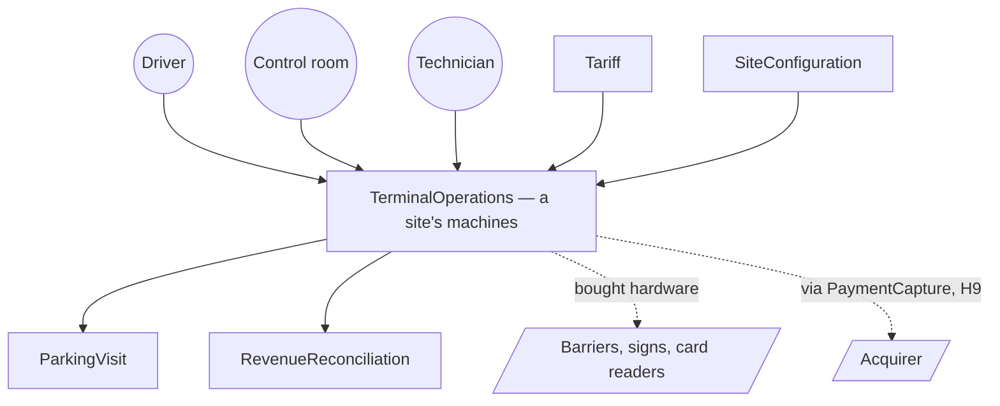

# TerminalOperations bounded context

## Purpose

Decides, at the site edge, whether a barrier opens — and keeps deciding when nothing else can be
reached. Serves the **driver** at the gate, the **control-room operator** who lets people out by
intercom, and the **technician** who keeps cards circulating.

**Boundary finding.** That purpose needs an "and also": deciding at the barrier and running a fleet of
plastic cards are two responsibilities, and the second has no stated rule at all. For `3-decompose`;
not redrawn here.

## Strategic classification

| Facet | Value | Source |
|---|---|---|
| Domain type | `core` in `model.yaml`, **disputed** — the chart proposes `supporting` pending an answer, or `differentiation: unsourced` | `core-domain-chart.md`, disagreements row 1 |
| Business-model role | engagement creator — "trapping a driver ends up in the local paper"; the entry/exit control under it is a revenue generator | `business-model.md`, capability table (two rows map here) |
| Evolution | **split**: the offline fallback is custom-built, entry/exit control is product | `business-model.md`, capability table |

Carried, not re-derived; the dispute stands. No source says a customer chose this product for the
offline path — only that its absence would be catastrophic.

## Domain roles

**Four**, which is the flag this section exists to raise. **Execution**: the open/refuse decision.
**Gateway**: translates between plastic, barriers, signs and the system's model. **Journal**:
`OfflineExitLog` holds facts not yet real anywhere else. **Fleet logistics**: cards collected and
refilled — the role with no rules. The first three change together and justify the split from
ParkingVisit; the fourth does not, and is the half a re-cut should take out. Brain-Context check
**passes** on message type: all twelve outbound messages are events, and four roles alone are not the
anti-pattern — four *plus* commands would be.

## Inbound communication

| Collaborator | Type | Message | Msg type | Relationship |
|---|---|---|---|---|
| Driver | actor (this context owns the UI) | `PresentCardAtExit`, `DeclareVehicleDetails`, `PayTicket`, `PayDifference`, `DeclareLostTicket` | command | direct interaction |
| Control-room operator / technician | actors | `LetDriverOut`; `RefillEntranceMachines` | command | direct interaction |
| ParkingVisit | bounded context | `CardStripeRecord`, `TicketIssued`, `AreaAssigned`, `TicketPaid`, `AdditionalPaymentCollected` | event / published language (theirs) | partnership |
| Tariff | bounded context | `TariffChanged` — live at this site's machines the same evening | event | customer/supplier, with a liveness SLO |

## Outbound communication

| Collaborator | Type | Message | Msg type | Relationship |
|---|---|---|---|---|
| ParkingVisit | bounded context | `MayThisCardLeave?` *; the forwarded driver commands | query, command | partnership |
| ParkingVisit | bounded context | `SpotWrittenToStripe`, `PaidStatusWrittenToStripe`, `EntryBarrierOpened`, `ExitBarrierOpened`, `ExitRefused`, `CardCollected` | event | partnership |
| ParkingVisit, RevenueReconciliation | bounded contexts | `OfflineExitLogUploaded` carrying `OfflineExitLog` | event | published language (ours) |
| SiteConfiguration | bounded context | which entrances and exits exist here | query | published language |
| RevenueReconciliation | bounded context | machine takings | event | published language |
| *(none)* | — | `OfflineExitGranted`, `CardsRefilled`, `RemoteExitGranted` unconsumed; `BarrierStuckOpen` has no **emitter** (H5) | event | — |

`*` = typed as a query upstream, no source names it. **Correction:** the site-topology read was filed
inbound by `3-decompose`; this context places the call, so it moves to outbound.

## Swimlanes — what this context actually decides

| Message in | Decision made here | Message(s) out |
|---|---|---|
| `PresentCardAtExit`, reachable | none — it asks | `MayThisCardLeave?`, then `ExitBarrierOpened` / `ExitRefused` |
| `PresentCardAtExit`, **unreachable** | **open or hold, alone, from the stripe** | `OfflineExitGranted`, `OfflineExitLogged`, later `OfflineExitLogUploaded` |
| `CardStripeRecord` / `TicketPaid` | what to write on the stripe | `SpotWrittenToStripe`, `PaidStatusWrittenToStripe` |
| `TariffChanged` | none — it distributes | (rates live at the machines) |
| `LetDriverOut` | none stated — the operator decided | `RemoteExitGranted`, consumed by nobody |

One lane genuinely decides: the offline one. Two decide nothing — flow 1.2's entrance-forward
observation again — and both are defensible only if H18 says the entrance also acts alone.

## Ubiquitous language

| Term | Meaning in THIS context | Differs elsewhere? |
|---|---|---|
| Card | the plastic; ~100 visits over its life, refilled twice a week, **no stated identity** (H13) | **yes** — `INPUT.md` §4 says "ticket", one per stay |
| Stripe | the copy of the system's record, carried on the card "so the machines can be quick" | — |
| Paid (on the stripe) | rewritable, and trusted anyway when the link is down | **yes** — in ParkingVisit, paid is the system's record and the stripe is a copy |
| Terminal | a machine at an entrance, a payment point or an exit; three named types, four described behaviours (H11) | — |
| Remote let-out | a control-room operator opening a barrier when a machine has eaten a card | — |

## Business decisions

| Rule | Source |
|---|---|
| **The barrier must open when the network is down**: the exit reads the stripe, and if it says paid, it opens | EXPERT 2026-07-27 |
| Every offline exit is logged at the terminal even offline, and uploaded when the link returns | EXPERT 2026-07-27 |
| An unpaid card is returned, the sign says NOT PAID, the barrier stays down — there is a payment machine before every exit for this | EXPERT 2026-07-27 |
| On a valid exit the machine keeps the card, and a technician refills the entrance machines from the collected stack twice a week | EXPERT 2026-07-27; `INPUT.md` §8 |
| A tariff change is live at that site's machines the same evening, with no support ticket | EXPERT 2026-07-27 |
| The stripe can be rewritten by the terminals; the system stays the truth when reachable | EXPERT 2026-07-27; `INPUT.md` §9–10 |

## Quality attributes

| Attribute | Requirement | Number | Source | Changes the model? |
|---|---|---|---|---|
| Partition tolerance | the exit decides alone with no connectivity; degradation is *toward* letting people out | absolute, no SLA stated | EXPERT | **yes** — the reason this context exists, and why the stripe is a second source of truth allowed to win |
| Integrity | a rewritten stripe will occasionally be believed; the loss is accepted | ~4–5 abuses in 15 years, at two sites | EXPERT | **yes** — makes RevenueReconciliation a compensating control, not a report |
| Latency (propagation) | a rate change reaches every machine at that site the same evening | "that evening"; a stated purchase condition | EXPERT | no — but it is a deal-breaker SLO |
| Durability | an offline exit must survive at the terminal until the link returns | **no deadline stated** (flow 4.5) | absence recorded | **yes if bounded** — an upload deadline would make the log a first-class domain object with an SLA |
| Availability (detection) | the terminal must tell "system unreachable" from "system says no" | unstated | absence recorded | **yes** — a slow answer is not a refusal, and nobody said which way to fail |
| Volume | terminals per site, outages per year and their duration | **unknown** | an abuse rate was given, an outage rate never | no, until known |
| Auditability | what a terminal did offline must be reconstructible next morning | — | EXPERT | yes — the log is domain state, not a diagnostic |

## Assumptions

*Domain* — the stripe may be trusted offline and the loss is priced (**stated**). A card is only
presented at the site that issued it (**inferred**). The barrier state the terminal believes is the
real one (**inferred, contradicted by H5**). A remote let-out has no financial consequence
(**inferred**; no reversal concept exists, H9). *Scale* — every offline terminal eventually reconnects
and its log survives until it does (**inferred**); a terminal destroyed, stolen or wiped before upload
takes its exits with it, which is the assumption that would break the compensating control and was
never discussed.

## Verification metrics

| Metric | What it would tell us | Where it comes from |
|---|---|---|
| Offline exits as a share of all exits, per site per month; predicted < 0.1% | if it is routine, the offline path is the primary path and "the system is the truth" is inverted | production, once live |
| Unmatched exits per site per year; the expert's own baseline is 4–5 in 15 years across an estate | whether the priced risk holds once the estate grows | the operator's existing exception records — **collectable today, before any code** |
| p95 time from a site manager saving a rate to the last machine at that site holding it; predicted < same evening | the stated purchase condition, as a number | pilot telemetry; today the operator can time their current system for a baseline |
| Cards refilled per week ÷ exits per week; predicted ≈ 1 | whether the unruled fleet half leaks. A ratio far below 1 means cards are vanishing and nobody has a rule | the technician's refill log at the pilot — **collectable today** |

## Open questions

- **H10** — does the stripe carry the payment *time*? Without it the window is unenforceable offline and PC-1 option A is unavailable.
- **H18** — what does an entrance terminal do offline: refuse, or issue a ticket it cannot register?
- **H5** — what detects a barrier stuck open? `BarrierStuckOpen` is in the interface with no emitter.
- **H11** — is declaring vehicle details a separate machine from collecting the ticket?
- **H9** — a driver let out remotely after paying; no reversal or refund concept exists.
- **New here** — is there an upload deadline, and what becomes of the exits on a terminal that never uploads? *Expert + terminal supplier.*
- **New here** — how does a terminal tell "unreachable" from "refused", and which way does it fail on a slow answer? *Expert + terminal supplier.*

## Interface critique

1. **Names.** `OfflineExitGranted`, `OfflineExitLogged` and `OfflineExitLogUploaded` are three names for one act; flow 0004 shows the first going "to nobody, until 5". Two may be one event.
2. **Types.** `CardCollected` and the two `…WrittenToStripe` events are hardware acknowledgements, not domain facts — no invariant reads them. `BarrierStuckOpen` cannot be typed until H5 names an emitter.
3. **Size.** Twelve events across two aggregates for a context whose job is "open or don't". Three have no consumer and one has no emitter; removing the unowned leaves nine.
4. **Internals.** The stripe-write events publish this context's mechanics to ParkingVisit; conversely
   `OfflineExitLog` is published deliberately — the one internal that *must* be shared, being the only
   record that an exit happened.
5. **Belongs elsewhere.** `CardsRefilled` has no owner in the business language at all; `RemoteExitGranted` belongs with a payment-reversal concept that does not exist (H9).

## Perturbation experiments

- **Move the exit decision here permanently** (PC-1 option A). Flow 0002 drops 11 → 9, one rule serves
  both paths, swimlanes 1 and 2 collapse. Cost: the window must live on the stripe (**H10**).
  *Recommended, gated — as PC-1 already says.*
- **Move `OfflineExitLog` to RevenueReconciliation**, next to the process that settles it. Improves:
  late facts sit with their consumer. Costs: it must be written while the terminal is unreachable,
  which is the entire point. *Rejected — the rejection argues for keeping it a separate aggregate here.*
- **Move the card fleet out** (role 4). Improves: the context becomes one thing. Costs: nothing, there
  are no rules to move. *If no stock rule ever appears, delete the concern rather than model it.*

## Aggregates (`8-code`, 2026-07-27)

| Aggregate | Canvas | Invariants enforced | Corrective policies | Contention |
|---|---|---|---|---|
| `Terminal` (root `Terminal`) | [aggregates/Terminal.md](aggregates/Terminal.md) | **3**, not 4 — open offline on a paid stripe · return an unpaid card · keep the card on a valid exit | 1 expert-stated and priced (reconcile the next morning); 2 with none (the window offline, a remote let-out) | **low** — the physical queue at a gate is the serialiser |
| `OfflineExitLog` (root `OfflineExitLog`) | [aggregates/OfflineExitLog.md](aggregates/OfflineExitLog.md) | **1** — every offline exit is logged and uploaded | 1 stated (reconciliation); **3 with none**: a lost log entry, a late upload into a settled day, an upload after day 7 | none — a single local writer |

Three findings. **The fourth "invariant" is not one:** *a tariff change is live at that site's
machines the same evening* spans every terminal at a site — a propagation SLO, proposed for removal
from `model.yaml` (delta 5). **One atomicity decision is forced and still open:** the barrier and the
journal change in the same instant with nothing else reachable, so either they are one aggregate or
the consistency is eventual — the never-trap-a-driver policy implies eventual, and nobody was ever
asked what happens to an exit the log loses. **`OfflineExitLog` is unbounded as modelled**; scoping
it to one offline episode is proposed, because splitting a two-year-old log later is far dearer.

## System context (C4 level 1)

## Changed in 7-define

Inbound/outbound re-split by initiator; actors and relationship types added; four domain roles named
(the card fleet is the fourth, and the one with no rules); swimlanes, quality attributes, assumptions,
verification metrics, interface critique, perturbations and a C4 diagram added; two new open questions
raised. `model.yaml` delta proposed and **not applied**: `BarrierStuckOpen` should leave the interface
until H5 names an emitter.
