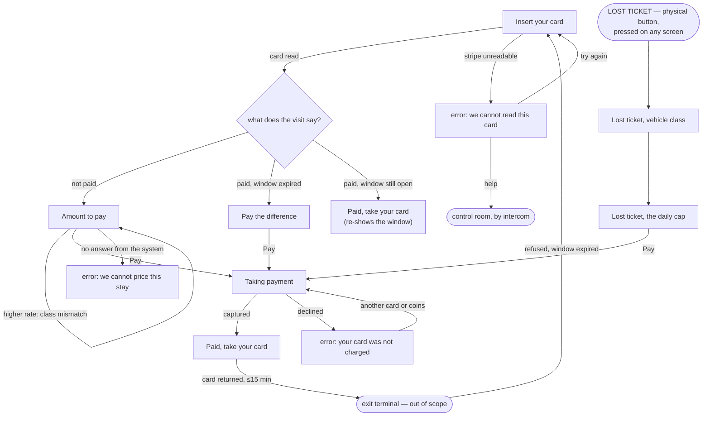

# Payment terminal — screen inventory

The self-service payment kiosk: the fixed portrait touchscreen a driver pays at before leaving.
The surface belongs to **TerminalOperations** — `terminal-operations/README.md` marks the Driver an
"actor (this context owns the UI)" — and it issues three of the five driver commands that context
lists: `PayTicket`, `PayDifference`, `DeclareLostTicket`. The entrance terminal
(`DeclareVehicleDetails`) and the exit terminal (`PresentCardAtExit`) are **out of scope** here and
are drawn as neither screen nor state.

Every screen name and every noun below is checked against `docs/domain/discovery/ubiquitous-language.md`.
Two vocabulary decisions are recorded in `../design-brief.md` § Language, one of them a finding.

## Flow

**Where this flow and the domain's flow disagree — a finding, not a paper-over.**
`DOMAIN-FLOW-0002` has the driver arrive at this machine already identified. They are not:
`PayTicket` carries only the stripe (`assignedSpot`, `paidFlag`) and **nothing identifies the
visit** (H13 / F7 — "a repository cannot load this root from what its own commands carry"). Every
screen below that shows an entry time, a duration or an amount assumes that blocker is resolved. If
H13 resolves to "the stripe carries a visit reference", these screens stand unchanged. If it
resolves any other way, *Amount to pay* cannot be drawn at all, and this inventory is the artifact
that will need redrawing first.

## Hardware, present on every frame

Drawn as a dark fascia band at the bottom of every screen, because these are things the hands meet
and they do not come and go with the software (`prototype-craft.md` § Hardware and platform
affordances). Left to right: **card slot**, **coin slot**, **card reader**, **LOST TICKET**,
**HELP**.

| Affordance | Source | Note |
|---|---|---|
| Card slot | the card is inserted here, written here (`PaidStatusWrittenToStripe`) and returned here; the *exit* keeps it (EXPERT) | every instruction that points at it uses a ↓ aimed at the slot's real position |
| Coin slot | reconciliation matches "machines vs bank vs **coin box**", per site, every morning (`business-model.md`; `revenue-reconciliation/README.md`) — so these machines take coins | **Gap G-5**: change, overpayment and exact-change behaviour are unstated, and no refund concept exists in the language. Nothing on screen promises change. |
| Card reader | payment is captured at the terminal (`payment-capture/README.md`) | the acquirer link is H9 — unknown to everyone in the room |
| **LOST TICKET** — a physical button | "a **button on the payment machine**… no attendant" (EXPERT, `timeline.md` 30; `parking-visit/model.yaml`) | **It is never a button in the UI.** A driver with no card cannot start a flow from a screen that asks them to insert one. |
| **HELP** — intercom to the control room | "Control-room intercom for remote let-out exists at every site, operator-staffed" (`business-model.md`) | **Gap G-6, and the weakest thing in this design**: the sources put the intercom at the *exit* ("machine eats the card → intercom"). Three error states here have no other way forward. If the payment machine has no intercom, that copy is wrong on all three. |

No hover state exists anywhere on this surface, and no control is smaller than 88 × 88 px
(`prototype-craft.md` floor: ≥56, primary ≥80).

## Insert your card

- **Primary action**: insert the parking card in the slot
- **Empty state**: n/a — this screen *is* the resting state of the machine; there is no emptier one
- **Loading state**: the card is in and being read — "Reading your card" with the stripe fields it
  is looking for held in place, so nothing shifts when the amount arrives
- **Error states**: (1) the stripe cannot be read — a real rejection path the model does not have a
  name for (F3: "a card the exit cannot read", EM-30), so the copy is the design's and the *event*
  is a gap. Two ways forward: insert it again the other way round, or HELP.
- **API bindings**: none — there is no `docs/api/` in this project (**Gap G-1**). The domain
  binding is the hardware read that precedes `PayTicket`; `DOMAIN-FLOW-0002` message 1.
- **Copy notes**: the tariff line ("€1,00 per started 15 minutes · first 15 minutes free · daily cap
  €25,00") states the priced rule verbatim from I2 / `tariff/README.md`. The rate €1,00 is the
  example EM-14 itself uses; the cap is an invented example (**Gap G-3**). Language row DE · EN · NL
  follows the stated market sequence Germany → Austria → Netherlands (`business-model.md`).

## Amount to pay

- **Primary action**: pay the amount shown
- **Empty state**: n/a — a card was read, so there is always a stay and always an amount
- **Loading state**: "Working out what you owe" — the amount's line box is held at final size so the
  number lands without the Pay button jumping under a thumb already moving toward it
- **Error states**: the system cannot be reached, so the stay cannot be priced. This is the state
  `terminal-operations/README.md` says nobody has specified: *"the terminal must tell 'system
  unreachable' from 'system says no'… nobody said which way to fail"* (**Gap G-4**). The design
  fails **toward telling the truth and not taking money**, and gives two ways forward: another
  payment machine, or HELP. It does **not** say "try again" — there is nothing the driver can do to
  fix a network.
- **Variants** (drawn, hand-added frames, not separate screens — same question, same action, one
  inserted explanation band): `Amount to pay--higher rate` — the registered class disagrees with the
  class declared at the entrance, so the higher rate is charged and the driver is told so
  (BRIEF; EXPERT rule in `vehicle-identification/README.md`; EM-11).
- **API bindings**: `PayTicket` (command, `parking-visit`), `PriceOfStay?` (query → Tariff,
  `DOMAIN-FLOW-0002` message 3), `VehicleClassMismatchDetected` (event, VehicleIdentification).
- **Copy notes**: numbers are EM-14's own worked example — entry 10:00, priced 11:07, 67 minutes =
  5 started fifteen-minute blocks, the first free, €4,00. "Started" is the domain's word and the
  screen keeps it: *5 × 15 min started*. The mismatch variant charges the truck/bus rate (EM-11's
  example pair, car declared / truck registered); its rate €2,50 is an example (**Gap G-3**). The
  mismatch band tells the driver what happened and offers HELP, and **there is no dispute path
  anywhere in the language** — `vehicle-identification/README.md` raises exactly this as an open
  question (**Gap G-7**).

## Taking payment

- **Primary action**: an instruction, not a tap — follow the card reader, and do not remove the card
  from the slot. (`screens-and-states.md` explicitly allows a transient system-driven screen whose
  one action is an instruction.)
- **Empty state**: n/a
- **Loading state**: n/a — this screen *is* the loading state; giving it a second one would draw the
  same frame twice
- **Error states**: the payment was declined. This is the second of F3's five missing rejection
  paths — `parking-visit/aggregates/ParkingVisit.md` §5: *"no rejection event exists for a declined
  payment"* (**Gap G-2**). The copy never blames the driver and never says why the bank refused,
  because the terminal does not know: "Your card was not charged." Two ways forward, both hardware:
  another card, or coins.
- **API bindings**: PaymentCapture — *the captured-payment fact has no name anywhere in the model*
  (H9, flow finding 2.3). This screen renders an event the domain has not named yet.
- **Copy notes**: the amount stays on screen through the whole attempt. A driver who looks away and
  back must not have to wonder whether it went through.

## Paid, take your card

- **Primary action**: take the card from the slot
- **Empty state**: n/a
- **Loading state**: n/a — the payment is already captured when this screen appears
- **Error states**: n/a — no source names a failed stripe write. `PaidStatusWrittenToStripe` is an
  acknowledgement, and `terminal-operations/README.md` critique 2 calls it a hardware ack that no
  invariant reads; there is no stated failure of it to design for (**Gap G-8**, recorded rather
  than invented)
- **Variants**: `Paid, take your card--replacement` — the same screen after a lost-ticket charge,
  where the card being returned is a fresh one marked paid ("a fresh card that says paid, and you
  leave", EXPERT / `timeline.md` 31)
- **API bindings**: `TicketPaid {visitId, amount, paidAt}` and `PaidStatusWrittenToStripe`
  (`DOMAIN-FLOW-0002` messages 5–6).
- **Copy notes**: this screen carries the **signature element** — the yellow band with the deadline
  as a clock time first (**Leave by 11:22**) and the count second (14:32 left). The clock time is
  the one a driver can act on while walking; the countdown is what makes it urgent. I1 is the rule
  the driver is judged by and today they meet it as a closed barrier and a "standing complaint"
  (`DOMAIN-FLOW-0003`). Making it unmissable *before* it is broken is the whole point of the
  element. **Gap G-9**: the exit machine, not this one, enforces the window, and offline it is not
  enforced at all (H10, EM-21) — this screen promises a deadline the system does not uniformly keep.

## Pay the difference

- **Primary action**: pay the difference shown
- **Empty state**: n/a — reached only with a card that is paid and out of window
- **Loading state**: n/a — reuses *Amount to pay*'s pricing frame; the driver has already seen it
- **Error states**: n/a — the payment errors on this path are the same ones drawn under
  *Taking payment*, which this screen hands off to
- **API bindings**: `PayDifference` (command), `PriceOfStay?` (query),
  `AdditionalPaymentCollected {visitId, amount, paidAt}` (`DOMAIN-FLOW-0003` messages 4–7).
- **Copy notes**: the screen has to explain a refusal that happened at a *different machine*, to
  someone who believes they already paid — so it opens with what it knows to be true ("You paid
  €4,00 at 11:07") before it asks for more. It never says NOT PAID: `DOMAIN-FLOW-0003` finding 3.1
  is that a driver who *has* paid is currently shown the unpaid sign, and D-2 records that nobody
  ever said what the expired-window sign should read. **Gap G-10**: the amount rule itself is
  unstated (D-3) — is the difference priced from `paidAt`, or from entry with the first payment
  deducted, and does the daily cap apply again? The €2,00 drawn is an example computed the first
  way. **Gap G-11**: nobody said whether a *fresh* window starts. The design starts one, because the
  alternative is a driver who can be refused twice for the same walk; that is a design decision
  standing in for a business answer, and it is the single loudest thing in this inventory needing
  an expert.

## Lost ticket, vehicle class

- **Primary action**: choose the vehicle class being paid for
- **Empty state**: n/a — the four classes are standing configuration, never absent
- **Loading state**: n/a — the class list and the caps are held at the terminal; a tariff change
  reaches the machines "the same evening" (`tariff/README.md`), so this screen never waits
- **Error states**: n/a — no input can fail; the driver picks one of four fixed targets
- **API bindings**: `DeclareLostTicket` (command) → `LostTicketCharged {siteId, vehicleClass,
  amount}`, `ReplacementCardIssued {siteId, paidFlag}` (EM-16).
- **Copy notes**: **this screen exists because of H12 and it does not solve it.** With no card there
  is no visit to look up, so "the daily cap **for that vehicle class**" has no source for *which*
  class. Asking the driver is the only self-service answer available — there is no attendant, by the
  expert's own description. The classes are INPUT §2's list minus the two entitlements (disabled and
  family are properties of the *person*, not the vehicle, and are "not in" the class —
  `ubiquitous-language.md`), so: motorcycle, car, electric car, truck/bus. **Gap G-12**: a driver
  choosing their own class will choose the cheapest, and the leakage is exactly the spread between
  the cheapest and dearest cap. H16 also records that motorcycles were never discussed at all.

## Lost ticket, the daily cap

- **Primary action**: pay the daily cap for the chosen class
- **Empty state**: n/a
- **Loading state**: n/a — the cap is a held rate, not a computed stay
- **Error states**: n/a — hands off to *Taking payment*, where the decline is drawn
- **API bindings**: as above; the payment leg is PaymentCapture (H9, unnamed).
- **Copy notes**: no entry time, no duration and no "started 15 minutes" appear here, because none
  of them is known — the flat charge *is* the daily cap (EXPERT). The screen says which class it is
  charging and offers a way back to change it, because the previous screen asked a driver to
  self-assess and they can be wrong. €25,00 for a car is an example (**Gap G-3**).

## What is deliberately not here

- **Entrance and exit terminal screens.** Different machines, different commands, out of scope.
- **A receipt.** The fiscal record is the *operator's* ten-year obligation and explicitly "not the
  plate"; nobody stated a printed VAT receipt for a driver, which in the first market (Germany) is
  the kind of thing a driver expects. Recorded as **Gap G-13** rather than drawn.
- **Anything with the words reservation, booking, subscription, season ticket, refund, cancellation
  or customer account.** `ubiquitous-language.md` § Words nobody used forbids introducing them
  downstream, and a "Refund" control on a decline screen would have been the natural invention.
- **A "pay by app / QR" path.** No source mentions one.
- **A cancel control on *Amount to pay*.** A driver whose card is in the slot and who wants it back
  without paying has no stated path: nothing in the sources says whether the machine times out and
  returns the card, or whether a physical cancel button exists on the fascia. Rather than invent a
  second piece of hardware or a control that might do nothing, this is **Gap G-14** — and it is the
  one place where the frames are quieter than a real machine probably needs to be. The lost-ticket
  screens *do* carry "Go back", because there the driver has pressed a button by mistake and no
  card is captive.
