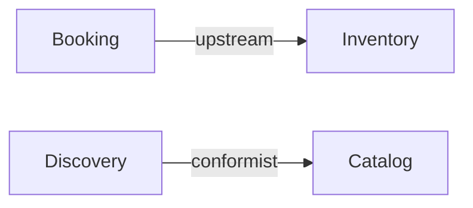

# Output Template — runtime artifacts

What `3-decompose` writes at runtime. Output lands in the **invoking project's** docs folder
— never in this plugin repo or any reference template you studied. Read before emitting anything.

## 1. Locate the docs root (detection order)

1. If the project has `docs/domain/` with an `INDEX.md` and/or `_TEMPLATE.md` → **follow that
   convention**: reuse its frontmatter fields, its `INDEX.md` table shape, and its id scheme.
2. Else if `docs/` exists but no `domain/` → create `docs/domain/`.
3. Else (no `docs/` and no obvious convention) → **PAUSE and ask** the user where docs should
   live. Do not guess a path.

Detect rather than hardcode so the skill drops into any repo and stays consistent with the team's
docs and tooling.

If the located `docs/domain/` **already holds generated artifacts** (`DOMAIN-NNNN` frontmatter,
`INDEX.md` rows, or per-context `model.yaml`), you're updating, not creating — see §7 "Delta
merge". Otherwise create fresh.

## 2. Layout (organized per bounded context)

```
docs/domain/
├── context-map.md            # all contexts + relationships + Core Domain Chart
├── INDEX.md                  # table of generated docs (create if missing, else append)
└── <context-slug>/           # one folder per bounded context (kebab-case)
    ├── README.md             # Bounded Context Canvas (see references/bounded-context-canvas.md)
    └── model.yaml            # machine-readable model (schema below)
```

Bounded contexts are the unit of division. A context folder is a candidate service boundary on
the monolith → microservices path.

## 3. `context-map.md`

Two required blocks:

**Context map** — a Mermaid `graph` showing each bounded context as a node and labelled edges for
relationships. Label the edge with the pattern the two ends play (`shared-kernel`, `conformist`,
`ACL`, `open-host`, `published-language`, `partnership`, `customer-supplier`) and let the arrow
carry the direction; §4 records both axes separately and per side:



**Sub-domain classification** — a table classifying every context:

| Bounded Context | Sub-domain type | Why |
|---|---|---|
| Booking | core | competitive differentiator |
| Notifications | generic | commodity, could be bought |

This is a first-pass label, enough to right-size the tactical model (step 4). It is **not** a Core
Domain Chart: that plots complexity against business differentiation on two axes and turns the
placement into build/buy/outsource and staffing decisions — `5-strategize` owns it, and its
findings come back here as proposed `subdomain_type` deltas.

**Conflicts & reconciliation** — **required whenever you reconcile existing artifacts that
disagree** (e.g. a draft PRD vs shipped code). One row per divergence. Never blend the two into a
hybrid; record both, choose the authoritative one (running code over a draft doc), and flag it.
Omit this block only when no existing sources conflict.

| Concept | Source A says | Source B says | Chosen (authoritative) | Flag for human |
|---|---|---|---|---|
| Fact shape | PRD-01 draft: `key`/`value` | code: `content`/`source` | code | confirm PRD migration |

## 4. `model.yaml` (per context)

```yaml
context: <ContextName>          # PascalCase, ubiquitous-language noun
subdomain_type: core            # core | supporting | generic | master-data
tactical_pattern: full-domain-model  # full-domain-model | transaction-script | crud | bought-adapter
                                     # size to subdomain_type — see "Right-size first" below
ubiquitous_language:
  - term: <Term>
    definition: <one line>
aggregates:                     # core → real aggregates; supporting/generic/master-data → usually []
  - name: <AggregateName>       # named after its root entity
    root: <RootEntity>
    exposed_to_api: false       # see "Say what is published" below — default false
    entities:
      - { name: <Entity>, attributes: [<attr>] }
    value_objects:
      - { name: <VO>, attributes: [<attr>], exposed_to_api: false }  # no identity; equal by value
    domain_events:
      - { name: <EventPastTense>, payload: [<field>] }  # e.g. OrderPlaced
    invariants:
      - <statement>             # ONLY if the user supplied it; else omit
notes: <one line>               # for a light context: why it has no aggregates (bought adapter / lookup CRUD / transaction script)
relationships:
  - to: <OtherContext>
    direction: downstream       # upstream | downstream | peer — who depends on whom
    our_roles: [acl]            # how THIS context governs the relationship
    their_roles: [open-host]    # how the OTHER context governs it
    note: <one line>            # free text; use it for a relationship DDD has no name for
```

**Two axes, not one.** `direction` and the role lists answer different questions, and a single
`type` field cannot carry both. Which way the dependency runs is independent of how the
relationship is governed: the same downstream is free to be a **Conformist** *or* to build an
**ACL**, and an upstream may be an **Open Host Service**, publish a **Published Language**, both,
or neither. Write `type: downstream` and you have said who depends on whom and nothing about the
contract — which is why a corpus full of it gives an API generator no way to tell a context that
publishes from one that does not.

> This is the **second instance of the same defect class** in this schema. `status`
> (`confirmed` / `candidate` — how strong the evidence is) was already split from `state`
> (`as-is` / `to-be` / `could-be` — when it happens) for exactly the same reason: one field was
> being asked to answer two independent questions, so neither could be checked. When a field's
> allowed values do not sit on one line, that is the shape to look for.

**Roles attach per side, and a side can carry several.** Three independent sources agree:
Context Mapper's DSL writes them per end and stacked — `VoyagePlanning [D,ACL]<-[U,OHS,PL]
Location`; EuroPLoP'21 Fig. 5 puts `U`/`PL` on the upstream end and `D`/`CF` on the downstream one;
ddd-crew's context-mapping repo groups the patterns as **Mutually Dependent** (Partnership, Shared
Kernel), **Upstream/Downstream** (OHS, Conformist, ACL, Customer/Supplier, Published Language) and
**Free** (Separate Ways), and states that a downstream team is free to conform *or* to build an
ACL. Open Host Service and Published Language co-occur constantly, so a single-valued `pattern`
field would be wrong too.

Common values — `open-host`, `published-language`, `conformist`, `acl`, `customer`, `supplier`,
`partnership`, `shared-kernel`, `separate-ways`, `other`:

| Where | Roles it usually holds |
|---|---|
| the **upstream** side | `open-host`, `published-language`, `supplier` |
| the **downstream** side | `conformist`, `acl`, `customer` |
| **both** sides of a `peer` edge | `partnership`, `shared-kernel` — same role on each side |

**The list is open, on purpose.** An unknown role must degrade, not explode — the same reason
OpenAPI 3.2 added `defaultMapping` to its discriminator. When the relationship is real but DDD has
no name for it, write `other` and say what is actually known in `note:`. A tolerant reader beats a
closed enum that forces a modeller to file a real relationship under the wrong pattern. `ddd_check`
enforces **presence** (a direction, and at least one role on each side), never the value.

**Symmetry.** The convention is self-relative — `direction` and `our_roles` describe *this* context
toward `to`. So the other context's own file must mirror it: opposite direction, roles swapped.
A `peer` edge (Partnership, Shared Kernel) carries the same role on both sides.

**Say what is published.** `exposed_to_api: true` on an aggregate or value object marks it as part
of the API model — the subset a facade may expose. Default `false`; set `true` only where the
model itself justifies it (an artifact you already labelled **Published Language**, an Open Host
Service contract). EuroPLoP'21 §5.2 names the failure this closes: *"Implicit Designation of API
Model Subset to be Exposed in the Facade: While it is advisable to mark domain model elements
clearly as API elements, often less clear options … are chosen … Such practices can lead confusions
and inconsistencies in the mappings."* Choosing what to publish is a **Published Language
decision** — a DDD act, not an HTTP one — so it belongs here, in the domain artifact, and not in
whatever skill later designs the endpoints. Never invent a justification to mark something `true`.

**Right-size first.** Match tactical depth to `subdomain_type` (SKILL.md step 4) *before* filling
this in. A **core** context gets real aggregates. A **supporting** context uses a lighter
transaction-script / CRUD-plus-a-calculation shape. **Generic** and **master-data / reference**
contexts get **no domain model** — set `aggregates: []` and record the reason in `notes:` (bought
behind an adapter, or plain lookup CRUD). Uniform aggregate machinery on every context regardless
of type is the cargo-cult failure this schema must not encourage — `aggregates: []` is a valid,
correct model for a light context, not a missing piece.

**Schema rule:** when an aggregate **is** present, it MUST include the keys `entities`,
`value_objects`, and `domain_events` — use an empty list `[]` when it has none. Never omit a key,
so the model stays machine-consumable and consumers can rely on the shape. `invariants` and
`notes` are optional (`invariants`: only user-stated rules; `notes`: the right-sizing rationale
for a context with `aggregates: []`).

## 5. Frontmatter on generated markdown docs

Reuse the project's convention if detected. Default (matches the monorepo template's
`docs/domain/_TEMPLATE.md`):

```yaml
---
id: DOMAIN-NNNN          # next free number; check INDEX.md
title: <Context> bounded context
risk: High               # High | Critical — only if invariants present, else omit
status: draft            # ALWAYS draft — never approved/accepted
owner: TBD               # ALWAYS TBD — ownership is a human act
date: YYYY-MM-DD
related_prds: []
related_rfcs: []
related_adrs: []
---
```

## 6. Update `INDEX.md`

One row per context, matching the existing columns. Create `INDEX.md` if missing
(`Id | Title | Risk | Status | Owner | Date`). In **update mode**, edit the existing row in place
(don't append a duplicate) and keep its human-set `Status`/`Owner`; add a row only for a genuinely
new context.

## 7. Delta merge (update mode)

When `docs/domain/` already holds generated artifacts, **read them before writing** and merge the
new model in as a delta. This is the step-1 reconcile discipline turned on your own past output:
build on it, don't clobber it. A re-run after the model evolved (or after humans edited the docs)
must feel like a careful diff, not a regeneration.

**Match by name, keep ids stable.** Match new contexts/aggregates/entities to existing ones by
their ubiquitous-language name. A matched context **keeps its existing `DOMAIN-NNNN` id**; only a
genuinely new context gets the next free number. Regenerating ids breaks `INDEX.md` and every
cross-reference — don't.

**Merge field-by-field, never whole-file overwrite:**

| Situation | Action |
|---|---|
| In the new model, absent on disk | **Add** it (context, aggregate, entity, VO, event, relationship). |
| In both, but the new model changed it (e.g. a new event, corrected attribute) | **Update** that field; leave the rest untouched. |
| On disk, absent from the new model | **Never delete.** Leave it in place and **flag** it as a candidate removal in the changelog — a dropped context is usually a modelling slip, and deletion is destructive. |
| A field a human set (status, owner, `related_*`, hand-written rules/notes/prose) | **Preserve verbatim.** These are human acts (see §8); never reset to draft/TBD. |
| In both, but the values disagree | **Don't blend.** Record both in the Conflicts table of `context-map.md` (§3), choose the authoritative side, flag for a human. |

**Close with a changelog** so the user sees exactly what the re-run did — append it to
`context-map.md` under a `## Changelog (YYYY-MM-DD)` heading and echo a one-line summary:

```markdown
## Changelog (2026-05-29)
- Added: `Billing` context (DOMAIN-0007); `PrescriptionDispensed` event on Pharmacy.
- Updated: Scheduling — added `appointmentType` to the Appointment entity.
- Preserved: Clinical status=`accepted`, owner=`dr-lan` (human-set); kept its 2 hand-written rules.
- Flagged: `Reception` is on disk but absent from the new model — candidate removal, confirm.
```

Stay inside `docs/domain/` — update mode still **never modifies source code or other repo files**.

## 8. Hard rules (mirror docs/domain/AGENTS.md where present)

- **Create:** `status: draft`, `owner: TBD`. **Update:** preserve whatever a human set — never
  reset an escalated status, assigned owner, or hand-written rule back to draft/TBD. Setting or
  reverting status is a human doc-owner act, never yours.
- **Never invent business rules or domain events.** Capture only invariants/rules the user
  actually stated, and only events for flows the input describes (naming an implied event is fine;
  inventing one for an undescribed flow is not). If a rule or event seems required but wasn't
  given, leave it out and note the gap — do not fabricate.
- Names come from the discovered ubiquitous language, not technical layers.
- Events past-tense (`BookingCancelled`); commands imperative (`CancelBooking`); aggregate = root
  entity name; value objects are nouns with no identity.
