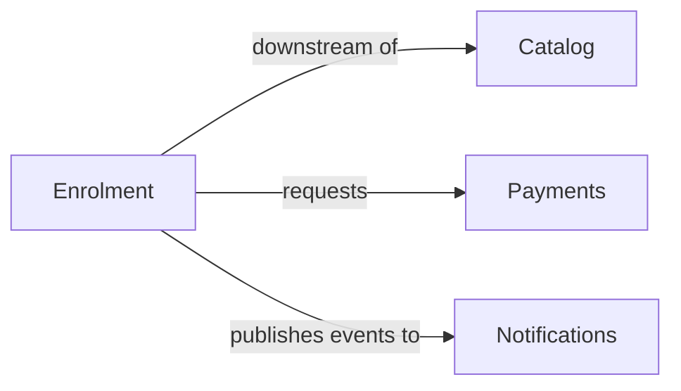

# Worked example — 3-decompose

**Input:** "Students browse our course catalog and enrol in courses. Enrolment requires payment;
we email a receipt and a welcome message. Instructors create and publish courses."

**First-pass contexts + classification (`context-map.md`):**



| Bounded Context | Sub-domain type | Why |
|---|---|---|
| Enrolment | core | the differentiating capability |
| Catalog | supporting | needed, not differentiating |
| Payments | generic | commodity — could be outsourced |
| Notifications | generic | commodity |

**Enrolment context (`docs/domain/enrolment/model.yaml`)** — tactical block (full schema in
output-template.md §4):

```yaml
context: Enrolment
subdomain_type: core
aggregates:
  - name: Enrolment
    root: Enrolment
    entities:
      - { name: Enrolment, attributes: [studentId, courseId, status] }
    value_objects:
      - { name: Money, attributes: [amount, currency] }
    domain_events:
      - { name: EnrolmentRequested, payload: [studentId, courseId] }
      - { name: EnrolmentConfirmed, payload: [enrolmentId] }
relationships:
  - to: Payments
    direction: downstream
    our_roles: [acl]
    their_roles: [other]
    note: A bought provider; we translate at our edge and it publishes no contract of its own.
  - to: Catalog
    direction: downstream
    our_roles: [other]
    their_roles: [published-language]
    note: Course identity and price read as a versioned contract, not a shared model.
```

Note what the example does **not** do: it doesn't assert a rule like "a student may enrol in at
most 5 courses" because the input never said so. If that mattered, the skill would ask.
