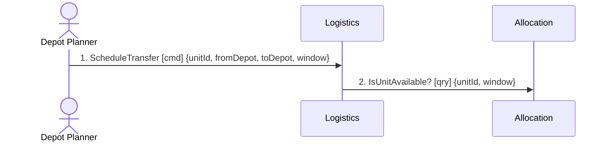

# Domain Connect

> *"It is necessary to challenge the initial design by applying concrete use-cases to uncover
> hidden complexity."* — ddd-crew, Connect

A context map tells you which contexts exist and that they are related. It cannot tell you whether
the split *works*, because it never moves. A **message flow** moves: one real business scenario,
message by message, in order, across the boundaries you just drew. That motion is what exposes the
coupling — a boundary looks clean until you watch four synchronous hops cross it to satisfy one
customer request.

**What this skill produces:** a small set of flows for the use cases that matter, plus the findings
those flows forced into the open — and, where a flow proves a boundary wrong, a **proposed** change
handed back to `3-decompose`. Proposed, not applied: a boundary redrawn by the skill that
discovered the problem skips the reconciliation, seam, and delta-merge discipline that decomposition
owns.

## Inputs — get them in one call

```bash
python3 ${CLAUDE_SKILL_DIR}/../design/scripts/ddd_context.py --root . --step 4-connect
```

One pass over the repo returns the design under test as facts: every context with its type, event
and invariant counts; every flow already traced with its message count, participant count and
whether it breaches the 5-to-9 rule; every traced message with from, to and type; and the discovery
counts that say whether the timeline behind all of it was confirmed by people or mined from
documents.

On a re-run that last part is what matters most. **Flows built from a discovered timeline are
grounded; flows built from context names alone are speculation**, and the difference is a number in
the pack rather than an impression you form while reading.

The pack does not choose the use cases, and it should not: that is the one input here a repo cannot
supply. If nobody names them, propose candidates and get agreement before drawing — see step 1.

The pack reports what is traced, never what should be. A message absent from it is absent from the
flows, which may mean the flow is incomplete or may mean the event is peripheral — deciding which is
this step's work.

**Treat the pack as the input, not as a summary to verify against the files.** Re-reading every
`model.yaml` after running it is the failure mode here, and a measured one: the run that did that
cost 30% more tokens and took 54% longer than the same task with no pack at all, and reached the
same verdict. Open a raw artifact only to **quote** it — an invariant's exact wording, a hotspot's
full text — and open only that one.

Nothing under `docs/domain/`? The pack will say so, and that is the answer: there is no design to
challenge yet, and `3-decompose` runs first. Modelling flows between contexts you are inventing as
you go produces a diagram that validates itself.

## Reference files (read as needed)

- `references/message-flow-notation.md` — the notation: message types and what each one costs in
  coupling, the three parts of a message (name, contents, order), separate vs combined format, the
  5-to-9 message rule and why exceeding it is a finding, temporal semantics (`within` / `after` /
  `every`). Read before drawing the first flow.
- `references/coupling-heuristics.md` — the smell catalogue: what each smell looks like on a flow,
  what it usually means, and the boundary move that resolves it. Read at step 3.

## Who to involve

- people who design, build and test software
- people who have domain knowledge

Flows are where developers and domain experts disagree productively: the developer knows what the
system does, the expert knows what the business does, and the gap between those two is the finding.

## Process

### 1. Choose the use cases — the three backbone scenarios

Trace **three**, not the whole backlog, and pick them by role rather than by taste:

| # | Scenario | Why this one |
|---|---|---|
| 1 | **the happy path** | the design's own story — if this one is ugly, nothing else will be better |
| 2 | **the path with money on it** | the scenario the business is actually paid for; coupling here has a price |
| 3 | **the failure path** | rejection, cancellation, refusal. Models are built happy-path-first, so this is where the missing messages live |

Add a fourth only for a known hotspot — something discovery flagged, or that the team already argues
about.

The failure path is the one teams skip and the one that pays. A model with no rejection message
anywhere is not a clean design; it is a design where nobody asked what happens when the answer is no.

A flow for a single-context CRUD scenario teaches nothing — it crosses no boundary. Say which
scenarios you chose and why, and let people add the one you missed.

**A prerequisite worth stating:** message flows are *not* a discovery technique. They exist to break
a cut that already exists — *"when you have an initial cut of your architecture… you can begin
design the message flows"*. If there is no `docs/domain/` yet, this step has nothing to refute.

### 2. Build the flow

For each use case, in order: identify the **sender** (actor, bounded context, or external system),
the **message** it sends, and the **recipient**. Each message carries three things — its **name**,
its **significant contents**, and its **order number**. Type every message:

| Type | What it is | Coupling it creates |
|---|---|---|
| **Event** | a fact that already happened, broadcast | lowest — the sender does not know who listens |
| **Command** | a request that another context do something | medium — the sender knows the receiver and expects it to act |
| **Query** | the sender needs the receiver's data *now*, with a response | highest — a runtime dependency; the sender cannot proceed without the receiver being up |

Getting the type wrong is not a labelling slip. It is the whole point: a flow drawn entirely with
undifferentiated arrows hides exactly the coupling this step exists to find.

Keep each diagram to **5–9 messages**. Beyond that, nobody in the room can hold the flow in their
head — and in practice a scenario that needs fifteen messages is telling you either that it is two
scenarios or that the boundaries are wrong. Treat the overflow as a finding, not a layout problem.

When a scenario is time-dependent, be exact about which temporal relation holds: *within* an
interval, *after* an event, or *every* period. These are three different business rules and they
generate three different designs.

### 3. Read the flow back for coupling

This is the step that pays for the diagram. Walk the finished flow and check for the smells in
`references/coupling-heuristics.md`. The ones worth naming here:

- **Synchronous query chain across a boundary** — context A cannot act without asking B, then C.
  Availability multiplies and latency accumulates. Usually the data is on the wrong side, or B
  should publish a read model A owns a copy of.
- **Cycle inside one use case** — A → B → A. Two contexts that must talk back and forth to complete
  one scenario are temporally coupled; often they are one context wearing two names.
- **Distributed invariant** — one business rule enforced across two contexts within the flow. Either
  the rule belongs to a single aggregate, or the business must accept eventual consistency *and*
  name the compensating action. Leaving it unstated is how double-bookings ship.
- **God context** — one context appears in every flow, usually as a coordinator forwarding messages.
  Orchestration is legitimate; a context that decides nothing of its own is a hop, not a boundary.
- **Pass-through** — a context receives a message and forwards it without making a decision.
- **Chatty pair** — two contexts exchanging many messages in one flow. Count them; a pair that talks
  more inside a scenario than either talks to anyone else is a candidate merge.

Every finding gets: the flow it came from, the messages that show it, and what it would take to
resolve it. A smell with no evidence attached is an opinion.

### 4. Feed findings back — do not redraw

**Two conditions refute the decomposition outright**, and they are the only place in the whole
modelling loop where a design is rejected by evidence rather than by opinion:

> **more than 9 messages in one scenario**, or **one context appearing at every step** ⇒ go back and
> re-cut.

Say it in those words when either fires. It is not a diagram-tidiness note; it is the loop-back
trigger, and `3-decompose` becomes stale the moment it fires.

Where a flow proves a boundary wrong, write it as a **proposed change** with its evidence, and hand
it to `3-decompose` (update mode) to merge. Where a flow reveals a domain event nobody discovered,
hand it to `2-discover` to confirm with people — do not promote your own inference to a confirmed
event.

This is the loop working as intended. The modelling process is iterative; connect is where decompose
gets its corrections.

### 5. Emit

Write one file per flow under `docs/domain/message-flows/`, plus a `README.md` index that lists the
flows and collects every finding in one place. `status: draft`, `owner: TBD`.

## Output shape

````markdown
---
id: DOMAIN-FLOW-0001
title: <Use case> — domain message flow
status: draft
owner: TBD
date: <date>
contexts: [Allocation, Logistics, Billing]
---

## Scenario
<!-- one paragraph, in business language: who wants what, and what "done" means -->

## Flow



| # | From | Message | Type | Contents | To | When |
|---|---|---|---|---|---|---|
| 1 | Depot Planner | `ScheduleTransfer` | command | unitId, fromDepot, toDepot, window | Logistics | — |
| 2 | Logistics | `IsUnitAvailable?` | query | unitId, window **→** available, freeFrom | Allocation | — |
| 3 | Logistics | `TransferLapsed` | event | unitId | Allocation | **after** 30 min of no confirmation |

**A query carries its response in the same row, after a `→`.** The notation draws a query and its
answer as one unit precisely because the sender is *blocked* in between — splitting them into two
rows doubles the diagram and hides the only interesting thing about a query. Everything left of the
arrow is what the sender sends; everything right of it is what it waits for. A query with nothing
after the `→` has not been thought through: someone has to say what comes back, because the shape of
the answer is what the caller is coupled to.

**The `When` column is for time-driven messages only**, and it exists because the semantics decide
the design: **within** 5 minutes, **after** 5 minutes and **every** 5 minutes are three different
systems. Leave it `—` for a message that follows immediately from the one above. Put the trigger
here rather than in the scenario prose — a temporal rule buried in a paragraph is invisible on the
diagram, and it is usually the rule that produces the failure path nobody drew.

## Findings
| # | Smell | Evidence (messages) | What it suggests | Proposed change |
|---|---|---|---|---|

## Open questions
<!-- one line each: the question, and who could answer it -->
````

The `README.md` index carries the use-case list, why each was chosen, and the consolidated findings
table with a status column (`proposed` / `accepted` / `declined`) so a later reader can tell which
findings were acted on.

## Hard rules

- **Length budget: ≤ 90 lines per flow file.** A flow longer than that is usually two scenarios.
  A budget caps prose, not findings: over it, cut rationale a reader can infer and anything
  restated from an upstream artifact — never open questions, provenance, or a stated absence.
- **Never invent a message.** A flow is only as real as the events, commands and queries that were
  discovered or modelled. Inferring `PaymentRefunded` because a refund "must exist somewhere"
  produces a diagram that validates a design against fiction. If the flow has a gap, the gap is an
  open question with a name attached.
- **Domain messages, not transport.** No HTTP verbs, no queue names, no retry policy, no
  serialization format. The moment a flow becomes an integration design, it stops being able to
  challenge the boundary — every coupling problem starts looking like a technology choice.
- **Type every message.** An untyped arrow hides the difference between a broadcast fact and a
  blocking read, which is the difference the whole step exists to surface.
- **A temporal rule belongs in the `When` column, never only in the scenario paragraph.** If the
  scenario says "within fifteen minutes", some message is the one that must happen within fifteen
  minutes — name it and put the rule on that row. Stated only in prose, the rule cannot be drawn,
  cannot be checked, and is invisible to everyone reading the diagram instead of the paragraph.
  `ddd_check` reports this as `temporal-rule-in-prose`.
- **A query states what comes back.** `Contents` for a query reads `sent fields → returned fields`.
  Without the `→` half, the row records a question nobody answered.
- **Propose boundary changes; never apply them.** `3-decompose` owns the model — it holds the
  reconciliation rules, the stable ids, the human edits and the extraction seam. A boundary quietly
  redrawn here is a change nobody reviewed.
- **Findings carry evidence.** Message numbers, not adjectives. "Feels coupled" is not a finding;
  "messages 2–5 are synchronous queries crossing three contexts before the planner gets an answer"
  is.
- A flow that turns out clean is a real result. Say so — a use case that crosses four contexts with
  four events and no queries is evidence the split is working, and it is worth recording as such.

## Worked example

**Input:** the equipment-rental model — contexts `Allocation`, `Logistics`, `Billing`,
`Notifications` — plus a discovery hotspot about units being double-booked across depots.

**Use case chosen:** *"Priority depot transfer, booked and billed"* — the paid add-on, and the
scenario touching the most contexts.

| # | From | Message | Type | To |
|---|---|---|---|---|
| 1 | Depot Planner | `ScheduleTransfer` | command | Logistics |
| 2 | Logistics | `IsUnitAvailable?` | query | Allocation |
| 3 | Allocation | *(response)* | query | Logistics |
| 4 | Logistics | `ReserveUnit` | command | Allocation |
| 5 | Allocation | `EquipmentAllocated` | event | — |
| 6 | Billing | `TransferFeeCharged` | event | — |

**Findings the flow forced out:**

| Smell | Evidence | What it suggests |
|---|---|---|
| Synchronous query chain | 2–4: Logistics asks, then commands, on the same data | check-then-act across a boundary — between 2 and 4 another planner can reserve the same unit |
| Distributed invariant | the no-double-booking rule is enforced by Logistics' check but owned by Allocation's data | the rule belongs to **one** aggregate; Allocation should own `ReserveUnit` end-to-end and answer with success or rejection |

**Proposed change handed back to `3-decompose`:** collapse the check-then-act pair into a
single `ReserveUnit` command that Allocation either accepts or rejects, and record the invariant as
Allocation's. This is the same double-booking hotspot discovery surfaced — the flow is what turned
it from a worry into a located defect with two message numbers on it.

Note what the example does **not** do: it does not move `Billing` into `Logistics` because the two
appear adjacent, and it does not silently edit `docs/domain/allocation/model.yaml`. It writes the
finding, names the change, and leaves the model to the skill that owns it.
