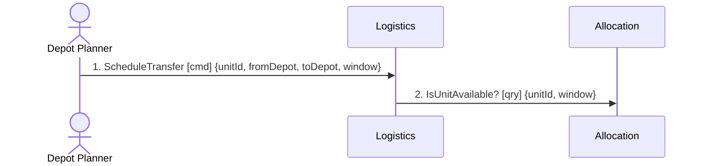

# Output Template — message-flow files (docs/domain/message-flows/)

The exact output contract for `4-connect`. Output lands in the **invoking project's** docs folder — never in this plugin repo.

````markdown
---
id: DOMAIN-FLOW-0001
title: <Use case> — domain message flow
status: draft
owner: TBD
date: <date>
contexts: [Allocation, Logistics, Billing]
---

## Scenario
<!-- one paragraph, in business language: who wants what, and what "done" means -->

## Flow



| # | From | Message | Type | Contents | To | When |
|---|---|---|---|---|---|---|
| 1 | Depot Planner | `ScheduleTransfer` | command | unitId, fromDepot, toDepot, window | Logistics | — |
| 2 | Logistics | `IsUnitAvailable?` | query | unitId, window **→** available, freeFrom | Allocation | — |
| 3 | Logistics | `TransferLapsed` | event | unitId | Allocation | **after** 30 min of no confirmation |

**A query carries its response in the same row, after a `→`.** The notation draws a query and its
answer as one unit precisely because the sender is *blocked* in between — splitting them into two
rows doubles the diagram and hides the only interesting thing about a query. Everything left of the
arrow is what the sender sends; everything right of it is what it waits for. A query with nothing
after the `→` has not been thought through: someone has to say what comes back, because the shape of
the answer is what the caller is coupled to.

**The `When` column is for time-driven messages only**, and it exists because the semantics decide
the design: **within** 5 minutes, **after** 5 minutes and **every** 5 minutes are three different
systems. Leave it `—` for a message that follows immediately from the one above. Put the trigger
here rather than in the scenario prose — a temporal rule buried in a paragraph is invisible on the
diagram, and it is usually the rule that produces the failure path nobody drew.

## Findings
| # | Smell | Evidence (messages) | What it suggests | Proposed change |
|---|---|---|---|---|

## Open questions
<!-- one line each: the question, and who could answer it -->
````

The `README.md` index carries the use-case list, why each was chosen, and the consolidated findings
table with a status column (`proposed` / `accepted` / `declined`) so a later reader can tell which
findings were acted on.
