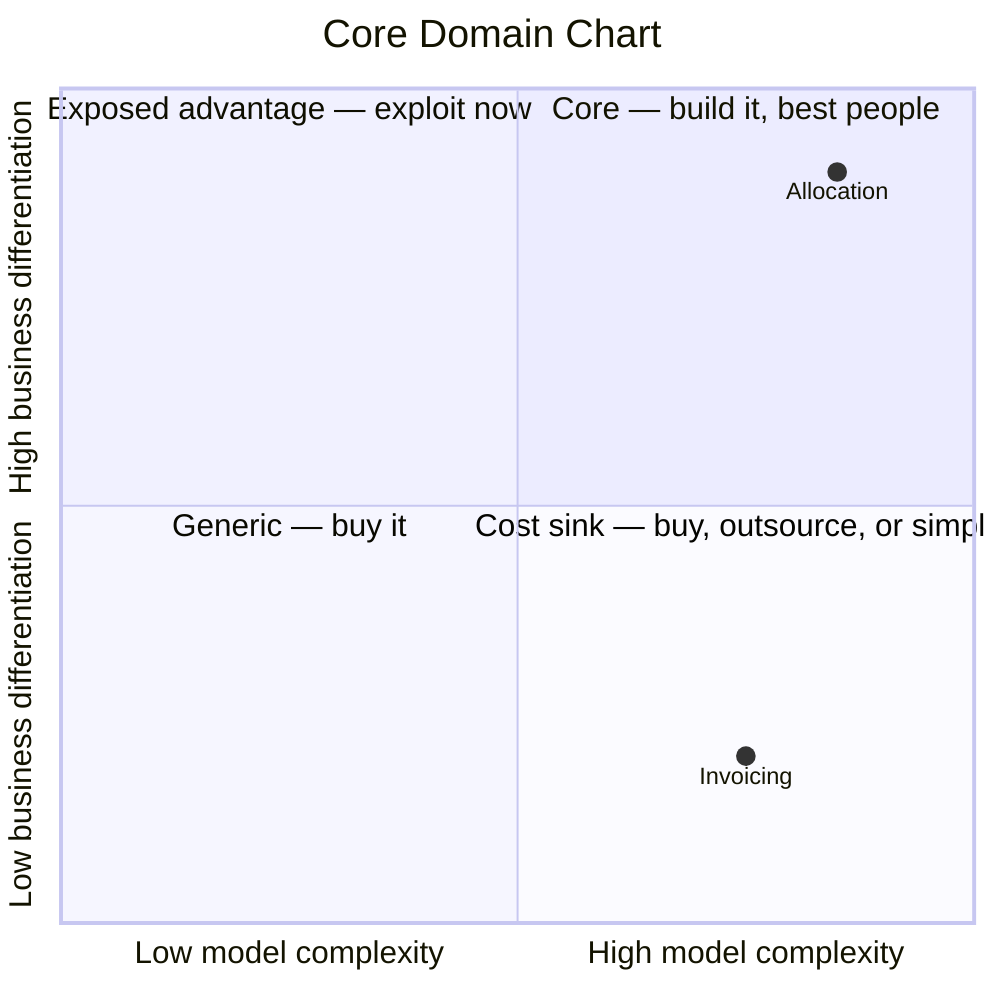

# Domain Strategize

## Hard rules

- **Length budget: `core-domain-chart.md` ≤ 150 lines.** A budget caps prose, not findings: over
  it, cut rationale a reader can infer and anything restated from an upstream artifact — never
  open questions, provenance, or a stated absence.
- **Never infer differentiation from the code.** A big model means the team spent effort there, not
  that customers value it — that inference is exactly the bias this step exists to break. y comes
  from business evidence or it stays `unknown`.
- **`unknown` is a real answer.** A chart with two contexts placed and six marked unknown, plus the
  question each needs, is more useful than eight confident dots. It tells you what conversation to
  have next.
- **At most one or two core contexts.** If your chart says everything is core, nothing is; the
  differentiation axis has not been thought about. Say that plainly rather than plotting five dots
  in the top-right corner.
- **Don't reclassify the model here.** Disagreements with `subdomain_type` are proposed deltas for
  `3-decompose` to merge — it owns stable ids, human edits, and the tactical right-sizing that
  depends on the label.
- **Record the date and the bet.** Placement expresses a belief about the future. Six months later
  nobody can tell an assessed placement from an inherited assumption unless the assessment says what
  it assumed and when.
- **Complexity is not effort spent, and not headcount.** Assess what the domain *requires*, not what
  the current implementation costs — otherwise accidental complexity gets rewarded with more
  investment, which is how a cost sink defends itself.

> *"Time and resources are limited, so understanding which parts of the domain to focus on is
> critical to delivering optimal business impact."* — ddd-crew, Strategize

A three-way `core / supporting / generic` label is a starting point, not a strategy. It says
nothing about *how much* more one context matters than another, it hides the quadrant nobody wants
to look at — high complexity, low differentiation — and it cannot be argued with, because there is
nothing to point at.

A **Core Domain Chart** can be argued with. Two axes, every context placed relative to the others,
and the argument that placement triggers is the actual deliverable. As ddd-crew puts it: complexity
is something engineers can gauge, differentiation comes from product and business stakeholders.
Neither side can fill in this chart alone, and that is the point of running the step.

## Inputs

| Input | What it supplies | If missing |
|---|---|---|
| `docs/domain/` | contexts, aggregates, invariants, events — the raw material for the **complexity** axis | run `3-decompose` first; there is nothing to plot |
| `docs/domain/business-model.md` | `business_role`, `differentiation`, `evolution_stage`, revenue streams — the **differentiation** axis | placement on y is a guess. Mark every y value `unknown`, plot what you can, and say the chart is half-blind until `1-understand` runs |
| `docs/data/`, `docs/domain/message-flows/` | table/attribute mass, cross-context coupling — sharpens complexity | use what exists; note what you could not measure |
| **People** | the argument | see *Who to involve* |

## Reference files (read as needed)

- `references/core-domain-chart.md` — the two axes, how to assess each one, the quadrant readings
  and what each implies, the third dimension worth recording (evolution), and the migration-planning
  variant. Read before plotting.
- `references/strategic-moves.md` — turning placement into decisions: build/buy/outsource, the
  Purpose Alignment Model, modelling rigour per quadrant, team-type implications, and the
  anti-patterns that show up most often. Read at step 4.

## Who to involve

- people who understand product and business strategy
- people who design, build and test software
- people who have domain knowledge

If only engineers are in the room, you can place the x axis and not the y. Say that explicitly
rather than letting engineering intuition stand in for commercial evidence — an engineer's sense of
what is *interesting* correlates with complexity, not with what customers pay for.

## Process

### 1. Measure what is measurable (the x axis)

Complexity is subjective, but it is not *unmeasurable*, and starting from numbers keeps the
conversation off vibes. Pull from the existing model, per context:

| Signal | Where it comes from | Reads as |
|---|---|---|
| aggregate count, invariant count | `docs/domain/*/model.yaml` | essential domain complexity |
| entity + value-object count | `model.yaml` | model richness |
| table / attribute mass | `docs/data/`, or the schema | accumulated weight |
| distinct domain events | `model.yaml` | behavioural richness |
| contexts it must talk to; queries crossing its boundary | `docs/domain/message-flows/` | integration complexity |

Then adjust with what no file knows — the ddd-crew clues in the reference: is the current solution
more complex than the functionality requires (accidental)? Are there complex processes, decisions
or calculations happening *outside* the software (operational)? Does it need specialist talent that
is hard to hire? How long does a newcomer take to become productive? What scale must it hold?

Record the measured signal **and** the adjustment separately, with the reason. A number carried
into the chart without its adjustment is precision pretending to be accuracy; an adjustment with no
number behind it is the vibe you were trying to avoid.

### 2. Source the differentiation (the y axis)

Take it from `1-understand`, not from the model. The question is not "is this hard" or "is this
interesting" — it is:

- How hard would it be for a **new entrant** to match or exceed this capability? For an **existing
  competitor**?
- How much advantage does it currently produce — revenue, brand, engagement? How much *could* it?
- What damage would recurring failures here do to the brand?

Anything you cannot source stays `unknown`. An unknown y is a legitimate, informative result: it
says the organisation has not decided what it competes on, which is a finding worth more than a
number you made up.

### 3. Plot

Place every context on the chart — **relative positions matter, absolute coordinates do not**. The
useful output is the ordering: which contexts sit above which, and which sit alone in a corner.

Then **reconcile with `3-decompose`'s existing `subdomain_type`**. Where the chart and the
label disagree — a context marked `supporting` sitting in the core quadrant, or three contexts all
labelled `core` but only one placed high on differentiation — that disagreement is a finding, and it
is usually the most valuable thing this step produces. Propose the reclassification as a delta for
`3-decompose` to merge; do not edit `model.yaml` here.

### 4. Decide

Placement is worthless until it changes something. For each context, record the decisions in
`references/strategic-moves.md`: **build / buy / outsource**, the **modelling rigour** it justifies
(which feeds `3-decompose`'s tactical right-sizing), and the **team type** it implies (which
feeds `6-organise`).

Two decisions deserve to be said out loud because they are the ones organisations get wrong in
opposite directions: *do not outsource the core*, and *do not build the generic*.

### 5. Report the investment mismatch

This is the check that a label-only classification cannot perform, and the one that usually changes
minds. Compare **where the model mass sits** (step 1) against **where the differentiation sits**
(step 2):

> *Invoicing carries 30 tables, 4 aggregates and the richest model in the system, and sits at 0.2
> differentiation. Allocation — the capability customers pay extra for — has 1 aggregate and 6
> tables.*

That sentence is the deliverable. It is evidence, not opinion, and it reframes the roadmap
conversation from "what should we build next" to "why is our effort here".

Report every mismatch in both directions: rich model in a low-differentiation context (effort
misallocated), and thin model in a high-differentiation context (the differentiator is
under-invested, often the more urgent one).

### 6. Record trajectory

Strategy is a bet on the future, so a chart with no time axis is a snapshot of a moving thing. For
each context, record where it is heading and **what would move it**:

Early music-streaming services competed on catalogue breadth; within a few years every competitor
had the same catalogue and the core moved to discovery and recommendation. The organisations that
suffered were the ones still architecting for catalogue.

So per context: current position → expected position → the trigger that would confirm the move
(a competitor shipping parity, a vendor productising it, a regulation, an acquisition). A core
domain whose advantage is easy to copy is not a mistake — it is a clock, and the trigger is what
tells you the clock has run out.

### 7. Emit

Write `docs/domain/core-domain-chart.md`, `status: draft`, `owner: TBD`, and close with the open
questions and who has to be in the room to answer them.

## Output shape

The exact output contract is in `references/output-template.md` — read it before emitting.

## Worked example

A full worked run is in `references/worked-example.md` — read it when the shape of the output is unclear.
