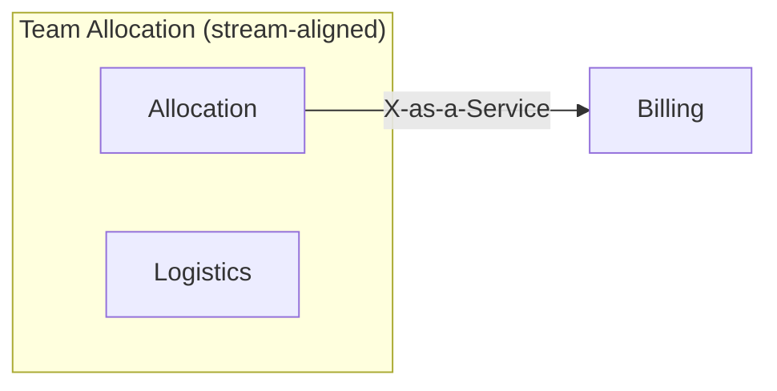

# Output Template — team-topology.md

The exact output contract for `6-organise`. Output lands in the **invoking project's** docs folder — never in this plugin repo.

````markdown
---
id: DOMAIN-ORG-0001
title: <Organisation> — team topology proposal
status: draft
owner: TBD
date: <date>
---

## Reality check
<!-- engineers, existing teams, contexts; what is known vs assumed -->

## Ownership
| Context | Proposed team | Team type | Sub-domain type | Load contribution | Notes |
|---|---|---|---|---|---|

## Team cognitive load
| Team | Contexts owned | Intrinsic (model mass) | Extrinsic | Verdict |
|---|---|---|---|---|

## Interaction modes
| Team A | Team B | Mode | Why (flow evidence) | Ends when |
|---|---|---|---|---|

## Sociotechnical map


## Independent Service Heuristics
| Candidate boundary | Yes / probably | Weakest answers |
|---|---|---|

## Findings
| # | Finding | Evidence | Suggested move |
|---|---|---|---|

## Open decisions
<!-- one line each: the decision, and who must make it -->
````
