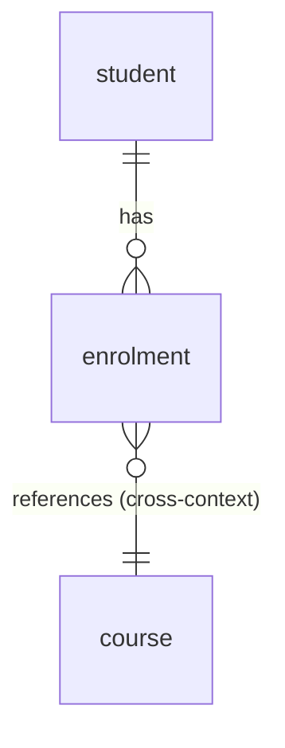

# Domain → Schema (FORWARD mapping)

How `data-model` turns a domain model into a **logical schema** (canonical) and a **PostgreSQL DDL
projection**. The logical model is dialect-agnostic; the DDL is one labeled projection of it.

## 1. Consume the domain (when `docs/domain/` exists)

`domain-decompose` writes per-context folders with `README.md` + `model.yaml`. Read `model.yaml`
as the authoritative input:

- Reuse `DOMAIN-NNNN` ids and ubiquitous-language names **verbatim** — never rename or re-derive.
- One logical model per bounded context (a candidate service / own schema).
- Read `relationships` to decide what is an in-schema FK vs. a cross-context id reference.

Without `docs/domain/`, take a prose description and identify aggregates, entities, value objects,
and relationships first — then apply the same rules.

## 2. Mapping rules

| Domain element | Logical schema |
|---|---|
| Aggregate (root entity) | A table; the aggregate's consistency/transaction boundary |
| Entity (non-root, inside the aggregate) | A table with a `NOT NULL` FK to its aggregate-root table; FK may cascade |
| Value object (single) | Inline columns on the owning table (no identity, no own table) |
| Value object (multi-valued / collection) | A child table owned by the parent (composite or surrogate PK), cascade-deleted |
| Invariant (user-stated) | A constraint: `NOT NULL`, `UNIQUE`, `CHECK`; if not expressible in DDL, a flagged note in the README |
| Domain event | **Not a table.** Events are messages, not state (see §6 outbox exception) |

### Keys
- **Surrogate PK** per table (`uuid` default, or `bigint` identity). Stable, opaque.
- **Natural keys** the domain states (e.g. "email is unique") → a `UNIQUE` constraint *in addition*
  to the surrogate PK, never replacing it.

### Relationships
- **Within an aggregate** → real FK (with `ON DELETE CASCADE` from root to its parts when the part
  cannot exist without the root).
- **Between aggregates in the same context** → FK by id, but **no cascade** (each aggregate is
  independently consistent); consider `ON DELETE RESTRICT`/`SET NULL`.
- **Across bounded contexts** → store the foreign id as a plain column, documented as a
  cross-context reference. **No physical FK** — the other context is a separate schema/service.
  (Mirror `api-designer`'s `courseId`-reference rule.)

### Indexes
- Index **every FK column** (FK without an index is the most common real-world performance bug).
- Index every column the domain says is **filtered, searched, or sorted** by.
- A `UNIQUE` constraint already creates an index — don't duplicate it.

## 3. Canonical logical model (`<context>/README.md`)

Dialect-agnostic. For each table: columns with a *logical* type (text, integer, decimal, boolean,
timestamp, uuid, enum[...]), key role (PK/FK/UNIQUE), nullability, and constraints-as-intent.

```markdown
## Table: enrolment            (aggregate root: Enrolment, DOMAIN-0001)

| Column      | Type           | Key      | Null | Notes |
|-------------|----------------|----------|------|-------|
| id          | uuid           | PK       | no   | surrogate |
| student_id  | uuid           | FK→student | no | same-context aggregate ref, no cascade |
| course_id   | uuid           | —        | no   | **cross-context** ref to Catalog.course (no FK) |
| status      | enum[requested,confirmed,cancelled] | — | no | from domain |
| amount      | decimal(12,2)  | —        | no   | Money VO (inline) |
| currency    | char(3)        | —        | no   | Money VO (inline), CHECK ISO-4217 |

Indexes: (student_id), (course_id), (status)
Assumptions: domain gave no timestamps — created_at/updated_at NOT added (flagged, ask if needed).
```

Plus an **ERD** (Mermaid) showing tables and relationships:



## 4. PostgreSQL projection (`<context>/schema.postgres.sql`)

Generate DDL from the logical model. **Label the dialect** at the top. Map logical → Postgres:
`uuid`→`uuid` (`gen_random_uuid()`), `text`→`text`, `decimal(p,s)`→`numeric(p,s)`,
`timestamp`→`timestamptz`, `enum[...]`→a `CHECK` or a native `CREATE TYPE … AS ENUM`. Emit FKs,
`UNIQUE`, `CHECK`, and `CREATE INDEX` for the indexes listed. Cross-context references get a column
and an index but **no `REFERENCES`**.

## 5. Assumptions & gaps — never fabricate

The symmetric sin to a domain modeller inventing events: do **not** materialize precision the
domain never gave. If the domain omits timestamps, soft-delete, audit columns, or cardinality —
do not silently add them. Instead emit a **flagged assumption** ("domain underspecifies X; option
A/B; not added — confirm") in the README. Invented columns presented as fidelity are a bug.

## 6. Events & scope boundaries

- **Domain events are not tables.** The one exception is when the user asks for an **outbox** /
  event-sourcing pattern — then model an `outbox`/event-store table explicitly. Never persist
  events unprompted.
- **Schema, not migration history.** Design the *target* schema. Do not emit Alembic/Prisma/
  TypeORM/Django migration files — those are downstream tooling, out of scope.

## 7. Cross-cutting concerns (decide once, apply uniformly)

Production data models almost always carry audit, ownership, and tenancy columns. These are
**standard cross-cutting patterns, not fabricated business columns** — apply them deliberately and
consistently. Default to including them; surface a one-line decision (and ask) when the policy is
genuinely ambiguous. Record the chosen policy in `INDEX.md`.

### Technical audit (infrastructural — not domain language)
- `created_at timestamptz NOT NULL DEFAULT now()` and `updated_at timestamptz NOT NULL DEFAULT now()`
  on every table — **default ON**.
- `created_by` / `updated_by` (the acting user/actor id) when the system has a user/auth context.
- `deleted_at timestamptz NULL` for soft delete — **propose, confirm** (not every table needs it).
- `version integer` (or `xmin`) for optimistic locking on aggregates with concurrent edits — propose.

Keep these *out of the domain model* — they are not ubiquitous language; they belong only in the
data layer. (If domain events are the chosen audit mechanism, an event log/outbox can replace
per-row audit columns — note which approach is used.)

### Business ownership (from the domain)
The owning party an aggregate belongs to is a real domain relationship, not infra: `owner_id`,
`user_id`, `team_id`. Model it as a column (id reference) wherever the domain states ownership.

### Tenancy (an architectural decision that shapes the whole schema)
Pick one isolation model and apply it uniformly:

| Model | Schema impact |
|---|---|
| Single-tenant | nothing |
| Row-level multi-tenant | `tenant_id`/`org_id` on **every** tenant-scoped table; composite indexes `(tenant_id, …)`; row-level security (RLS) policies; consider `(tenant_id, id)` PKs |
| Schema-per-tenant | one schema per tenant; no tenant column |
| Database-per-tenant | one DB per tenant; no tenant column |

Tenancy drives PKs, every index, and isolation — decide it **before** detailing tables, and reflect
it on all tenant-scoped tables consistently. Don't add `tenant_id` to global/reference tables
(currencies, country codes).
